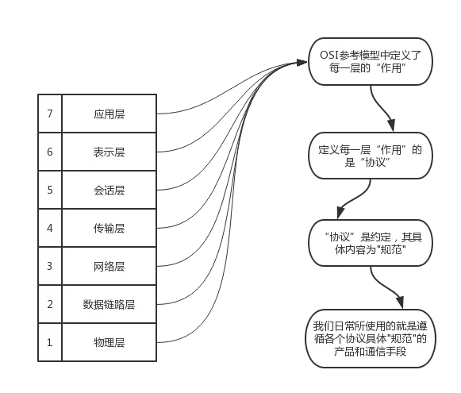
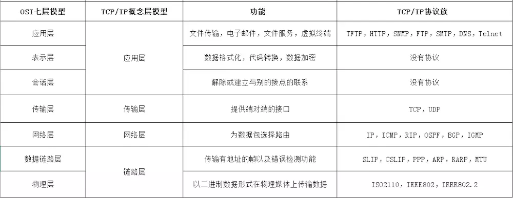
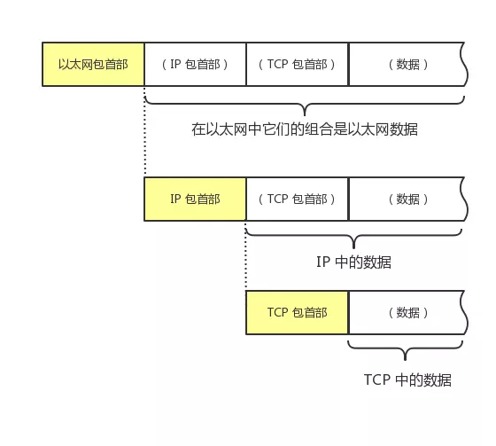
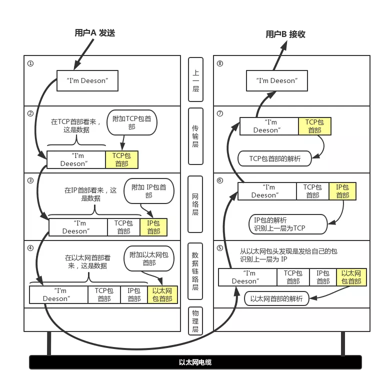
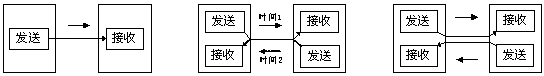

# 本篇说明
本篇介绍tcp/ip协议基础知识，tcp篇和ip篇将对tcp和ip两个协议作详细介绍。 
红字为重要说明，橙字为不确定说明，绿字待定。 

# 计算机网络体系

osi与tcp模型在分层上稍有区别，osi更注重每一层的功能，tcp更注重实用性。

# tcp/ip协议
tcp/ip协议是指tcp/ip协议族，并非字面意思的tcp与ip协议，这一协议族上有很多协议，参考上图。

## 数据包
网络中传输的数据包由两个部分构成，一部分是协议首部，一部分是上层传递过来的数据，首部由具体的协议规范定义。

网络模型中，每个分层都会对所发数据附加一个首部，这个首部包含了此层所必要的通信信息(如：端口、目标地址、协议等)。从下层的角度看，上层传递过来的数据包都被认为是本层的数据，如下图所示：

数据包、桢、包、段、消息等5个数据单位大致区分如下： 
- 数据包 **:** 全能性术语，泛指网络传输中的数据单位 
- frame(桢) **:** 链路层数据单位 
- packet(包) **:** 网络层数据单位 
- segment(段) **:** 传输层数据单位 
- message(消息) **:** 应用层数据单位 

## 数据流转过程
下图为用户 a 向用户 b 发送邮件的数据流转过程：

# 补充知识点
## 单工、半双工、全双工

单工 **:** 支持数据在固定方向上传输，例：电视、广播 
半双工 **:** 支持数据在两个方向上传输，但不能同时传输，例：对讲机 
全双工 **:** 支持数据在两个方向上同时传输，例：电话 

## localhost、127.0.0.1、本机地址
localhost **:** 指域名，这个域名可以指向127.0.0.1，也可以指向任何一个地址，通常指向127.0.0.1 
127.0.0.1 **:** 127.0.0.1这个地址通常分配给loopback接口 
本机地址 **:** 指绑定在物理或虚拟网络接口上的ip地址，可供其他设备访问

## loopback接口
虚拟网络接口，可用来测试tcp/ip协议栈

# 参考文献
0. [一篇文章带你熟悉TCP/IP协议](https://www.jianshu.com/p/9f3e879a4c9c)
0. [单工，半双工和全双工有何区别和联系？](https://zhidao.baidu.com/question/58243700.html)
0. [localhost、127.0.0.1 和 本机IP 三者的区别？](https://www.zhihu.com/question/23940717)
