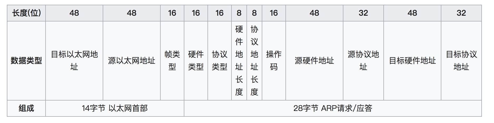

# 本篇说明
本系列为《tcp/ip 详解-卷1》浓缩，本篇为ARP浓缩。 
红字为重要说明，橙字为不确定说明，绿字待定。

# ARP 协议
当一台主机把以太网数据帧发送到位于同一局域网上的另一台主机时，是根据48 bit的以太网地址来确定目的接口，设备驱动程序从不检查IP数据报中的目的IP地址。

ARP(地址解析协议)为这两种不同形式的地址提供映射：即将32 bit的IP地址转换成硬件地址。

## 例子
在命令行键入命令“ftp bsdi”(此命令为连接bsdi主机)，都会进行以下这些步骤，如下图所示：

- 1. FTP客户端调用函数gethostbyname把主机名bsdi转换成32 bit的IP地址。
- 2. FTP客户端用得到的IP地址请求建立TCP连接。
- 3. TCP发送一个连接请求到远端主机，即用上述IP地址发送一份IP数据报。
- 4. 如果目的主机在本地网络上（如以太网、令牌环网或点对点链接的另一端），那么IP数据报可以直接送到目的主机上。如果目的主机在一个远程网络上，那么就通过IP路由来确定位于本地网络上的下一站路由器地址，并让它转发IP数据报。在这两种情况下，IP数据报都是被送到位于本地网络上的一台主机或路由器。
- 5. 假定是一个以太网，那么发送端主机必须把32 bit的IP地址转换成48 bit的以太网地址，这就是ARP的功能。
- 6. ARP发送一份称作ARP请求的以太网数据帧给以太网上的每个主机。这个过程称作广播，如上图中的虚线所示。ARP请求数据帧中包含目的主机的IP地址（主机名为bsdi），其意思是“如果你是这个IP地址的拥有者，请回答你的硬件地址。”
- 7. 目的主机的ARP层收到这份广播报文后，识别出这是发送端在寻问它的IP地址，于是发送一个ARP应答，这个ARP应答包含IP地址及其对应的硬件地址。
- 8. 收到ARP应答后，现在就可以传送IP数据报了。
- 9. 发送IP数据报到目的主机。

## ARP 高速缓存
ARP高效运行的关键是每个主机上都有一个ARP高速缓存。这个高速缓存存放了最近Internet地址到硬件地址之间的映射记录。高速缓存中每一项记录的生存时间一般为20分钟，起始时间从被创建时开始算起。

可以用arp -a来查看ARP高速缓存，-a的意思是显示高速缓存中所有的内容。

## ARP 分组格式
ARP请求和应答分组的格式如下图所示：

- 目标以太网地址：目标MAC地址，二进制全为1(FF:FF:FF:FF:FF:FF)的广播地址，电缆上的所有以太网接口都要接收广播的数据帧。
- 源以太网地址：发送方MAC地址。
- 帧类型：以太类型，ARP为0x0806。
- 硬件类型：如以太网、分组无线网。
- 协议类型：如IPv4（0x0800）、IPv6（0x86DD）。
- 硬件地址长度：每种硬件地址的字节长度，一般为6（以太网）。
- 协议地址长度：每种协议地址的字节长度，一般为4（IPv4）。
- 操作码：1为ARP请求，2为ARP应答，3为RARP请求，4为RARP应答。
- 源硬件地址：一般为发送方MAC地址。
- 源协议地址：一般为发送方IP地址。
- 目标硬件地址：一般为目标MAC地址。
- 目标协议地址：一般为目标IP地址。

对于一个ARP请求来说，除目标硬件地址外的其他的字段都要填写。当系统收到一份目的地为本机的ARP请求后，它就填写目标硬件地址，然后用两个目标地址替换两个源地址，并把操作字段置为2，最后把它发送回去。

## ARP 代理
当发送主机和目的主机不在同一个局域网时，即便知道对方的MAC地址，两者也不能直接通信，必须经过路由器转发才可以。所以此时，发送主机通过ARP协议获得的将不是目的主机的MAC地址，而是一台可以通往局域网外的路由器的MAC地址。于是此后发往目的主机的所有帧，都将发往该路由器，通过它向外发送，这种情况称为委托ARP或ARP代理（ARP Proxy）。

## 免费 ARP
免费ARP是指主机发送ARP查找自己的IP地址，它通常发生在系统引导期间进行接口配置的时候。

免费ARP可以有两个方面的作用：

- 一个主机可以通过它来确定另一个主机是否设置了相同的IP地址。通常，主机并不希望对此请求有一个回答，但如果收到一个回答，那么就可以警告系统管理员，某个主机有不正确的IP配置。
- 如果发送免费ARP的主机正好改变了硬件地址（很可能是主机关机了，并换了一块网卡，然后重新启动），那么这个分组就可以使其他主机高速缓存中旧的硬件地址进行更新。

## 命令
查看arp：arp -a

# 参考引用
0. [tcp/ip详解-卷1](https://book.douban.com/subject/1088054/)
0. [地址解析协议](https://zh.wikipedia.org/wiki/%E5%9C%B0%E5%9D%80%E8%A7%A3%E6%9E%90%E5%8D%8F%E8%AE%AE)
