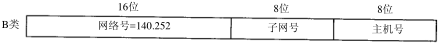
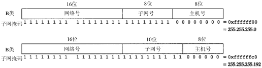
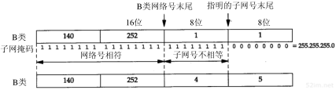
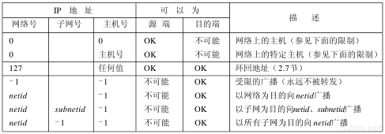

# 本篇说明
本系列为《tcp/ip 详解-卷1》浓缩，本篇为IP浓缩。 
红字为重要说明，橙字为不确定说明，绿字待定。

# IP 协议
IP是TCP/IP协议族中最为核心的协议，TCP、UDP、ICMP及IGMP数据都以IP数据报格式传输，IP是一个不可靠、无连接的传输协议。

- 不可靠，IP不保证数据报成功到达目的地
- 无连接(和传输层的无连接有区别)，IP并不维护任何关于后续数据报的状态信息，每个数据报的处理都是相互独立的。IP数据报可以不按发送顺序接收，如果同一信源向相同的信宿发送两个连续的数据报（先是A，然后是B），每个数据报都是独立地进行路由选择，因此B可能在A到达之前先到达

## IP 首部
IP 首部如下图所示：

### 大端字节序
分析上图中的首部，最高位在左边，记为0bit；最低位在右边，记为31 bit。4个字节32bit值以下面的次序传输：首先是0～7bit，其次8～15 bit，然后16～23 bit，最后是24~31 bit。这种传输次序称作big endian字节序。由于TCP/IP首部中所有的二进制整数在网络中以这种次序传输，因此它又称网络字节序。以其他形式存储二进制整数的机器，如little endian格式，则必须在传输数据之前把首部转换成网络字节序。

协议版本：目前的协议版本号是4，因此IP有时也称作IPv4。

首部长度：指首部中有多少个以32bit(即4字节)为单位的字，包括任何选项。因为它是一个4bit的字段，所以首部被限制为最多15个字，即60字节。

服务类型：包括一个3bit的优先权子字段，4bit的TOS子字段和1bit未用位但必须置0。4bit的TOS分别代表：最小时延、最大吞吐量、最高可靠性和最小费用，4bit中只能置位其中1bit，如果所有4bit均为0，那么就意味着是一般服务。

总长度：指整个IP数据报的长度，以字节为单位。利用首部长度和总长度字段，就可以知道IP数据报中数据内容的起始和结束位置。由于该字段长16bit，所以IP数据报最长可达65535字节。

标识字段：

TTL：生存时间字段设置了数据报可以经过的最多路由器数。一旦经过一个处理它的路由器，它的值就减去1。当该字段的值为0时，数据报就被丢弃，并发送ICMP报文通知源主机。

协议字段：1表示ICMP协议，2表示IGMP协议，6表示TCP协议，17表示UDP协议。

首部检验和：根据IP首部计算的检验和码。它不对首部后面的数据进行计算，ICMP、IGMP、UDP、TCP在它们各自的首部中均含有同时覆盖首部和数据的检验和码。

源和目的IP地址：每一份IP数据报都包含源IP地址和目的IP地址，它们都是32 bit的值。

选项：IP数据报中的一个可变长的可选信息，目前定义如下：

- 安全和处理限制（用于军事领域，详细内容参见RFC 1108）
- 记录路径（让每个路由器都记下它的IP地址）
- 时间戳（让每个路由器都记下它的IP地址和时间）
- 宽松的源站路由（为数据报指定一系列必须经过的IP地址）
- 严格的源站路由（与宽松的源站路由类似，但是要求只能经过指定的这些地址，不能经过其他的地址）。

这些选项很少被使用，并非所有主机和路由都支持这些选项。

## IP 路由
参考 IP 路由与动态路由两节。

## 什么是子网
待定...

## 子网划分
现在所有的主机都要求支持子网编址，不再是把IP地址看成由一个网络号和一个主机号组成，而是把主机号再分成一个子网号和一个主机号。

在InterNIC获得某类IP网络号后，就由系统管理员来进行分配，由他来决定是否建立子网，以及分配多少比特给子网号和主机号。例如，一个B类网络地址（140.252），在剩下的16 bit中，8bit用于子网号，8bit用于主机号，格式如下图所示。这样就允许有254个子网，每个子网可以有254台主机。

## 子网掩码
任何主机在引导时进行的部分配置是指定主机的IP地址。大多数系统把IP地址存在一个磁盘文件里供引导时读。一种动态获取IP地址的方法叫DHCP，参考DHCP一节。

主机还需要知道有多少比特用于子网号及多少比特用于主机号。这是在引导过程中通过子网掩码来确定的，这个掩码是一个32 bit的值，其中值为1的比特留给网络号和子网号，为0的比特留给主机号，如下图所示：

给定IP地址和子网掩码以后，主机就可以确定IP数据报的目的是：

- (1)本子网上的主机
- (2)本网络中其他子网的主机
- (3)其他网络上的主机。

如果知道本机的IP地址，那么就知道它是否为A类、B类或C类地址(从IP地址的高位可以得知)，也就知道网络号和子网号之间的分界线。而根据子网掩码就可知道子网号与主机号之间的分界线。

### 例子
假设我们的主机地址是140.252.1.1（一个B类地址），而子网掩码为255.255.255.0（其中8bit为子网号，8bit为主机号）。

- 如果目的IP地址是140.252.4.5，那么我们就知道B类网络号是相同的（140.252），但是子网号是不同的（1和4）。用子网掩码在两个IP地址之间的比较如下图所示：
- 如果目的IP地址是140.252.1.22，那么B类网络号还是一样的（140.252），而且子网号也是一样的（1），但是主机号是不同的。
- 如果目的IP地址是192.43.235.6（一个C类地址），那么网络号是不同的，因而进一步的比较就不用再进行了。

## 子网例子
参考《tcp/ip详解-卷1》第3章3.7节

## 特殊的IP地址
经过子网划分的描述，现在介绍7个特殊的IP地址，如下图所示。在这个图中，0表示所有的比特位全为0；-1表示所有的比特位全为1；netid、subnetid和hostid分别表示不为全0或全1的对应字段。子网号栏为空表示该地址没有进行子网划分。

我们把这个表分成三个部分。表的头两项是特殊的源地址，中间项是特殊的环回地址，最后四项是广播地址。

表中的头两项，网络号为0，如主机使用BOOTP协议确定本机IP地址时只能作为初始化过程中的源地址出现(什么意思？？？)。

# 参考引用
0. [tcp/ip详解-卷1](https://book.douban.com/subject/1088054/)
