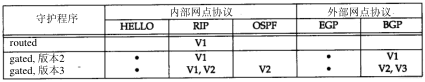
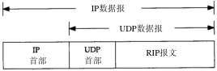
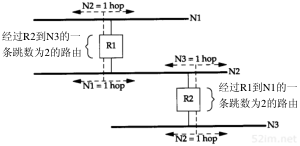
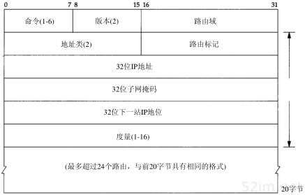

# 本篇说明
本系列为《tcp/ip 详解-卷1》浓缩，本篇为动态路由浓缩。 
红字为重要说明，橙字为不确定说明，绿字待定。

# 动态路由
## 动态路由
当相邻路由器之间进行通信，以告知对方自己所连接的网络，这时就出现了动态路由。路由器上有一个进程称为路由守护程序（routing daemon），它运行动态路由协议，并与其相邻的路由器进行通信。路由守护程序根据它从相邻路由器接收到的信息，更新内核中的路由表。

如果路由守护程序发现同一信宿存在多条路由，那么它将选择最佳路由并将其加入内核路由表中；如果它发现一条链路已经断开（可能是路由器崩溃或电话线路不好），它将删除受影响的路由或增加一条路由以绕过该问题。

### 自治系统
Internet是以一组自治系统(AS，Autonomous System)的方式组织的，每个自治系统通常由单个实体管理，常常将一个公司或大学校园定义为一个自治系统。

每个自治系统可自行选择该系统中各个路由器之间的路由协议，这种协议我们称之为内部网关协议IGP（Interior Gateway Protocol）或域内路由协议（intradomain routing protocol）。最常用的IGP是RIP协议，另外还有OSPF、BGP协议。

外部网关协议EGP（Exterier Gateway Protocol）用于不同自治系统之间的路由器，当前，它已经不使用了，另一种替代EGP的协议叫边界网关协议BGP（Border Gateway Protocol）。

### unix路由守护程序
unix系统上常常运行名为routed、gated的路由守护程序，下面来看一看他们的对比。

## RIP 协议
### 报文格式
RIP报文包含中在UDP数据报中，如下图所示：

下图给出了RIP报文的具体格式：

命令：1 请求 2 应答 3 废弃 4 废弃 5 轮询(非正式命令) 6 轮询表项(非正式命令)，请求表示要求其他系统发送其全部或部分路由表，应答则包含发送者全部或部分路由表。

版本：1，第2版RIP为2

20字节：从地址系列开始 至 度量结束，以20字节为一个单位，地址系列其值为2代表IP地址，度量以跳计数代表路由器之间的距离。采用这种格式的RIP报文最多可以通告25条路由，上限25是用来保证RIP报文的总长度为20×25+4=504，小于512字节。

### 运行过程
来看一下采用RIP协议的routed程序(常用端口号是520)的运行过程：

- 初始化：在启动一个路由守护程序时，它先判断启动了哪些网络接口，并在每个接口上发送一个请求报文，要求其他路由器发送完整路由表。这种请求报文的命令字段为1，地址系列字段为0，度量字段为16，这是一种要求另一端发送完整路由表的特殊请求报文。
- 接收到请求：如果这个请求是刚才提到的特殊请求，那么路由器就将完整的路由表发送给请求者。
- 接收到响应：更新路由表响应生效。
- 定期更新：每过30秒，所有或部分路由器会将其完整路由表发送给相邻路由器，发送路由表可以是广播形式也可以是点对点形式。
- 触发更新：每当一条路由的度量发生变化时，就对它进行更新。不需要发送完整路由表，只需要发送那些变化的路由表。

每条路由都有与之相关的定时器，如果运行RIP的守护程序发现一条路由在3分钟内未更新，就将该路由的度量设置成无穷大(16)，并标记为删除。这意味着已经在6个30秒的更新周期里没收到通告该路由的路由器的更新了，再过60秒，将从本地路由表中删除该路由，以保证该路由的失效已被传播开。

### 度量
RIP所使用的度量是以跳(hop)计算的，所有直接相连的接口跳数为1。考虑下图所示的路由器和网络，画出的4条虚线是广播RIP报文：

路由器R1通过发送广播给N1通告它与N2之间的跳数是1，同时也通过发送广播给N2通告它与N1之间的跳数为1。如果相邻路由器通告它与其他网络路由的跳数为1，那么我们与那个网络的度量就是2，这是因为为了发送报文到那个网络，我们必须经过那个路由器。在上述例子中，R1到N3的度量是2，与R2到N1的度量一样。

由于路由器都发送其路由表给相邻的路由器，那么在一个AS(自治系统)内，如果从一个路由器到一个网络有多条路由，那么路由器将选择跳数最小的路由，而忽略其他路由。

跳数的最大值是15，这意味着RIP只能用在最大跳数为15的AS内，度量为16表示无路由到达该IP地址。

### 问题
- RIP没有子网地址的概念。如果标准的B类地址中16 bit的主机号不为0，那么RIP无法区分非零部分是一个子网号还是一个主机地址
- 在路由器或链路发生故障后，需要很长的一段时间才能稳定下来。这通常需要几分钟，在这段建立路由的时间里，可能会发生路由环路
- 采用跳数作为路由度量忽略了其他一些应该考虑的因素。另外，度量的最大值为15限制了网络的大小

### 例子
参考《tcp/ip详解-卷1》10.4.5/6 两节

## RIP 2
RFC 1388对RIP定义进行了扩充，通称为RIP-2。这些扩充并不改变协议本身，而是利用RIP报文中的一些标注“必须为0”的字段来传递额外的信息。如果RIP忽略这些必须为0的字段，那么，RIP和RIP-2可以互操作。

下图给出了RIP-2的报文格式，其版本字段为2：

路由域：是一个路由守护程序的标识符，它指出了这个数据报的所有者。在一个unix实现中，它可以是路由守护程序的进程号，路由域允许管理者在路由器上运行多个RIP实例，每个实例在一个路由域内运行。

路由标记：是为了支持外部网关协议而存在的，它携带着一个EGP或BGP的自治系统号。

子网掩码：每个子网掩码应用于相应的IP地址上。

下一站IP地址：指明发往目的IP地址的报文该发往哪里，该字段为0意味着发往目的地址的报文应该发送给发送RIP报文的系统。

## OSPF 开放最短路径优先
OSPF 是另一个内部网关协议，它克服了RIP的所有问题。与采用距离向量的RIP协议不同，OSPF是一个链路状态协议。距离向量的意思是，RIP发送的报文包含一个距离向量（跳数），每个路由器都根据它所接收的邻站的这些距离向量来更新自己的路由表。

在一个链路状态协议中，路由器并不与其邻站交换距离信息。它采用的是每个路由器主动地测试与其邻站相连的链路状态，并将这些信息发送给其他邻站，而邻站将这些信息在自治系统中传播出去。每个路由器接收这些链路状态信息，并建立起完整的路由表。

## BGP  边界网关协议
原文只是简单描述了一下边界网关协议，参考《tcp/ip详解-卷1》10.7 一节

## CIDR 无类别域间路由
为了应对B类地址的缺乏，现在多个网络站点采用了C类网络号，尽管分配C类地址解决了B类地址的缺乏，但它却带来了新的问题，路由表的膨胀，因为每个C类网络都需要一个路由表项。无类别域间路由(CIDR)就是一个防止Internet路由表膨胀的方法。

CIDR的基本观点是采用一种分配多个IP地址的方式，使其能够将多个路由表整合成更少的路由表项。例如，如果给单个站点分配16个C类地址，以一种可以整合的方式来分配这16个地址，这样，所有这16个地址可以整合成单个路由表项。

要使用这种整合，必须满足以下三种特性：

- 为进行路由要对多个IP地址进行整合时，这些IP地址必须具有相同的高位比特地址。
- 路由表和路由算法必须扩展成根据32 bit IP地址和32 bit掩码做出路由决策。
- 必须扩展动态路由协议使其除了有32 bit地址外，还要有32 bit掩码。

“无类别”的意思是路由决策是基于32 bit IP地址的掩码操作，而不管其IP地址是A类、B类还是C类，都没有什么区别。

### 例子
RFC 1466建议欧洲新的C类地址的范围是194.0.0.0～195.255.255.255，以16进制表示，这些地址的范围是0xc2000000～0xc3ffffff，它代表了65536个不同的C类网络号，但它们地址的高7bit是相同的。

在欧洲以外的国家里，可以采用IP地址为194.0.0.0(0xc2000000)和掩码为254.0.0.0(0xfe000000)的单个路由表项来对所有这些65536个C类网络号进行路由。

# 参考引用
0. [tcp/ip详解-卷1](https://book.douban.com/subject/1088054/)
