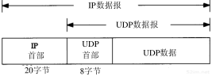

# 本篇说明
本系列为《tcp/ip 详解-卷1》浓缩，本篇为UDP浓缩。 
红字为重要说明，橙字为不确定说明，绿字待定。

# UDP
UDP是一个面向数据报的无连接的不可靠传输层协议。所谓无连接是指并不确认对端是否在线，不可靠是指不保证数据报送达目的地。UDP报文如下图所示：

## UDP 首部

源端口号：发送进程

目的端口号：接收进程

UDP长度：首部+数据的长度

UDP校验和：首部+数据的校验和，此值是可选的

UDP数据报的长度可以为奇数字节，但是检验和算法是把若干个16 bit字相加，解决方法是必要时填充字节0，这只是为了检验和的计算(填充字节无需传送)。

UDP数据报和TCP段都包含一个12字节长的伪首部，它是为了计算检验和而设置的。伪首部包含IP首部一些字段，其目的是让UDP两次检查数据是否已经正确到达目的地。伪首部格式如下图所示：

## IP 分片
物理网络层一般要限制每次发送数据帧的最大长度，任何时候IP层接收到一份要发送的IP数据报时，它要判断向本地哪个接口发送数据，并获取该接口的MTU，把MTU与数据报长度进行比较，如果需要则进行分片。分片可以发生在源端主机上，也可以发生在中间路由器上。

把一份IP数据报分片以后，每一片都成为一个分组，具有自己的IP首部，并在选择路由时与其他分组独立，只有到达目的地才进行重组。重组由目的地的IP层来完成，其目的是使分片和重组过程对传输层透明。

回忆IP首部：

标识：对于待发送的每份IP数据报来说，其标识字段都包含一个唯一值，该值在数据报分片时被复制到每个片中。

标志：
- 3个比特位，其中一个比特位表示“更多的片”，除最后一片外，其他每个分片都要把该比特置1。
- 3个比特位，其中一个比特位表示“不分片”，如果将这一比特置为1，IP将不对数据报进行分片，相反把数据报丢弃并发送一个ICMP差错报文（“需要进行分片但设置了不分片比特”）给源端。

片偏移：指分片偏移原始数据报开始的位置(注意：此字段的最大值为8192，所以每个值是以乘8为单位的，即8192*8=65536，这样就和IP首部中的16位总长度所能表达的值一样)。

### 例子
假设MTU是1500字节，那么一份儿1473字节的UDP数据报将被分片，分片情况下图所示：需要重申的是，任何传输层首部只出现在第1片数据报中

更详细的例子请参考《tcp/ip详解-卷1》11.5一节

## ICMP不可达差错
当路由器收到一份需要分片的数据报，而IP首部又设置了不分片（DF）的标志比特，如果某个程序需要判断目的地路径中最小MTU是多少，那么这个差错就可以被该程序使用。

这种情况下的ICMP不可达差错报文格式如下图所示：

## 最大UDP数据报长度
理论上，IP数据报的最大长度是65535字节，这是由IP首部16比特总长度字段所限制的，去除20字节的IP首部和8字节的UDP首部，UDP数据报中用户数据的最长长度为65507字节。但是，大多数实现所提供的长度比这个最大值小，限制来自于以下两个方面：

- socket接口限制
- tcp/ip内核限制

### 数据报截断
由于IP能够发送或接收特定长度的数据报，但这并不意味着接收应用程序可以读取该长度的数据。如果接收的数据报长度大于应用程序所能处理的长度，那么会发生什么情况呢？答案取决于socket接口及其实现

## ICMP源站抑制差错
当一个系统（路由器或主机）接收数据报的速度比其处理速度还快时，可能产生源站抑制差错。注意限定词“可能”，即使一个系统已经没有缓存并丢弃数据报时，也不要求它一定要发送源站抑制报文。源站抑制差错报文的格式如下图所示：

## UDP服务器的设计
这里仅讨论那些影响使用UDP协议进行服务器设计和实现的协议特性。

### 限制本地ip地址
参考《tcp/ip详解-卷1]》11.12.4一节

### 限制远端ip地址
参考《tcp/ip详解-卷1]》11.12.5一节

### 地址绑定
如下图所示：总结了UDP服务器本身可以创建的三类地址绑定

### 同一端口绑定多个应用
尽管在RFC中没有指明，但大多数的系统在某一时刻只允许一个应用程序与某个本地IP地址及UDP端口号相绑定。但如果使用不同的ip地址和相同的端口号，则可以绑定成功(参考限制本地ip地址一节)，要知道，许多网络接口都不只一个ip地址。

如下图所示：使用“sock -u -s 9999”命令在端口9999上将sock应用启动了两次，第二次将失败，尽管使用了 -A 参数来重用端口。

在一个支持多播的系统上，这种情况将发生变化。多个应用可以使用同一个IP地址和UDP端口号，但应用必须使用-A(使用SO_REUSEADDR选项)来告知socket api。。

当UDP数据报到达的目的IP地址为广播地址或多播地址，且目的IP地址和端口号上有多个应用绑定时，就向每个应用发送一份数据报的复制。

# 参考引用
0. [tcp/ip详解-卷1](https://book.douban.com/subject/1088054/)
