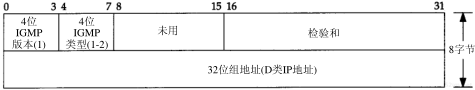

# 本篇说明
本系列为《tcp/ip 详解-卷1》浓缩，本篇为IGMP浓缩。 
红字为重要说明，橙字为不确定说明，绿字待定。

# IGMP
当多播需要跨越多个网络时，复杂性就增加了，这需要有一个协议让多播路由器了解确定网络中属于确定多播组的任何一个主机以便进行数据转发，这个协议就是Internet组管理协议（IGMP）。

## IGMP报文
正如ICMP一样，IGMP也被当作IP层的一部分，IGMP报文通过IP数据报进行传输，下图显示了IGMP的报文格式：

版本：固定为1

类型：1 多播路由器发出的查询报文 2 主机发出的报告报文

校验和：覆盖整个IGMP报文

组地址：为D类IP地址，当类型为查询报文时，此字段为0；当类型为报告报文时，此字段为要参加的组地址

## IGMP协议

# 参考引用
0. [tcp/ip详解-卷1](https://book.douban.com/subject/1088054/)
