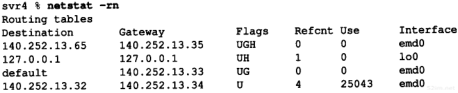
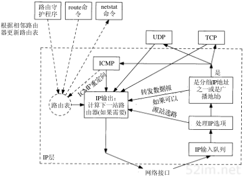
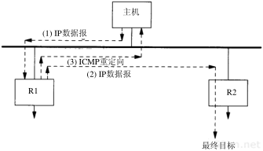
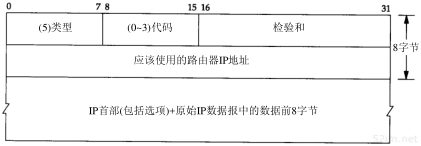
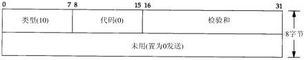
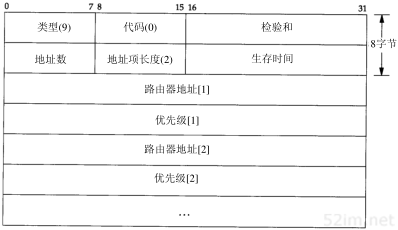

# 本篇说明
本系列为《tcp/ip 详解-卷1》浓缩，本篇IP路由浓缩。 
红字为重要说明，橙字为不确定说明，绿字待定。

# IP 路由
## IP 路由
从概念上说，IP路由的选择是简单的，特别对于主机来说。如果目的主机与源主机直接相连（如点对点链路）或都在一个共享网络上（以太网或令牌环网），那么IP数据报就直接送到目的主机上。否则，主机把数据报发往默认的路由器，由路由器来转发该数据报。

一般的情况下，IP可以从TCP、UDP、ICMP和IGMP接收数据报并进行发送，或者从一个网络接口接收数据报并进行发送。IP层在内存中有一个路由表，当收到一份数据报并进行发送时，它都要对该表搜索一次。
当数据报来自某个网络接口时，IP首先检查目的IP地址是否为本机的IP地址之一或者IP广播地址。如果是这样，数据报就被送到由IP首部协议字段所指定的协议模块进行处理。如果数据报的目的不是这些地址，那么如果IP层被设置为路由器的功能，那么就对数据报进行转发；否则，数据报被丢弃。

下面来看一看路由表：

如上图所示，路由表包含以下信息：

- 目的IP地址，它既可以是一个完整的主机地址，也可以是一个网络地址，由表目中的标志字段来确定（如下所述）。
- 下一跳路由器（next-hop router）的IP地址，或者直连网络的IP地址。
- 标志
    - U 该路由可以使用
    - G 该路由是到一个网关(路由器)，没有此标志，则说明目的地是直连的，该标志区分了是直接还是间接路由。
    - H 该路由是到一个主机，也就是说，目的地址是一个完整的主机地址。没有此标志，则说明该路由是到一个网络
- Refcnt，正在使用该路由的活动进程个数
- Use，通过该路由发送的分组数
- Interface，该路由所使用的网络接口

IP路由是逐跳（hop-by-hop）进行的，从上面的路由表信息可以看出，IP并不知道任何目的地的完整路径（除了那些与主机直连的目的地）。所有的IP路由只为数据报传输提供下一站路由器的IP地址，它假定下一站路由器比发送数据报的主机更接近目的地。

IP路由主要完成以下这些功能：

- 搜索匹配的主机地址
- 搜索匹配的网络地址
- 搜索默认表项
- 如果以上步骤不成功，如果数据报是由本机产生的，那么就给发送数据报的应用程序返回一个“主机不可达”或“网络不可达”的差错；如果是被转发的数据报，那么就给源端发送一份ICMP主机不可达的差错报文。

### 例子
参考《tcp/ip详解-卷1》3.3一节

## 路由的原理
如下图所示，它描述了一个路由守护程序（daemon）。路由表经常被IP访问（在一个繁忙的主机上，一秒钟内可能要访问几百次），但是它被路由守护程序更新的频率却要低得多（可能大约30秒种一次），除路由守护程序外，路由表还可能被route命令以及ICMP重定向报文更新。

### 初始化路由表
一个常用的方法是在系统引导时显式地在初始化文件中运行route命令，但不幸的是，几乎没有系统愿意在启动文件中包含route命令。初始化路由表的其他方法是运行路由守护程序或者使用路由器发现协议。

## ICMP 主机或网络不可达差错
当路由器收到一份IP数据报但又不能转发时，就要发送一份ICMP“主机不可达”差错报文。

## ICMP 重定向差错
当IP数据报应该被发送到另一个路由器时，收到数据报的路由器就要发送ICMP重定向差错报文给IP数据报的发送端。如下图所示：

- 1. 我们假定主机发送一份IP数据报给R1，这种路由决策经常发生，因为R1是该主机的默认路由。
- 2. R1收到数据报并且检查它的路由表，发现R2是该数据报的下一站。当它把数据报发送给R2时，R1检测到它正在发送的接口与数据报到达接口是相同的（即主机和两个路由器所在的LAN）。这样就给路由器发送重定向报文给原始发送端提供了线索。
- 3. R1发送一份ICMP重定向报文给主机，告诉它以后把数据报发送给R2而不是R1。

重定向一般用来让具有很少路由信息的主机逐渐建立更完善的路由表。主机启动时路由表中可以只有一个默认表项，一旦默认路由发生差错，默认路由器将通知它进行重定向，并允许主机对路由表作相应的改动。ICMP重定向允许TCP/IP主机在进行路由时不需要具备智能特性，而把所有的智能特性放在路由器。显然，在上述例子中，R1和R2必须知道有关网络的更多拓扑结构信息，但是连在LAN上的所有主机在启动时只需一个默认路由，通过接收重定向报文来逐步学习。

### 重定向报文格式

有4种不同类型的报文：0 网络重定向 1 主机重定向 2 服务类型和网络重定向 3 服务类型和主机重定向

关于ICMP重定向报文有一些规则。首先，重定向报文只能由路由器生成，而不能由主机生成。另外，重定向报文是为主机而不是为路由器使用的。路由器之间的路由信息由动态路由协议交换而来。

一台4.4BSD主机在收到ICMP重定向报文后，再修改路由表之前要作一些检查。这是为了防止路由器或主机的误操作，以及恶意用户的破坏，导致错误地修改系统路由表。

- 新的路由器必须直接与网络相连接。
- 重定向报文必须来自当前到目的地所选择的路由器。
- 重定向报文不能让主机本身作为路由器。
- 被修改的路由必须是一个间接路由。

## ICMP 路由器发现报文
一般认为，主机在引导以后要广播或多播一份路由器请求报文，一台或更多台路由器响应一份路由器通告报文。另外，路由器定期地广播或多播它们的路由器通告报文，允许每个正在监听的主机相应地更新它们的路由表。

### 路由器请求报文

### 路由器通告报文

路由器在一份报文中可以通告多个地址。地址数指的是报文中所含的路由器地址个数，地址项长度指的是每个路由器地址32 bit字的数目(始终为2)，生存时间指的是通告地址有效的时间（单位：秒）。接下来是一对或多对IP地址及优先级。IP地址是某个路由器的地址，优先级是一个有符号的32 bit整数，指出该IP地址作为默认路由器地址的优先级，值越大说明优先级越高。如果优先级为0x8000000，则不能作为默认路由器地址使用，优先级的默认值一般为0。

### 路由器操作
当路由器启动时，它定期在所有广播或多播接口上发送通告报文。准确地说，这些通告报文不是定期发送的，而是随机传送的，以减小与子网上其他路由器发生冲突的概率(如果有多台路由器，则由管理员为每个路由器设置优先级)。一般每两次通告间隔450秒或600秒，一份给定的通告报文默认生命周期是30分钟。

除了定期发送通告报文以外，路由器还要监听来自主机的请求报文，并发送通告报文以响应这些请求报文。另外，当路由器上的某个接口被关闭时，路由器可以在该接口上发送最后一份通告报文，并把生命周期值设为0。

### 主机操作
主机在引导期间一般发送三份路由器请求报文，每三秒钟发送一次。一旦接收到一个有效的通告报文，就停止发送请求报文。

一般来说，默认路由器会每隔10分钟发送一次通告报文，报文的生命周期是30分钟，即使错过一俩份通告报文，主机的默认路由也不会超时。另外，主机也监听来自相邻路由器的通告报文，这些通告报文可以改变主机的默认路由(这得看路由器的优先级)。

# 参考引用
0. [tcp/ip详解-卷1](https://book.douban.com/subject/1088054/)
