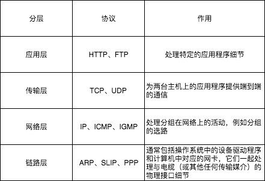
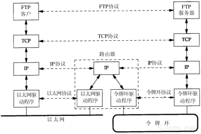

# 本篇说明
本系列为《tcp/ip 详解-卷1》浓缩，本篇为概述浓缩。 
红字为重要说明，橙字为不确定说明，绿字待定。

# 目录
- 概述
- 链路层
- 2.5 层
    - ARP
- 网络层
    - IP 协议
    - IP 路由
    - 动态路由
- 3.5 层
    - ICMP
    - IGMP
- 传输层
    - UDP
    - TCP
- 其他
    - 单播、广播、多播
    - 单工、半双工、全双工

# 概述
很多不同的厂家生产各种型号的计算机，它们运行完全不同的操作系统，但TCP/IP协议族允许它们互相进行通信。

## 分层
网络协议通常分不同层次进行开发，每一层分别负责不同的通信功能。TCP/IP协议族是一组不同层次上的多个协议的组合，其通常被认为是一个四层协议系统，尽管通常也称该协议族为TCP/IP，但TCP和IP只是其中的两种协议而已，如下图所示：

## 互联
一个互连网就是一组通过相同协议族互连在一起的网络。构造互连网最简单的方法是把两个或多个网络通过路由器进行连接。路由器的好处是为不同类型的物理网络提供连接：以太网、令牌环网、点对点的链接和FDDI（光纤分布式数据接口）等等。下面来看一个以太网与令牌环网互联的例子。

在上图中，我们注意到FTP应用程序通常是一个用户进程，而下三层则一般在（操作系统）内核中执行(通常是这样)。顶层与下三层之间还有另一个关键的不同之处。应用层关心的是应用程序的细节，而不是数据在网络中的传输活动。下三层对应用程序一无所知，但它们要处理所有的通信细节。

在上图中，列举了四种不同层次上的协议。FTP是一种应用层协议，TCP是一种传输层协议，IP是一种网络层协议，而以太网协议是一种链路层协议。但是，从表面上看，网络层和传输层之间的区别不那么明显。为什么要把它们分为两个不同的层次呢？

在TCP/IP协议族中，网络层IP提供的是一种不可靠服务。也就是说，它只是尽可能快地把分组从源站点送到目的站点，但是并不提供任何可靠性保证。而另一方面，TCP在不可靠的IP层上提供了一个可靠的传输层。为了提供这种可靠的服务，TCP采用了超时重传、发送和接收端到端的确认分组等机制。由此可见，传输层和网络层分别负责不同的功能。

## TCP/IP 分层
在TCP/IP协议族中，有很多种协议，如下图所示：

TCP和UDP是最著名的传输层协议，二者都使用IP作为网络层协议。虽然TCP使用不可靠的IP服务，但它却提供一种可靠的传输层服务。UDP为应用程序发送和接收数据报，但与TCP不同的是，UDP是不可靠的，它不能保证数据报安全无误地到达目的地。

IP是网络层上的主要协议，同时被TCP和UDP使用。TCP和UDP的每组数据都通过端系统和中间路由器的IP层在互联网中进行传输。ICMP是IP的附属协议，IP用它来与其他主机或路由器交换错误报文和其他重要信息。IGMP是Internet组管理协议，它把一个UDP数据报多播到多个主机。

ARP（地址解析协议）和RARP（逆地址解析协议）是某些网络接口（如以太网和令牌环网）使用的特殊协议，用来转换IP层与网络接口层的地址。

## 互联网地址
互联网上的每个接口必须有一个唯一的Internet地址（也称作IP地址）。IP地址长32位。IP地址具有一定的结构，五类不同的互联网地址格式如下图所示。

这些32位的地址通常写成四个十进制的数，其中每个整数对应一个字节。这种表示方法称作“点分十进制表示法(Dotted decimal notation)”，例：8.8.8.8。区分各类地址的最简单方法是看它的第一个十进制整数。如下图所示，列出了各类地址的起止范围，其中第一个十进制整数用黑体加粗表示。需要指出的是，多接口主机具有多个IP地址，其中每个接口对应一个IP地址。

由于互联网上的每个接口必须有一个唯一的IP地址，因此必须要有一个管理机构为接入互联网的网络分配IP地址。这个管理机构就是互联网络信息中心（Internet Network Information Centre），称作InterNIC。InterNIC只分配网络号。主机号的分配由系统管理员来负责。

## DNS
在TCP/IP中，域名系统（DNS）是一个分布式数据库，用它来提供IP地址与主机名称之间的映射。

## 封装
当应用程序用TCP传送数据时，数据被送入协议栈中，然后逐层通过直到被当作一串比特流送入网络。其中每一层对收到的数据都要增加一些首部信息（有时还要增加尾部信息），该过程下图所示。
TCP传给IP的数据单元称作TCP报文段或简称为TCP段（TCP segment）。IP传给网络接口的数据单元称作IP数据报(IP datagram)。通过以太网传输的比特流称作帧(Frame)。

更准确地说，上图中IP和网络接口之间传送的数据单元应该是分组（packet）。分组既可以是一个IP数据报，也可以是IP数据报的一个片（fragment）。  

由于TCP、UDP、ICMP和IGMP都要向IP传送数据，因此IP必须在生成的IP首部中加入某种标识，以表明数据属于哪一层。为此，IP在首部中存入一个长度为8bit的数值，称作协议域。1表示ICMP协议，2表示IGMP协议，6表示TCP协议，17表示UDP协议。

类似地，许多应用程序使用TCP或UDP来传送数据。传输层协议在生成报文首部时要存入一个应用程序的标识符。TCP和UDP都用一个16bit的端口号来表示不同的应用程序。TCP和UDP把源端口号和目的端口号分别存入报文首部中。

## 分用
当目的主机收到一个以太网数据帧时，数据就开始从协议栈中由底向上升，同时去掉各层协议加上的报文首部。每层协议都要去检查报文首部中的协议标识，以确定接收数据的上层协议。这个过程称作分解（Demultiplexing），如下图所示：

为协议ICMP和IGMP定位是一件很棘手的事情(个人更情愿取名3.5层)。把它们放在IP层的上方，这是因为ICMP和IGMP报文都被封装在IP数据报中，但是，又把它们放在TCP/UDP的下方，那是因为它们是IP的附属协议。

对于ARP和RARP，我们也遇到类似的问题(个人更情愿取名2.5层)。把它们放在以太网设备驱动程序的上方，这是因为它们被封装在以太网数据桢中(有自己的帧类型)，但是，又把它们放在IP层的下方，那是因为他们是作为以太网设备驱动程序的一部分在工作。

## 客户端-服务器模型
大部分网络应用程序在编写时都假设一端是客户端，另一端是服务器，其目的是为了让服务器为客户端提供一些特定的服务。

## 端口号
TCP和UDP采用16bit的端口号来识别应用程序。那么这些端口号是如何选择的呢？

任何TCP/IP所提供的服务都用知名的1～1023之间的端口号。这些知名端口号由IANA(Internet Assigned Numbers Authority)来管理，例：FTP 21、SSH 22、HTTP 80。

客户端通常对它所使用的端口号并不关心，只需保证该端口号在本机上是唯一的就可以了。客户端口号又称作临时端口号（即存在时间很短暂）。大多数TCP/IP分配的临时端口号处于1024～5000之间。大于5000的端口号是为其他服务预留的（Internet上并不常用的服务)。

## 标准化
究竟是谁控制着TCP/IP协议族，又是谁在定义新的标准？

- ISOC(Internet Society)是一个推动、支持和促进Internet不断增长和发展的专业组织，它把Internet作为全球研究通信的基础设施。
- IAB(Internet Architecture Board)是一个技术监督和协调的机构。它由国际上来自不同专业的15个志愿者组成，其职能是负责Internet标准的最后编辑和技术审核。IAB隶属于ISOC。
- IETF(Internet Engineering Task Force)是一个面向近期标准的组织，它分为9个领域(应用、寻径和寻址、安全等等)。IETF开发能够成为Internet标准的规范。为帮助IETF主席，又成立了IESG(Internet Engineering Steering Group)。
- IRIF(Internet Research Task Force)主要对长远的项目进行研究。

## RFC
所有关于Internet的正式标准都以RFC（Request for Comment）文档出版。另外，大量的RFC并不是正式的标准，出版的目的只是为了提供信息。

## internet & Internet
internet是一个用共同的协议族把多个网络连接在一起，而Internet是指世界范围内通过TCP/IP互相通信的所有主机集合。Internet是一个internet，但internet不等于Internet。

## 实现
既成事实标准的TCP/IP实现来自于伯克利的加利福尼亚大学的计算机系统研究小组。从历史上看，软件是随同4.x BSD系统（Berkeley Software Distribution）的网络版一起发布的。它的源代码是许多其他实现的基础。

## 应用编程接口
使用TCP/IP协议的应用程序通常采用两种应用编程接口（API）：socket和TLI（传输层接口：Transport Layer Interface）。前者有时称作“Berkeley socket”，表明它是从伯克利版发展而来的。后者起初是由AT&T开发的，有时称作XTI（X/Open传输层接口），以承认X/Open这个自己定义标准的国际计算机生产商所做的工作。XTI实际上是TLI的一个超集。

# 其他
## 单工、半双工、全双工

单工 **:** 支持数据在固定方向上传输，例：电视、广播 
半双工 **:** 支持数据在两个方向上传输，但不能同时传输，例：对讲机 
全双工 **:** 支持数据在两个方向上同时传输，例：电话 

# 参考引用
0. [tcp/ip详解-卷1](https://book.douban.com/subject/1088054/)
0. [单工，半双工和全双工有何区别和联系？](https://zhidao.baidu.com/question/58243700.html)
