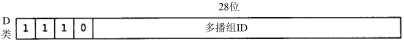
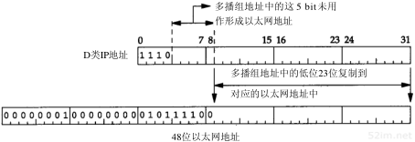

# 本篇说明
本系列为《tcp/ip 详解-卷1》浓缩，本篇为广播与多播浓缩。 
红字为重要说明，橙字为不确定说明，绿字待定。

# 广播与多播
在概述中我们提到有三类IP地址：单播地址、广播地址和多播地址。单播即为点对点之间的通信，广播为向一个网络上的所有主机发送数据报，多播则处于单播和广播之间，即向一个多播组内的所有主机发送数据报。

## 帧过滤
为了弄清广播和多播，需要了解主机对传送过来的帧的过滤过程，如下图所示：

首先，网卡查看由信道传送过来的帧，确定是否接收该帧，若接收就将它传给设备驱动程序，通常网卡仅接收那些目的地址为网卡物理地址或广播地址的帧。另外，多数接口均被设置为混合模式，这种模式能对每个帧进行复制，作为一个例子，tcpdump使用的就是这种模式。

接下来，设备驱动程序进行帧类型过滤和多播过滤，检查帧中是否指明了要使用的协议，检测该主机是否属于多播地址说明的多播组。

接下来，设备驱动程序将数据帧传输给下一层，比如，当帧类型指定为IP数据报时，就传往IP层。IP根据IP地址中的源地址和目的地址进行更多过滤，如果正常，就将数据报传输给下一层（如TCP或UDP）。

接下来，当UDP收到由IP传输过来的数据报，就根据目的端口号和源端口号进行过滤。如果当前没有进程使用该目的端口号，就丢弃该数据报并产生一个ICMP不可达报文（TCP根据它的端口号作相似的过滤）。

### 广播的问题
使用广播的问题在于它增加了对广播数据不感兴趣的主机的处理负荷。已一个UDP广播应用作为例子，如果网内有50个主机，但仅有20个主机参与该广播应用，每次这20个主机中的某一个发送UDP广播数据时，其余30个主机不得不处理这些广播数据报，一直到UDP层才会丢弃该广播数据报，因为这30个主机没有使用那个广播端口。

多播的出现减少了对应用不感兴趣的主机的处理负荷。使用多播，主机可加入一个或多个多播组，这样，网卡将获悉该主机属于哪个多播组，然后仅接收主机所在多播组的那些多播帧。

## 广播
回忆ip一节中，我们知道了4种广播地址，下面来进一步看一看：

### 受限的广播
受限的广播地址是255.255.255.255，在任何情况下，路由器都不转发目的地址为受限的广播地址的数据报，这样的数据报仅出现在本地网络中。

### 指向网络的广播
指向网络的广播地址是主机号为全1的地址。A类网络广播地址为netid.255.255.255，其中netid为A类网络的网络号。一个路由器必须转发指向网络的广播，但它也必须有一个不转发的选择。

### 指向子网的广播
指向子网的广播地址是主机号为全1且有特定子网号的地址。作为子网广播地址的IP地址需要了解子网的掩码。例，如果路由器收到发往128.1.2.255的数据报，当B类网络128.1的子网掩码为255.255.255.0时，该地址就是指向子网的广播地址；但如果该子网的掩码为255.255.254.0，该地址就不是指向子网的广播地址。

### 指向所有子网的广播
指向所有子网的广播也需要了解目的网络的子网掩码，以便与指向网络的广播地址区分开。指向所有子网的广播地址的子网号及主机号为全1。例如，如果目的子网掩码为255.255.255.0，那么IP地址128.1.255.255就是一个指向所有子网的广播地址。然而，如果没有划分子网，它就是一个指向网络的广播。

## 多播
多播提供两类服务：

- 向多个目的地址传送数据，例：交互式会议系统。
- 客户对服务器的请求，例：无盘工作站需要确定启动引导服务器。目前，这项服务是通过广播来提供的，但是使用多播可降低不提供这项服务主机的负担。

### 多播组地址
多播组地址包括最高4bit为1110和28bit的多播组号，范围从224.0.0.0到239.255.255.255，如下图所示：

能够接收发往一个特定多播组地址数据的主机集合称为主机组。一个主机组可跨越多个网络，主机组中的成员可随时加入或离开，主机组对主机的数量没有限制，同时不属于某一主机组的主机可以向该组发送信息。

一些多播组地址被IANA确定为知名地址，它们也被当作永久主机组，虽然这些主机组是永久的，但组成员却不是永久的。例：224.0.1.1用作NTP网络时间协议，224.0.0.9用作RIP-2协议。

### 多播组地址到以太网地址的转换
IANA拥有一个以太网地址块(一个以太网地址是48bit)，即高24bit为00:00:5e，这意味着该地址块范围从00:00:5e:00:00:00到00:00:5e:ff:ff:ff。IANA将其中的一半分配为多播地址，为了指明一个多播地址，任何一个以太网地址的首字节必须是01，这意味着与IP多播相对应的以太网地址范围从01:00:5e:00:00:00到01:00:5e:7f:ff:ff。

通过将多播组号中的低位23bit映射到以太网地址中的低位23bit，建立了以太网多播地址与ip多播地址的联系，这个过程如下图所示：

### 多播帧过滤
由于多播组号中的高5bit在映射过程中被忽略，因此每个以太网多播地址对应的多播组不是唯一的。例：下表中的两个多播ip地址都映射为同一以太网地址01:00:5e:00:40:20。

|ip地址|16进制|二进制|
|---|---|---|
|224.128.64.32|e0.80.40.20|1110 0000 1-000 0000 0100 0000 0010 0000|
|224.0.64.32|e0.00.40.20|1110 0000 0-000 0000 0100 0000 0010 0000|

既然地址映射不是唯一的，那么设备驱动程序或IP层就必须对数据报进行过滤，因为网卡可能接收到主机不想接收的多播数据帧。

> 局域网网卡趋向两种处理类型：
> - 一种是网卡根据多播地址的散列值进行过滤，这意味着仍会接收到不想接收的多播数据
> - 一种是网卡只接收一些固定的多播地址，这意味着当主机想接收更多的多播地址时，必须将网卡设置为“多播混杂”模式。

> 因此，这两种类型的网卡仍需要设备驱动程序对帧进行过滤。

> 即使网卡实现了完美的多播过滤，由于D类IP地址到48 bit以太网地址的映射不是唯一的，过滤仍然是必要的。尽管存在地址映射的不完美和需要硬件过滤的不足，多播仍然比广播好。

# 参考引用
0. [tcp/ip详解-卷1](https://book.douban.com/subject/1088054/)
