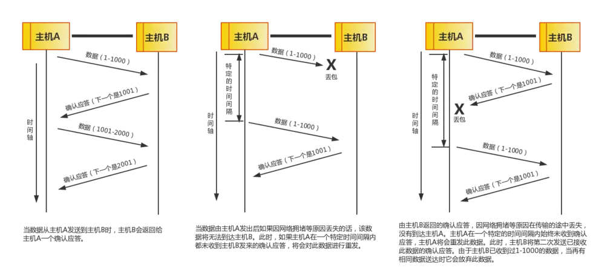

# 本篇说明
本篇介绍tcp协议，红字为重要说明，橙字为不确定说明，绿字待定。 

# tcp和udp
tcp/ip协议族中有两个具有代表性的传输层协议，tcp和udp。

- tcp **:** 面向连接的、可靠的流协议。 
    连接：在建立连接之前，需要确认对端的存在，并非你脑海中管道一样的东西。 
    可靠：tcp会确保数据送达对端，不会丢失 
    流：不间断的数据结构
- udp **:** 面向无连接的、不可靠的数据报协议。 
    无连接：发数据之前，不会确认对端是否存在，只管发 
    不可靠：udp不会像tcp一样确保数据送达对端，这需要应用自己处理 
    数据报：待解释
- tcp与udp对比 **:** 
    tcp：更适合对可靠性有要求的应用 
    udp：更适合对实时性有要求的应用

## 端口号
链路层和网络层中的地址，分别指mac地址和ip地址。前者用来识别同一链路中不同的计算机，后者用来识别tcp/ip网络中互连的主机和路由器。 
在传输层也有类似地址的概念，那就是端口号。端口号用来识别同一计算机中不同的应用程序。因此，它也被称为程序地址。

### 识别应用
下图为传输层协议利用端口号识别应用程序

### 识别通信

- 仅凭目标端口号识别某一个通信是远远不够的
- ①、② 可通过源端口号区分，① 和 ③ 可通过源ip地址区分
- 当ip地址和端口号全都一样时，可通过协议号(tcp和udp)来区分

注：同一个端口号可同时由不同的应用监听，只要应用使用不同的传输层协议即可。

### 端口号的确定
- 固定端口，常见应用程序都有其固定的端口，如：ssh22，http80
- 时序分配，应用程序将端口交给OS分配，其范围为49152~65535

注：端口号可任意分配，当然，占用固定端口是不好的

# tcp首部
待完善...

# 3次握手
3次握手是指建立一个tcp连接时需要客户端和服务端总共发送3个包以确认连接的建立。 
在socket编程中，这一过程由客户端执行connect来触发。

- 第1次握手：客户端设置SYN=1、seq=J并将其发送给服务端，随后进入SYN_SENT状态以等待服务端确认。
- 第2次握手：服务端收到SYN=1，知道客户端请求建立连接，随后设置SYN=1、ACK=1、ack=J+1、seq=K并将其发送给客户端以确认请求，服务端进入
    SYN_RCVD状态。
- 第3次握手：客户端收到包后，检查ACK==1、ack==J+1，如果正确则设置ACK=1，ack=K+1并将其发送给服务端，服务端检查ACK==1、ack==K+1，如果正确则连接成功，客户端和服务端进入ESTABLISHED状态。
- 为什么需要3次握手：双方都需要通知对方自己的Sequence Number，作为以后数据通信的序号

# 4次挥手
4次挥手是指断开一个tcp连接时需要客户端和服务端总共发送4个包以确认连接的断开。 
在socket编程中，这一过程由客户端或服务端任意一方执行close来触发。

## 单方关闭

- 第1次挥手：客户端发送FIN=M，用来关闭客户端到服务端的数据传送，客户端进入FIN_WAIT_1状态。
- 第2次挥手：服务端收到FIN=M后，先发送ack=M+1，然后进入CLOSE_WAIT状态。客户端收到报文后，进入FIN_
    WAIT_2状态并继续等服务端的FIN=N报文。
- 第3次挥手：当服务端确定数据已发送完成，则向客户端发送FIN=N报文，随后进入LAST_ACK状态。
- 第4次挥手：客户端收到FIN=N报文后，发送ACK=1、ack=N+1后进入TIME_WAIT
    状态，如果服务端没有收到ACK则可以重传。服务端收到ACK后，则断开连接进入CLOSED状态。客户端等待2MSL后依然没有收到回复，则断开连接。

## 同时关闭

- 为什么需要4次挥手：因为tcp是全双工协议，所以发送方和接收方都需要FIN和ACK报文。如果是不是同时关闭的情况，看上去就像是4次挥手。
- 为什么第4次挥手后等待时间是2MSL
    - MSL：一个报文的最大生存时间
    - 客户端发送ack报文后，并不知道服务端收到ack报文没有，因此有两种情况
         1）服务端收到ack报文，不会再发任何消息并关闭连接
         2）服务端没有收到ack报文，会重发FIN=N报文
         无论哪种情况都需要等待，取最坏的情况，则是“去向ACK的最大生存时间+来向FIN的最大生存时间”，因此是2MSL
- 为什么第4次挥手后需要等待2MSL
    - 有足够的时间让对方收到ack报文
    - 有足够的时间让旧连接不会跟新连接混在一起，因为某些路由器可能缓存数据包

# 可靠传输
- 序列号
     对于接收端说，重复收相同的数据是不可取的。为了对上层提供可靠传输，接收端必须放弃重复的数据，为此引入了序列号。
- 确认应答
     当发送端的数据到达接收端时，接收端回复一个确认收到的消息，这个消息叫确认应答(ack)。
     注意：SeqNum和Ack是以字节数为单位，所以ack的时候，不能跳着确认，只能确认最大的连续收到的包，不然发送端就以为之前的都收到了，这就无法保证可靠传输了。
- 超时重传
     当经过一段时间发送端仍然没有收到ack，则认为数据已经丢失需要重发。由此，即便丢包也能保证可靠传输。
- 传输机制
     序列号是按照顺序给发送数据的每一个字节都标上编号，接收端根据TCP首部中的序列号和数据长度，将自己下一步需要接收的序列号作为ack发送回去。
     通过序列号与确认应答号，TCP能够识别数据是否需要发送与已经接收，从而实现可靠传输。
    

# 超时重传
- RTT
     Round Trip Time，即一个报文从发出到收到ack的时间
- RTO
     Retransmission TimeOut，即重传超时时间

tcp每发出一个报文，就会启一个定时器来监测此报文是否送达对端，一旦超时就会重发此报文。因此这个超时时间的设置就显得非常重要：设长了，重发慢，效率低；设短了，可能导致没有丢就重发，增加网络拥塞。
 为了解决此问题，tcp会测量RTT，根据RTT就可以轻松地设置超时时间即RTO了。听起来好像很简单，只要发的时候记t1，收的时候记t2，则 RTT = t2 - t1，然而这只是一个采样。

## RTO算法
    SRTT = SRTT + α (RTT – SRTT)  计算平滑RTT
    DevRTT = (1 - β) * DevRTT + β * (|RTT - SRTT|) 计算DevRTT(Deviation RTT)
    RTO = µ * SRTT + ∂ *DevRTT 计算RTO
以上参数在linux下的取值分别是α = 0.125，β = 0.25，μ = 1，∂ = 4，nobody knows why, it just works …

# 滑动窗口
## MSS
- 在建立TCP连接的同时会确定发送数据的的单位，也被称为最大消息长度(MSS)。最理想的情况是，最大消息长度正好是IP中不会被分片处理的最大数据长度(即1500-40=1460)。
- 在建立连接时，两端主机通过在TCP首部中写入MSS选项来告诉对方自己能够适应的MSS大小，然后会在两者中选一个较小值投入使用。

## 窗口
- TCP已段为单位，每发送一个段收一个ack，这样的传输方式效率太低，为此引入了“窗口”的概念。
- 引入窗口后，发送端可发送多个段而不必等待ack，接收端也可对多个段作确认应答。窗口既是指无需等待ack而可以连续发送的字节序列集合。如下图所示：窗口为4个段
  
- 窗口内的确认应答，在ack未能返回且数据已送达对端的情况下，可由后续的ack确认，如下图所示
      

## 滑动窗口与拥塞窗口
- 滑动窗口，用于流控的可动态缩放的发送与接收窗口，防止发送端发送过快淹没接收端
- 拥塞窗口，在一个RTT内可发送的最大报文段数，用于发送方的流量控制

## 发送窗口
  
发送方任何时候其发送缓存内的数据都可以被分为4类，如上图所示，其中第2、3部分为发送窗口 

- #1 已发送且收到ack的
- #2 已发送但还未收到ack的
- #3 未发送但对端允许发送的
- #4 未发送且对端不允许发送的

对于发送方，发送窗口既是滑动窗口，下图为滑动后的示意图(收到36的ack，发送窗口由32~51滑动到37~56)
    

- 如何决定发送窗口的大小
 发送窗口的大小为拥塞窗口与对端接收窗口间的较小值，既 swnd = min(cwnd, rwnd)

## 接收窗口
  
接收方任何时候其接收缓存内的数据都可以被分为3类，如上图所示，其中第3部分为接收窗口 

- #1+2 已接收且已ack，但还没有被应用处理，仍然占用缓冲区
- #3 未接收准备接收
- #4 未接收不准备接收

## 发送窗口与接收窗口的关系
因为TCP是全双工协议，会话双方都可以同时发送和接收数据，所以双方都维护着一个发送窗口和接收窗口，参考下图
  

- 接收窗口的大小取决于应用、系统、硬件等限制

## 窗口滑动协定
窗口有3种动作：闭合(左沿向右滑动)、展开(右沿向右滑动)、收缩(右沿向左滑动)

- 收缩，RFC 强烈不鼓励这种做法，但TCP必须能够在一端发生这种情况时进行处理
- 左沿，left edge of swnd，参考“发送窗口”一节中的图
- 右沿，right edge of swnd，参考“发送窗口”一节中的图

对于发送窗口和接收窗口，都有这3种动作

- 发送窗口
    - 闭合，数据已发送且收到ack时发生
    - 展开，收到对端接收窗口有可用字节时发生，即对端应用读取了已确认的数据且释放了接收缓冲区
    - 收缩，表示本来可以发送的，现在不可以发送；但如果收缩的是已经发出的数据就会给发送端带来问题，为了避免这种情况，接收端会等到接收缓存有可用空间时才进行通信。
- 接收窗口
    - 闭合，数据ack时发生(只有当收到的数据是连续的时候才会ack，如果有间断则不会对间断的数据ack)
    - 展开，数据已ack且被应用取走时发生
    - 收缩，待定
- 1字节探测包和0通告窗口
    - 当接收端发送rwnd=0的ack时，表示不再接收数据。这种情况下，发送端不是把窗口收缩而是停止发送数据，直至收到rwnd!=0的ack
    - 为了避免死锁，发送端会用定时器发送1字节的探测包来解除这种情况。

## 滑动窗口的作用
- 提高传输效率
    - 窗口可以发送多个段
- 保证可靠传输
    - 发送方，未确认的数据必须被缓存起来
    - 接收方，乱序的数据必须被缓存起来
- 保证流控特性
    - 发送方发送太快就必须阻塞等待

## 流量控制
下面来看一个接收窗口控制发送窗口的示意图
  

# 拥塞控制
- 网络中的链路容量、交换结点中的缓存、处理机都有着其工作极限，当网络需求超过它们的工作极限时，就出现了拥塞。
- 拥塞控制就是防止过多的数据注入到网络中，这样可以使网络中的路由器或链路不致过载。
- 有了流量控制，为什么还需要拥塞控制？
    - 流控只代表接收方的处理能力，并不代表中间网络的处理能力
    - 如果一开始就把窗口内的数据全部发送出去，中间网络可能一时处理不了如此多的突发流量

## 慢启动与拥塞控制
- 目的
    - 拥塞发生时，循序减少主机发送到网络的数据以减轻网络的压力
- 过程
    - 发送方维护两个状态变量，一个为“拥塞窗口(cwnd)”的状态变量，一个为“慢开始阀值(ssthresh)”的状态变量
        - 注意拥塞窗口与发送窗口的区别，拥塞窗口的单位是报文段，发送窗口的单位是字节
        - 拥塞窗口的变化原则是：只要网络没有发生拥塞，拥塞窗口就再增大一些，一旦网络拥塞，拥塞窗口就减小一些
    - 当主机开始发送数据时，将cwnd置为1，并试探性的发送1个报文段，已避免过多的数据注入网络导致拥塞
    - 每经过一个RTT，cwnd = cwnd * 2
    - 最终cwnd到达预设的ssthresh，停止使用慢开始算法，改用拥塞避免算法
        - “慢”开始的慢不是指cwnd的增长速率慢，而是指一开始将cwnd置为1，然后逐渐增大cwnd
        - 当cwnd < ssthresh，使用慢开始算法
        - 当cwnd > ssthresh，使用拥塞避免算法
    - 拥塞避免算法是指：每经过一个RTT，cwnd = cwnd + 1，如此，cwnd按线性增长不再按指数增长
    - 最终会出现网络拥塞，停止使用拥塞避免算法，重设 ssthresh = cwnd / 2，cwnd = 1 两个变量，开始新一轮慢开始算法
- 示意图
      

## 快重传与快恢复
- 目的
    - 减少数据包丢失(因网络拥塞导致)的重传时间
- 过程
    - 接收方每收到一个失序的报文段后就立即发出重复确认，而不是等到自己发送数据时才捎带确认
    - 发送方一旦收到3个重复的ack就判定网络拥塞但不是非常拥塞，并执行以下操作
        - 立即重传丢失的包，而不是等到重传计时器超时才重传
        - 执行快恢复算法
            - 设 cwnd = ssthresh = cwnd / 2，执行拥塞避免算法
- 示意图
      

# 传输效率
## nagle与捎带确认

# 参考文献
0. [一篇文章带你熟悉TCP/IP协议](https://www.jianshu.com/p/9f3e879a4c9c)
0. [TCP 的那些事儿（上） | | 酷 壳 - CoolShell](https://coolshell.cn/articles/11564.html)
0. [TCP 的那些事儿（下） | | 酷 壳 - CoolShell](https://coolshell.cn/articles/11609.html)
0. [TCP 窗口 | Jacks Blog](https://blog.dreamtobe.cn/tcp-window/)
0. [TCP/IP之TCP协议：流量控制（滑动窗口协议） - 文章 - 伯乐在线](http://blog.jobbole.com/105500/)
0. [TCP滑动窗口 - yiyeguzhou100的专栏 - CSDN博客](https://blog.csdn.net/yiyeguzhou100/article/details/51760507)
0. [滑动窗口机制 - 我有一个梦想 - CSDN博客](https://blog.csdn.net/ljlstart/article/details/51340829)
0. [滑动窗口和拥塞窗口 - qq_33436509的博客 - CSDN博客](https://blog.csdn.net/qq_33436509/article/details/81979024)
0. [TCP 滑动窗口（发送窗口和接收窗口） - 建建的博客 - CSDN博客](https://blog.csdn.net/u013898698/article/details/61615356)
0. [关于TCP/IP，必须知道的十个知识点 - u012371712的博客 - CSDN博客](https://blog.csdn.net/u012371712/article/details/80795297)
0. [请列出至少三种TCP拥塞控制机制，并请就其中一种描述其工作原_猿辅导笔试题_牛客网](https://www.nowcoder.com/questionTerminal/10752827d8ff4b9d9b307c7432b58826?toCommentId=1543965)
0. [为什么TCP4次挥手时等待为2MSL？ - 知乎](https://www.zhihu.com/question/67013338)