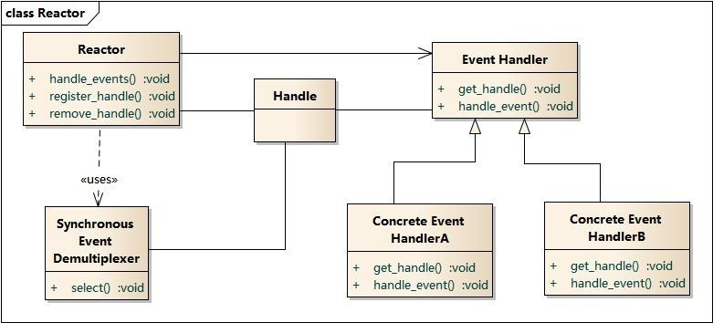
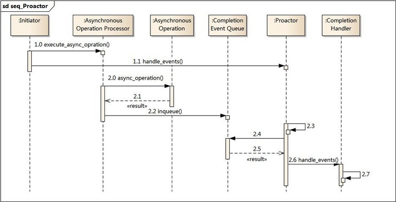

# NIO
## 与io区别
- io，面向流的阻塞io模型
- nio，面向缓冲区的多路io复用模型

## 同步、异步、阻塞、非阻塞
- 涉及概念
    - 线程、锁、io、用户空间、内核空间
- 定义
    - 同步，发起一个调用，在得到结果后返回
    - 异步，发起一个调用，不得到结果就返回，结果由被调用者通知回来
    - 阻塞，发起一个调用，该调用会阻塞线程直至得到结果
    - 非阻塞，发起一个调用，该调用不会阻塞线程而会立刻返回
- 区别
    - 同步与异步，该调用是否由调用者发起并完成
    - 阻塞与非阻塞，该调用是否会阻塞线程
- 从调用者角度出发，在限定调用的场景下作一个相对合理的解释
    - 普通调用
        - 没有同步异步、阻塞非阻塞之分，均为同步非阻塞调用
    - 锁调用
        - 没有同步异步之分，均为同步调用
        - 因为锁的特性，有阻塞与非阻塞之分

            ```java
            // 阻塞
            lock.lock()
            // 非阻塞
            lock.tryLock()
            ```
    - io调用
        - 因为io的特性，有同步异步、阻塞非阻塞之分
        - 同步，由用户空间线程发起调用并等待操作完成

            ```java
            // 阻塞
            socket.getInputStream().read()
            // 非阻塞[此场景没有实际使用意义，因为它会消耗CPU]
            // 非阻塞适用于多路io复用模型
            socket.getChannel().configureBlocking(false);
            while ((len = socket.getChannel().read(byteBuffer)) != -1) {
                // do something
            }
            ```
        - 异步，由用户空间线程发起调用且不等待操作完成，之后由内核空间完成操作并通知用户空间线程
            - java
                - nio，此模式并非异步io，因为io操作是由用户空间线程完成
                - aio，此模式也非异步io，因为它是由java平台开启线程池模拟内核空间完成io操作后通知用户空间线程
                - java为什么不能提供异步io？
                    - 只有win提供了异步io(iocp)支持，而mac/linux提供的都是多路io复用模型(kqueue/epoll)
        - 同步与异步区别
            - 同步是由用户空间发起调用并完成操作，异步是由用户空间发起调用内核空间完成操作

## 实现
- linux，select/poll/epoll
    - epoll工作模式
        - LT 通知多次，应用可以不立即处理事件，下次还会通知
        - ET 通知一次，应用必须立即处理事件，之后不再通知
            - 不重复通知进一步提高了效率，但是使用ET，必须使用非阻塞socket，以免某个文件句柄的阻塞读/写把其他文件句柄的处理饿死
- win，iocp
- mac，kqueue

## io设计模式
### reactor
- 类图
    <br><br>
    <br><br>各角色说明：
    - Reactor：反应器，定义一个接口，实现以下功能：
        - 1）供应用程序注册和删除关注的事件句柄
        - 2）运行事件循环
        - 3）有就绪事件时，分发事件给之前注册的回调函数
    - Synchronous Event Demultiplexer：同步事件多路分离器
        - 由操作系统内核实现的一个函数，如：select、poll、epoll
        - 用于阻塞等待发生在句柄集合上的一个或多个事件
        - 此实现一般是单线程
    - Handle 句柄：用来标识socket连接或是打开文件；
    - Event Handler：事件处理接口
    - Concrete Event HandlerA：实现应用程序所提供的特定事件处理器
- 时序图
    <br><br>
- 实现
    - 待补充

### proactor
- 类图
    <br><br>
    <br><br>各角色说明如下：
    - Asynchronous Operation Processor：异步操作处理器，负责执行异步操作，一般由操作系统内核实现
    - Asynchronous Operation：异步操作
    - Completion Event Queue：完成事件队列
    - Proactor：主动器，为应用程序提供事件循环；从完成事件队列中取出操作结果，分发调用相应的事件处理器
        - 此实现是多线程的
    - Handle 句柄：用来标识socket连接或是打开文件
    - Completion Handler：完成事件接口
    - Concrete Completion Handler：实现特定的应用处理逻辑
- 时序图
    <br><br>
- 实现
    - 待补充

### 两者区别
- 实现
    - reactor 实现了一个被动的事件分离和分发模型
    - proactor 实现了一个主动的事件分离和分发模型
- 优点
    - reactor 实现简单，对于耗时短的场景处理高效
    - proactor 性能更高，能够处理耗时长的并发场景
- 缺点
    - reactor 处理耗时长的操作会造成事件分发的阻塞，影响到后续事件的处理
    - proactor 依赖操作系统对异步的支持
- 适用场景
    - reactor 同时接收多个服务请求，并依次同步的处理它们的事件驱动程序
    - proactor 异步接收和同时处理多个服务请求的事件驱动程序
- 以上，不能这么简单的评判这两个模型
    - os对异步io支持有限，所以服务端应用基本是reactor模式
    - reactor模式中事件分离器虽然是单线程，但是
        - linux下使用epoll的ET模式，则可以使用多线程的事件分离器
        - 即便是单线程的reactor，也可以高效的处理事件分发
            - redis，因为直接读写内存，所以它也高效
            - netty，将事件封装后甩给独立的工作线程池来处理，这样就分离了事件分发和事件处理
    - 是否高效，还得看具体的应用和设计

# FAQ
0. 乱码毛病<br>
    -Dfile.encoding=UTF-8
0. Method.isBridge()
    - 泛型接口和实现

            public interface AInterface<T> {
                void func(T t);
            }

            public class AClass implements AInterface<String> {
                @Override
                public void func(String s) {
                    System.out.println(s);
                }
            }
    - 虚拟机擦除泛型后的样子

            public interface AInterface {
                void func(Object t);
            }

            public class AClass implements AInterface {
                public void func(String s) {
                    System.out.println(s);
                }
                // 虚拟机自动生成的桥接方法
                public void func(Object s) {
                     this.func((String) s);
                }
            }


0. System.nanoTime() & System.currentTimeMillis()<br>
    currentTimeMillis，起始时间基于1970.01.01 00:00:00.000<br>
    nanoTime，基于CPU核心启动时间计算而成，在现代多核处理器上，不能用来计算时间差、确定时间等等


# 参考引用
0. [Java反射中method.isBridge()由来,含义和使用场景?](https://www.zhihu.com/question/54895701)
0. [System.nanoTime()的隐患](https://hold-on.iteye.com/blog/1943436)
0. [Java NIO：浅析I/O模型](https://blog.yoodb.com/yoodb/article/detail/1498)
0. [IO设计模式：Reactor和Proactor对比 - 大CC - SegmentFault 思否](https://segmentfault.com/a/1190000002715832)
0. [怎样理解阻塞非阻塞与同步异步的区别？ - 知乎](https://www.zhihu.com/question/19732473)
0. [深入理解并发 / 并行，阻塞 / 非阻塞，同步 / 异步 - 后端 - 掘金](https://juejin.im/entry/58ae4636b123db0052b1caf8)