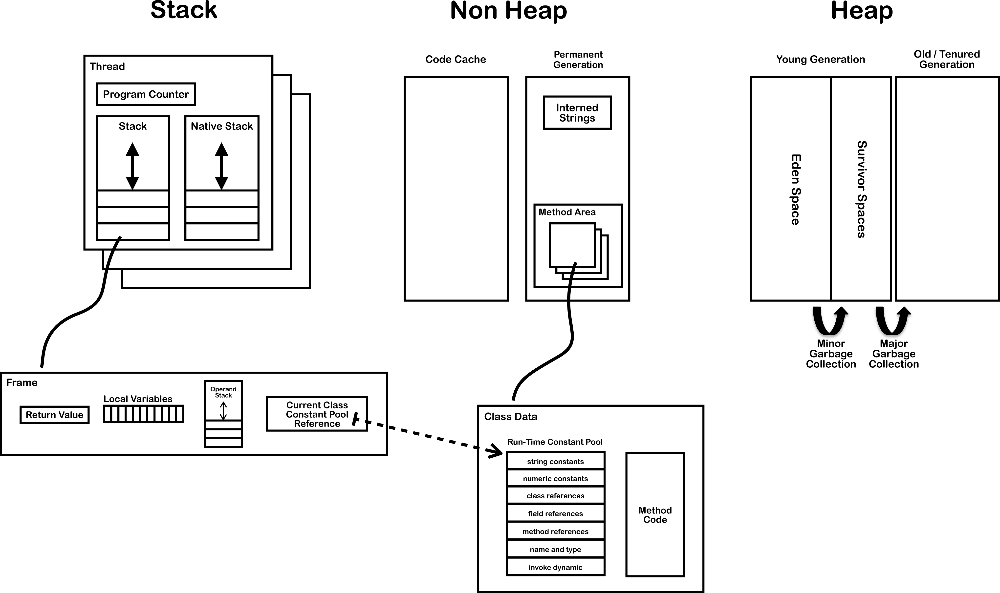

# 运行时数据区
- 文字描述
    - 类加载器
    - 代码缓存 永久代 堆 栈 本地方法栈 程序计数器
        - 栈
            - 栈桢[本地变量表/操作数/返回值/class引用]
        - 堆
            - 新生代[eden/s0/s1]
            - 老年代
        - 永久代
            - 字符串常量池
            - 方法区[运行时常量池]
    - 执行引擎
        - 即时编译器
        - 垃圾收集器
    - 本地库接口
        - 本地方法库
- 图片描述
    

## 字面值
- 定义，双引号包起来的字符串称为字面值
- 存放位置，字面值对象被分配在堆上，由字符串常量池存储

## 字符串常量池
- 所在位置
    - 6 永久代
    - 7 堆
- intern区别
    - 6 如果string pool没有值，在堆上新分配一个对象，并存入string pool
    - 7 如果string pool没有值，不在堆上新分配对象，直接将当前对象存入string pool

# gc
## gc算法及收集器
- 复制[复制存活对象]
    - 使用eden+s0，复制存活对象至s1，使用eden+s1，复制存活对象至s0，如此循环
- 标记整理
    - serial old/parallel old
- 标记清除
    - cms

## gc组合
- serial + serial old
- parallel scavenge + parallel old
- parnew + cms
- g1

## gc分类
    partial gc
        young gc  [收集新生代]
        old gc    [收集老年代，只有CMS的concurrent collection是这个模式]
        mixed gc  [收集新生代和部分老年代，只有G1有这个模式]
    full gc       [收集新生代、老年代、永久代]
    major gc      [通常跟full gc等价，但一定要问清楚是仅指old gc还是full gc]

## gc大致触发条件
新生代/老年代/永久代耗尽则触发gc

- full gc直接触发条件
    - 新生代晋升时，老年代内存不足
    - 分配大对象时，老年代内存不足
    - 永久代耗尽
    - System.gc()
    - heap dump
- serial/parallel组合
    - young gc [eden区耗尽]
    - full gc
        - 当准备触发young gc时，如果之前的统计数据说明young gc的平均晋升大小 > old gen的剩余空间，则不会触发young gc转而触发full gc
        - parallel gc会默认触发一次young gc以减轻full gc的负担，两次gc之间能让应用稍微运行一下
- parnew/cms组合
    - young gc [eden区耗尽]
    - old gc   [老年代使用率超过阀值]
    - full gc  [cms gc失败]

# 类加载器
- bootstrap/ext/app
- 安全
- SPI & ThreadContextClassLoader

# 执行引擎

# jvm配置
- 内存配置

        -server
        -Xms1024m
        -Xmx1024m
        -XX:NewRatio=1
        -XX:PermSize=256m
        -XX:MaxPermSize=256m
        -XX:ReservedCodeCacheSize=128m
        -XX:+UseCodeCacheFlushing
- gc配置

        -XX:+UseConcMarkSweepGC
        -XX:+UseCMSInitiatingOccupancyOnly
        -XX:CMSInitiatingOccupancyFraction=75
        -XX:+ExplicitGCInvokesConcurrent
        -XX:+ExplicitGCInvokesConcurrentAndUnloadsClasses
- 日志配置

        -Xloggc:/C:/Program Files (x86)/JetBrains/IntelliJ IDEA 13.1.6/idea-gc.log
        -XX:+PrintGCCause
        -XX:+PrintGCDateStamps
        -XX:+PrintGCDetails
        -XX:+PrintGCApplicationStoppedTime
        -XX:+PrintPromotionFailure
- 崩溃配置

        -XX:ErrorFile=/C:/Program Files (x86)/JetBrains/IntelliJ IDEA 13.1.6/idea-hs_err_%p.log
        -XX:HeapDumpPath=/C:/Program Files (x86)/JetBrains/IntelliJ IDEA 13.1.6/
        -XX:+HeapDumpOnOutOfMemoryError
- 调优配置

        -Dfile.encoding=UTF-8

# 参考引用
0. [聊聊JVM（七）一张图说明JVM运行时状态 - ITer_ZC的专栏 - CSDN博客](https://blog.csdn.net/ITer_ZC/article/details/41853855)
0. [JVM Internals](http://blog.jamesdbloom.com/JVMInternals.html)
0. [java用这样的方式生成字符串：String str = "Hello"，到底有没有在堆中创建对象？ - 知乎](https://www.zhihu.com/question/29884421)
0. [如何理解《深入理解java虚拟机》第二版中对String.intern()方法的讲解中所举的例子？ - 知乎](https://www.zhihu.com/question/51102308)
0. [请别再拿“String s = new String("xyz");创建了多少个String实例”来面试了吧 - Script Ahead, Code Behind - ITeye博客](https://rednaxelafx.iteye.com/blog/774673)
0. [What are the main differences between the Z Garbage Collector and the Shenandoah Garbage Collector in Java? - Quora](https://www.quora.com/What-are-the-main-differences-between-the-Z-Garbage-Collector-and-the-Shenandoah-Garbage-Collector-in-Java)
0. [图解CMS垃圾回收机制，你值得拥有 - 简书](https://www.jianshu.com/p/2a1b2f17d3e4)
0. [Major GC和Full GC的区别是什么？触发条件呢？ - 知乎](https://www.zhihu.com/question/41922036)
0. [触发Full GC的时机 - J.M.Liu - 博客园](https://www.cnblogs.com/JMLiu/p/8482437.html)