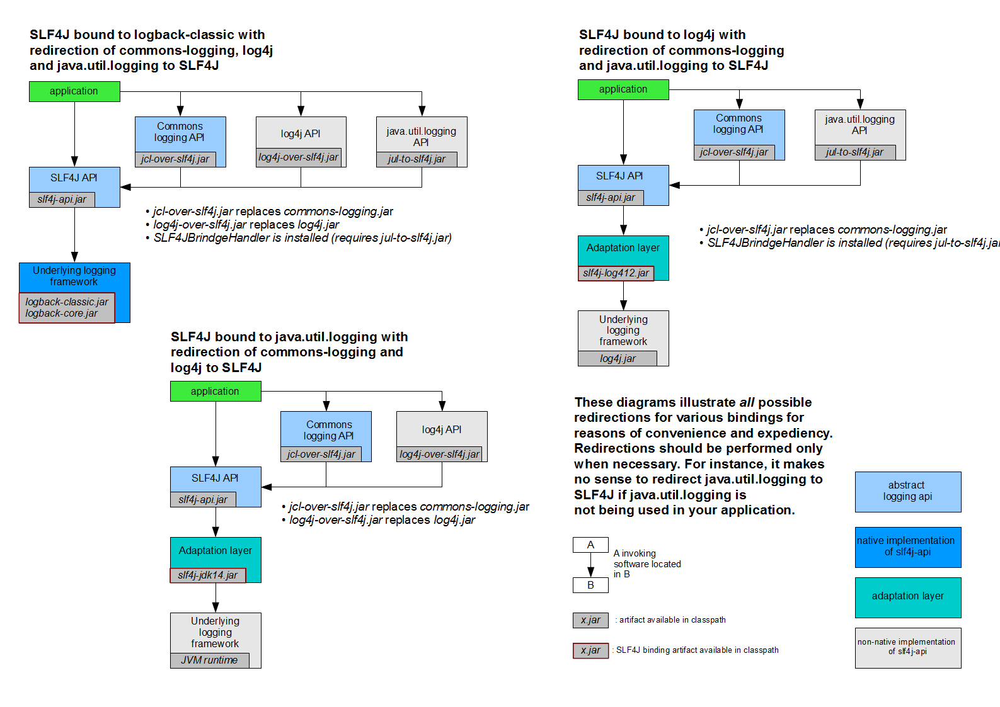
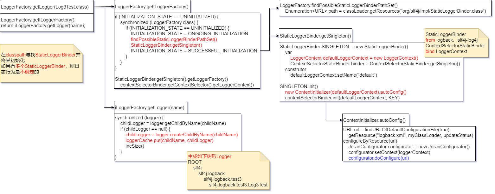
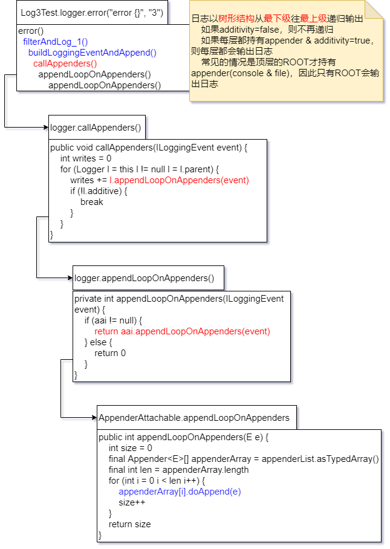

# slf4j
<span style="color:red">红字</span>为主要执行路径，<span style="color:blue">蓝字</span>为暂不分析的代码

## 架构
```
        xxx-over-slf4j   (adapt/bridge)
             |
            \ /
        slf4j API
        /    |    \  
      /      |      \
logback  slf4j-log4j  slf4j-jdk   (binding)
             |           |
           log4j        java.util.logging            
```

## 官网架构


## 启动流程


## 执行流程


## 日志实现简述
无论何种日志框架，其实现原理都是写文件，不细究其过程
