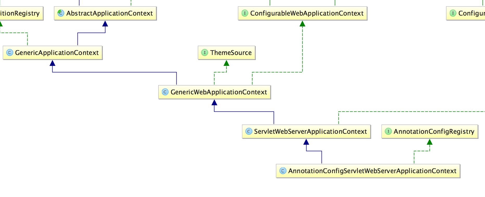

# spring-boot
红字为主要执行路径，蓝字为暂不分析的代码

## 架构
spring-boot 由 SpringApplication、AutoConfigurationImportSelector、AnnotationConfigServletWebServerApplicationContext、ConfigFileApplicationListener、LoggingApplicationListener 五大核心构成，下面来看看他们的类图和介绍。

### SpringApplication
主要控制 spring-boot 应用的核心流程

### AutoConfigurationImportSelector
选择所要的自动配置，并根据配置上条件进行过滤

### ConfigFileApplicationListener
启动 ApplicatonContext 之前，初始化 Environment

### LoggingApplicationListener
启动 ApplicatonContext 之前，初始化 LoggingSystem

### AnnotationConfigServletWebServerApplicationContext

- GenericWebApplicationContext 存储 servletContext 和注册 WebApplicationScopes
- ServletWebServerApplicationContext 覆盖 onRefresh、finishRefresh 来创建和启动 embedded web container，并接驳 embedded web container 与 applicationContext
- AnnotationConfigServletWebServerApplicationContext 同 AnnotationConfigApplicationContext

## 核心流程
- 参见 SpringApplication.run

        /**
         * 运行 SpringApplication
         */
        public ConfigurableApplicationContext run(String... args) {
            // 启动计时器
            StopWatch stopWatch = new StopWatch();
            stopWatch.start();
            // 声明 context、exceptionReporters
            ConfigurableApplicationContext context = null;
            Collection<SpringBootExceptionReporter> exceptionReporters = new ArrayList<>();
            // 设置 headless 模式
            configureHeadlessProperty();
            /**
             * 读取 SpringApplicationRunListener 并包装成 SpringApplicationRunListeners
             * @see EventPublishingRunListener
             */
            SpringApplicationRunListeners listeners = getRunListeners(args);
            // 发布正在启动事件
            listeners.starting();
            try {
                // 包装命令行参数
                ApplicationArguments applicationArguments = new DefaultApplicationArguments(args);
                // 准备 environment
                ConfigurableEnvironment environment = prepareEnvironment(listeners, applicationArguments);
                // ???
                configureIgnoreBeanInfo(environment);
                // 打印 banner
                Banner printedBanner = printBanner(environment);
                // 创建 context
                context = createApplicationContext();
                // 读取 exceptionReporters
                exceptionReporters = getSpringFactoriesInstances(SpringBootExceptionReporter.class, new Class[] { ConfigurableApplicationContext.class }, context);
                // 准备 context
                prepareContext(context, environment, listeners, applicationArguments, printedBanner);
                // 刷新 context
                refreshContext(context);
                // 提供给子类处理的机会
                afterRefresh(context, applicationArguments);
                // 停止计时器
                stopWatch.stop();
                // 打印启动完成日志
                if (this.logStartupInfo) {
                    new StartupInfoLogger(this.mainApplicationClass).logStarted(getApplicationLog(), stopWatch);
                }
                // 发布已启动事件
                listeners.started(context);
                // 运行 ApplicationRunner、CommandLineRunner
                callRunners(context, applicationArguments);
            }
            catch (Throwable ex) {
                handleRunFailure(context, ex, exceptionReporters, listeners);
                throw new IllegalStateException(ex);
            }
            // 发布正在运行事件
            try {
                listeners.running(context);
            }
            catch (Throwable ex) {
                handleRunFailure(context, ex, exceptionReporters, null);
                throw new IllegalStateException(ex);
            }
            return context;
        }

## 初始化 Environment
- 参见 SpringApplication.prepareEnvironment

        /**
         * 准备 environment
         * @see ConfigFileApplicationListener#postProcessEnvironment
         */
        private ConfigurableEnvironment prepareEnvironment(SpringApplicationRunListeners listeners,
                ApplicationArguments applicationArguments) {
            // 创建 environment
            ConfigurableEnvironment environment = getOrCreateEnvironment();
            // 配置 environment
            configureEnvironment(environment, applicationArguments.getSourceArgs());
            // 发布 environmentPrepared 事件
            listeners.environmentPrepared(environment);
            // ???
            bindToSpringApplication(environment);
            // 如果是自定义 environment, 则可能需要转换
            if (!this.isCustomEnvironment) {
                Class environmentClass = deduceEnvironmentClass();
                EnvironmentConverter converter = new EnvironmentConverter(getClassLoader());
                environment = converter.convertEnvironmentIfNecessary(environment, environmentClass);
            }
            // ??? 将 environment.propertySources 包装一次并放入 environment.propertySources 的第一顺位
            ConfigurationPropertySources.attach(environment);
            return environment;
        }

- 参见 ConfigFileApplicationListener.onApplicationEvent

        /**
         * 初始化 environment
         * @see SystemEnvironmentPropertySourceEnvironmentPostProcessor
         * @see SpringApplicationJsonEnvironmentPostProcessor
         * @see CloudFoundryVcapEnvironmentPostProcessor
         * @see ConfigFileApplicationListener
         */
        private void onApplicationEnvironmentPreparedEvent(ApplicationEnvironmentPreparedEvent event) {
            // 读取 EnvironmentPostProcessor
            List<EnvironmentPostProcessor> postProcessors = loadPostProcessors();
            postProcessors.add(this);
            // 排序 EnvironmentPostProcessor
            AnnotationAwareOrderComparator.sort(postProcessors);
            // postProcessEnvironment
            for (EnvironmentPostProcessor postProcessor : postProcessors) {
                postProcessor.postProcessEnvironment(event.getEnvironment(), event.getSpringApplication());
            }
        }

        // 读取 profile 和其对应的配置并设置激活的profile
        @Override
        public void postProcessEnvironment(ConfigurableEnvironment environment, SpringApplication application) {
            addPropertySources(environment, application.getResourceLoader());
        }

        /**
         * 将 randomPropertySource 加入 environment
         * 读取 profile 和其对应的配置并设置激活的profile
         */
        protected void addPropertySources(ConfigurableEnvironment environment, ResourceLoader resourceLoader) {
            RandomValuePropertySource.addToEnvironment(environment);
            new Loader(environment, resourceLoader).load();
        }

        public void load() {
            this.waitForProcessedProfiles = new LinkedList<>();
            this.processedProfiles = new LinkedList<>();
            this.activatedProfiles = false;
            this.loaded = new LinkedHashMap<>();
            // 初始化 waitForProcessedProfiles
            initializeProfiles();
            // 迭代 waitForProcessedProfiles 并加载相应的配置
            while (!this.waitForProcessedProfiles.isEmpty()) {
                Profile profile = this.waitForProcessedProfiles.poll();
                // 如果 profile 不是 default, 则将其加入 environment
                if (profile != null && !profile.isDefaultProfile()) {
                    addProfileToEnvironment(profile.getName());
                }
                // 加载 profile 对应的配置
                load(profile, this::getPositiveProfileFilter, addToLoaded(MutablePropertySources::addLast, false));
                this.processedProfiles.add(profile);
            }
            // 设置 activeProfiles
            resetEnvironmentProfiles(this.processedProfiles);
            // 再次加载 default profile
            load(null, this::getNegativeProfileFilter, addToLoaded(MutablePropertySources::addFirst, true));
            // 将所有已加载的配置放入 environment
            addLoadedPropertySources();
        }

## 初始化 LoggingSystem
- 参见 LoggingApplicationListener.onApplicationEvent

        // 日志配置入口
        @Override
        public void onApplicationEvent(ApplicationEvent event) {
            if (event instanceof ApplicationStartingEvent) {
                onApplicationStartingEvent((ApplicationStartingEvent) event);
            }
            else if (event instanceof ApplicationEnvironmentPreparedEvent) {
                onApplicationEnvironmentPreparedEvent((ApplicationEnvironmentPreparedEvent) event);
            }
            else if (event instanceof ApplicationPreparedEvent) {
                onApplicationPreparedEvent((ApplicationPreparedEvent) event);
            }
            else if (event instanceof ContextClosedEvent
                    && ((ContextClosedEvent) event).getApplicationContext().getParent() == null) {
                onContextClosedEvent();
            }
            else if (event instanceof ApplicationFailedEvent) {
                onApplicationFailedEvent();
            }
        }

        /**
         * 创建日志系统
         * @see LogbackLoggingSystem#beforeInitialize
         */
        private void onApplicationStartingEvent(ApplicationStartingEvent event) {
            this.loggingSystem = LoggingSystem.get(event.getSpringApplication().getClassLoader());
            this.loggingSystem.beforeInitialize();
        }

        // beforeInitialize
        @Override
        public void beforeInitialize() {
            // 初始化 LoggerContext
            LoggerContext loggerContext = getLoggerContext();
            // 如果 LoggerContext 已初始化, 则返回
            if (isAlreadyInitialized(loggerContext)) {
                return;
            }
            // 将 jdk logger 接驳到 slf4j
            super.beforeInitialize();
            // ???
            loggerContext.getTurboFilterList().add(FILTER);
        }

        // beforeInitialize
        @Override
        public void beforeInitialize() {
            super.beforeInitialize();
            // 将 jdk logger 接驳到 slf4j
            configureJdkLoggingBridgeHandler();
        }

        private void configureJdkLoggingBridgeHandler() {
            try {
                // 是否可接驳 slf4j
                if (isBridgeJulIntoSlf4j()) {
                    // 移除 jdk handler
                    removeJdkLoggingBridgeHandler();
                    // 安装 slf4j handler
                    SLF4JBridgeHandler.install();
                }
            }
            catch (Throwable ex) {
                // Ignore. No java.util.logging bridge is installed.
            }
        }

        // 初始化日志系统
        private void onApplicationEnvironmentPreparedEvent(ApplicationEnvironmentPreparedEvent event) {
            if (this.loggingSystem == null) {
                this.loggingSystem = LoggingSystem.get(event.getSpringApplication().getClassLoader());
            }
            initialize(event.getEnvironment(), event.getSpringApplication().getClassLoader());
        }

        /**
         * 初始化日志系统
         */
        protected void initialize(ConfigurableEnvironment environment, ClassLoader classLoader) {
            // 设置日志系统配置
            new LoggingSystemProperties(environment).apply();
            // ???
            LogFile logFile = LogFile.get(environment);
            if (logFile != null) {
                logFile.applyToSystemProperties();
            }
            // 设置日志级别 ???
            initializeEarlyLoggingLevel(environment);
            // 初始化日志系统
            initializeSystem(environment, this.loggingSystem, logFile);
            // 设置最终的日志级别 ???
            initializeFinalLoggingLevels(environment, this.loggingSystem);
            // 注册关闭钩子
            registerShutdownHookIfNecessary(environment, this.loggingSystem);
        }

        // 初始化日志系统
        private void initializeSystem(ConfigurableEnvironment environment, LoggingSystem system, LogFile logFile) {
            LoggingInitializationContext initializationContext = new LoggingInitializationContext(environment);
            String logConfig = environment.getProperty(CONFIG_PROPERTY);
            // 使用配置初始化日志系统
            if (ignoreLogConfig(logConfig)) {
                system.initialize(initializationContext, null, logFile);
            }
            else {
                try {
                    ResourceUtils.getURL(logConfig).openStream().close();
                    system.initialize(initializationContext, logConfig, logFile);
                }
                catch (Exception ex) {
                    // NOTE: We can't use the logger here to report the problem
                    System.err.println(
                            "Logging system failed to initialize " + "using configuration from '" + logConfig + "'");
                    ex.printStackTrace(System.err);
                    throw new IllegalStateException(ex);
                }
            }
        }

        // 初始化日志系统
        @Override
        public void initialize(LoggingInitializationContext initializationContext, String configLocation, LogFile logFile) {
            // 如果配置存在, 则使用配置初始化日志系统
            if (StringUtils.hasLength(configLocation)) {
                initializeWithSpecificConfig(initializationContext, configLocation, logFile);
                return;
            }
            // 查找配置并初始化日志系统
            initializeWithConventions(initializationContext, logFile);
        }

        private void initializeWithConventions(LoggingInitializationContext initializationContext, LogFile logFile) {
            // 查找"logback-test.groovy", "logback-test.xml", "logback.groovy", "logback.xml"
            String config = getSelfInitializationConfig();
            // 如果以上配置存在, 则使用其初始化日志系统
            if (config != null && logFile == null) {
                reinitialize(initializationContext);
                return;
            }
            // 查找"logback-test-spring.groovy", "logback-test-spring.xml", "logback-spring.groovy", "logback-spring.xml"
            if (config == null) {
                config = getSpringInitializationConfig();
            }
            // 如果以上配置存在, 则使用其初始化日志系统
            if (config != null) {
                loadConfiguration(initializationContext, config, logFile);
                return;
            }
            // 如果以上配置都不存在, 则使用缺省配置初始化日志系统
            loadDefaults(initializationContext, logFile);
        }

## 初始化 ApplicatonContext & WebServer
- 参见 ServletWebServerApplicationContext

        // 覆盖 onRefresh 方法并创建 embedded web container
        @Override
        protected void onRefresh() {
            super.onRefresh();
            try {
                createWebServer();
            }
            catch (Throwable ex) {
                throw new ApplicationContextException("Unable to start web server", ex);
            }
        }

        // 创建 web server
        private void createWebServer() {
            WebServer webServer = this.webServer;
            ServletContext servletContext = getServletContext();
            // 如果 webServer 不存在, 则创建之
            if (webServer == null && servletContext == null) {
                ServletWebServerFactory factory = getWebServerFactory();
                this.webServer = factory.getWebServer(getSelfInitializer());
            }
            // 反之, 则完成 web server 与 applicationContext 之间的接驳
            else if (servletContext != null) {
                try {
                    getSelfInitializer().onStartup(servletContext);
                }
                catch (ServletException ex) {
                    throw new ApplicationContextException("Cannot initialize servlet context", ex);
                }
            }
            initPropertySources();
        }

        /**
         * 获取 WebServerFactory
         */
        protected ServletWebServerFactory getWebServerFactory() {
            String[] beanNames = getBeanFactory().getBeanNamesForType(ServletWebServerFactory.class);
            if (beanNames.length == 0) {
                throw new ApplicationContextException("Unable to start ServletWebServerApplicationContext due to missing "
                        + "ServletWebServerFactory bean.");
            }
            if (beanNames.length > 1) {
                throw new ApplicationContextException("Unable to start ServletWebServerApplicationContext due to multiple "
                        + "ServletWebServerFactory beans : " + StringUtils.arrayToCommaDelimitedString(beanNames));
            }
            return getBeanFactory().getBean(beanNames[0], ServletWebServerFactory.class);
        }

        /**
         * 创建 ServletContextInitializer, 实现 web server 与 applicationContext 之间的接驳
         * 由 web server 回调回来
         */
        private org.springframework.boot.web.servlet.ServletContextInitializer getSelfInitializer() {
            return this::selfInitialize;
        }

        // 实现 web server 与 applicationContext 之间的接驳
        private void selfInitialize(ServletContext servletContext) throws ServletException {
            // 接驳 servletContext 与 applicationContext
            prepareWebApplicationContext(servletContext);
            // 注册 application scope 到 applicationContext
            registerApplicationScope(servletContext);
            // 注册 servletContext、servletConfig 到 applicationContext
            WebApplicationContextUtils.registerEnvironmentBeans(getBeanFactory(), servletContext);
            /**
             * 读取并注册以下类到 servletContext
             * @see javax.servlet.ServletContextListener
             * @see javax.servlet.Filter
             * @see javax.servlet.Servlet
             */
            Collection<ServletContextInitializer> initializerBeans = getServletContextInitializerBeans();
            for (ServletContextInitializer beans : initializerBeans) {
                beans.onStartup(servletContext);
            }
        }

        // 覆盖 finishRefresh 方法并启动 embedded web container
        // 最后, 发布 embedded web container 已启动事件
        @Override
        protected void finishRefresh() {
            super.finishRefresh();
            WebServer webServer = startWebServer();
            if (webServer != null) {
                publishEvent(new ServletWebServerInitializedEvent(webServer, this));
            }
        }

        private WebServer startWebServer() {
            WebServer webServer = this.webServer;
            if (webServer != null) {
                webServer.start();
            }
            return webServer;
        }

        // 覆盖 onClose 方法并停止 embedded web container
        @Override
        protected void onClose() {
            super.onClose();
            stopAndReleaseWebServer();
        }

        private void stopAndReleaseWebServer() {
            WebServer webServer = this.webServer;
            if (webServer != null) {
                try {
                    webServer.stop();
                    this.webServer = null;
                }
                catch (Exception ex) {
                    throw new IllegalStateException(ex);
                }
            }
        }

## 选择自动配置
- 参见 AutoConfigurationImportSelector.AutoConfigurationGroup.process

        @Override
        public void process(AnnotationMetadata annotationMetadata, DeferredImportSelector deferredImportSelector) {
            Assert.state(deferredImportSelector instanceof AutoConfigurationImportSelector,
                    () -> String.format("Only %s implementations are supported, got %s",
                            AutoConfigurationImportSelector.class.getSimpleName(),
                            deferredImportSelector.getClass().getName()));
            // 加载 META-INF/spring-autoconfigure-metadata.properties 配置
            AutoConfigurationMetadata autoConfigMetadata = getAutoConfigurationMetadata();
            // 选择 configuration
            AutoConfigurationImportSelector autoConfigSelector = ((AutoConfigurationImportSelector) deferredImportSelector);
            AutoConfigurationEntry autoConfigEntry = autoConfigSelector.getAutoConfigurationEntry(autoConfigMetadata, annotationMetadata);
            this.autoConfigurationEntries.add(autoConfigEntry);
            // 迭代 configurations, 映射 configuration-class-name 与 annotationMetadata
            for (String importClassName : autoConfigEntry.getConfigurations()) {
                this.entries.putIfAbsent(importClassName, annotationMetadata);
            }
        }

        // 加载 META-INF/spring-autoconfigure-metadata.properties 配置
        private AutoConfigurationMetadata getAutoConfigurationMetadata() {
            if (this.autoConfigurationMetadata == null) {
                this.autoConfigurationMetadata = AutoConfigurationMetadataLoader.loadMetadata(this.beanClassLoader);
            }
            return this.autoConfigurationMetadata;
        }

        /**
         * 选择所有的 configuration
         */
        protected AutoConfigurationEntry getAutoConfigurationEntry(AutoConfigurationMetadata autoConfigurationMetadata,
                AnnotationMetadata annotationMetadata) {
            // 检查 spring.boot.enableautoconfiguration 是否为 true
            if (!isEnabled(annotationMetadata)) {
                return EMPTY_ENTRY;
            }
            // 读取 @EnableAutoConfiguration
            AnnotationAttributes attributes = getAttributes(annotationMetadata);
            // 读取所有的 AutoConfiguration
            List<String> configurations = getCandidateConfigurations(annotationMetadata, attributes);
            // 对 AutoConfiguration 去重
            configurations = removeDuplicates(configurations);
            // 读取被排除的 configuration
            Set<String> exclusions = getExclusions(annotationMetadata, attributes);
            // 验证被排除的 configuration 是否存在
            checkExcludedClasses(configurations, exclusions);
            // 去除被排除的 configuration
            configurations.removeAll(exclusions);
            // 过滤不满足条件的 configuration
            configurations = filter(configurations, autoConfigurationMetadata);
            // 发布 AutoConfigurationImportEvent 事件
            fireAutoConfigurationImportEvents(configurations, exclusions);
            // 返回 configuration
            return new AutoConfigurationEntry(configurations, exclusions);
        }

        /**
         * 读取所有的 AutoConfiguration
         * META-INF/spring.factories
         */
        protected List<String> getCandidateConfigurations(AnnotationMetadata metadata, AnnotationAttributes attributes) {
            List<String> configurations = SpringFactoriesLoader.loadFactoryNames(getSpringFactoriesLoaderFactoryClass(),
                    getBeanClassLoader());
            Assert.notEmpty(configurations, "No auto configuration classes found in META-INF/spring.factories. If you "
                    + "are using a custom packaging, make sure that file is correct.");
            return configurations;
        }

        private List<String> filter(List<String> configurations, AutoConfigurationMetadata autoConfigurationMetadata) {
            long startTime = System.nanoTime();
            String[] candidates = StringUtils.toStringArray(configurations);
            // 声明同 configurations 一样大的 boolean[]
            boolean[] skip = new boolean[candidates.length];
            boolean skipped = false;
            // 读取 AutoConfigurationImportFilter 并过滤不满足条件的 configuration
            for (AutoConfigurationImportFilter filter : getAutoConfigurationImportFilters()) {
                // 初始化 AutoConfigurationImportFilter
                invokeAwareMethods(filter);
                // 过滤不满足条件的 configuration
                boolean[] match = filter.match(candidates, autoConfigurationMetadata);
                // 将过滤结果赋值给 skip
                for (int i = 0; i < match.length; i++) {
                    if (!match[i]) {
                        skip[i] = true;
                        candidates[i] = null;
                        skipped = true;
                    }
                }
            }
            // 如果没有 configuration 被过滤, 则直接返回
            if (!skipped) {
                return configurations;
            }
            // 将没有被过滤的 configuration 转换成结果集
            List<String> result = new ArrayList<>(candidates.length);
            for (int i = 0; i < candidates.length; i++) {
                if (!skip[i]) {
                    result.add(candidates[i]);
                }
            }
            // 打印日志
            if (logger.isTraceEnabled()) {
                int numberFiltered = configurations.size() - result.size();
                logger.trace("Filtered " + numberFiltered + " auto configuration class in "
                        + TimeUnit.NANOSECONDS.toMillis(System.nanoTime() - startTime) + " ms");
            }
            return new ArrayList<>(result);
        }

- 参见 AutoConfigurationImportSelector.AutoConfigurationGroup.selectImports

        @Override
        public Iterable<Entry> selectImports() {
            if (this.autoConfigurationEntries.isEmpty()) {
                return Collections.emptyList();
            }
            // 集合被排除的 configuration
            Set<String> allExclusions = this.autoConfigurationEntries.stream()
                    .map(AutoConfigurationEntry::getExclusions)
                    .flatMap(Collection::stream)
                    .collect(Collectors.toSet());
            // 集合所有的 configuration
            Set<String> processedConfigurations = this.autoConfigurationEntries.stream()
                    .map(AutoConfigurationEntry::getConfigurations)
                    .flatMap(Collection::stream)
                    .collect(Collectors.toCollection(LinkedHashSet::new));
            // 从所有 configuration 里移除被排除的 configuration
            processedConfigurations.removeAll(allExclusions);
            // 排序所有 configuration 并转换成 Entry
            return sortAutoConfigurations(processedConfigurations, getAutoConfigurationMetadata())
                    .stream()
                    .map((importClassName) -> new Entry(this.entries.get(importClassName), importClassName))
                    .collect(Collectors.toList());
        }
