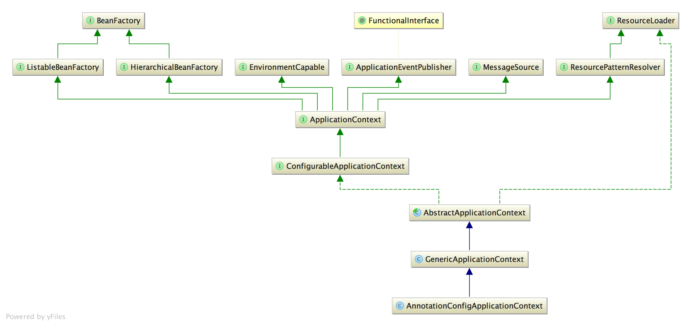
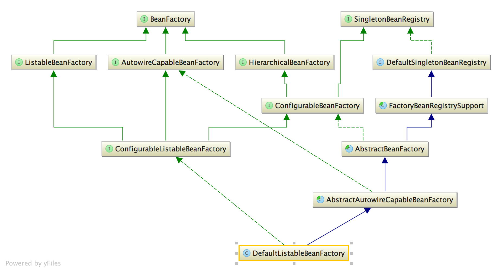

# spring-ioc
红字为主要执行路径，蓝字为暂不分析的代码

## 架构
spring-ioc 由 ApplicationContext、 BeanFactory 两大核心构成，下面来看看他们的类图和介绍。

### ApplicationContext
  
ApplicationContext 主要由 BeanFactory、Environment、EventPublisher、MessageSource、ResourceLoader 五大功能组成，它并不是 BeanFactory 的代理或者门面。

- BeanFactory 由下面代为解释
- Environment 提供的是环境配置，其存储着所有的配置信息和profile
- EventPublisher 提供的是事件发布，其实现委托给 ApplicationEventMulticaster，而 ApplicationEventMulticaster 的主要实现是 SimpleApplicationEventMulticaster。
- MessageSource 提供的是 i18n，这里不对它做展开。
- ResourceLoader 提供的是加载类路径上的资源，这里不对它做展开。

### BeanFactory
  
BeanFactory 主要由 SingletonBeanRegistry、HierarchicalBeanFactory、ConfigurableBeanFactory、AutowireCapableBeanFactory、ListableBeanFactory 五大接口组合而成。

- SingletonBeanRegistry 的主要功能是存储所有单例 bean，其主要实现是 DefaultSingletonBeanRegistry
- HierarchicalBeanFactory 的主要功能是提供父子 BeanFactory，其主要实现是 AbstractBeanFactory
- ConfigurableBeanFactory 的主要功能是提供可配置的 BeanFactory，其主要实现是 AbstractBeanFactory
- AutowireCapableBeanFactory 的主要功能是提供可自动注入的 BeanFactory，其主要实现 AbstractAutowireCapableBeanFactory
- ListableBeanFactory 的主要功能是提供可批量获取 bean 的 BeanFactory，其主要实现是 DefaultListableBeanFactory

## 启动流程
构造方法分为三步

    public AnnotationConfigApplicationContext(Class<?>... annotatedClasses) {
        this();
        register(annotatedClasses);
        refresh();
    }

### 第一步
注册 BeanFactoryPostProcessor, BeanPostProcessor

    /**
     * 注册缺省的 BeanFactoryPostProcessor, BeanPostProcessor
     * @see ConfigurationClassPostProcessor        其主要功能是读取所有的 beanDefinition 并增强带 @Confinguration 的类
     * @see AutowiredAnnotationBeanPostProcessor   其主要功能是处理 @Autowire、@Value，完成对 bean 的注入
     * @see CommonAnnotationBeanPostProcessor      其主要功能是处理 @Resource、@PostConstruct、@PreDestroy，完成对 bean 的注入、初始化前操作、销毁前操作
     * @see EventListenerMethodProcessor           其主要功能是处理 @EventListener，将带 @EventListener 的方法注册成为 ApplicationListener
     * @see DefaultEventListenerFactory            其主要功能是将 @EventListener 的方法 创建成 ApplicationListenerMethodAdapter
     */
    AnnotationConfigUtils.registerAnnotationConfigProcessors(this.registry);
### 第二步
将 main-class 注册到 BeanFactory，如果其注解了 @ComponentScan，则可以进行 bean 扫描

    // 注册 annotated classes 并自带 name & instanceSupplier & qualifiers & beanDefinitionCustomizer
    <T> void doRegisterBean(Class<T> annotatedClass, @Nullable Supplier<T> instanceSupplier, @Nullable String name,
            @Nullable Class<? extends Annotation>[] qualifiers, BeanDefinitionCustomizer... definitionCustomizers) {
        // 根据注解信息判断是否需要跳过此 annotatedClass
        AnnotatedGenericBeanDefinition abd = new AnnotatedGenericBeanDefinition(annotatedClass);
        if (this.conditionEvaluator.shouldSkip(abd.getMetadata())) {
            return;
        }
        // 设置 annotatedClass 实现
        // 设置 scope
        // 设置 beanName
        abd.setInstanceSupplier(instanceSupplier);
        ScopeMetadata scopeMetadata = this.scopeMetadataResolver.resolveScopeMetadata(abd);
        abd.setScope(scopeMetadata.getScopeName());
        String beanName = (name != null ? name : this.beanNameGenerator.generateBeanName(abd, this.registry));
        // 设置 Lazy、Primary、DependsOn、Role、Description 等值
        AnnotationConfigUtils.processCommonDefinitionAnnotations(abd);
        // 设置 qualifiers
        if (qualifiers != null) {
            for (Class<? extends Annotation> qualifier : qualifiers) {
                if (Primary.class == qualifier) {
                    abd.setPrimary(true);
                }
                else if (Lazy.class == qualifier) {
                    abd.setLazyInit(true);
                }
                else {
                    abd.addQualifier(new AutowireCandidateQualifier(qualifier));
                }
            }
        }
        // BeanDefinition 自定义处理
        for (BeanDefinitionCustomizer customizer : definitionCustomizers) {
            customizer.customize(abd);
        }
        // 注册 annotatedClass
        BeanDefinitionHolder definitionHolder = new BeanDefinitionHolder(abd, beanName);
        definitionHolder = AnnotationConfigUtils.applyScopedProxyMode(scopeMetadata, definitionHolder, this.registry);
        BeanDefinitionReaderUtils.registerBeanDefinition(definitionHolder, this.registry);
    }

### 第三步
启动 ApplicationContext

    public void refresh() throws BeansException, IllegalStateException {
        synchronized (this.startupShutdownMonitor) {
            // 准备环境参数
            prepareRefresh();
            // 获取 beanFactory
            ConfigurableListableBeanFactory beanFactory = obtainFreshBeanFactory();
            // 准备 beanFactory
            prepareBeanFactory(beanFactory);
            try {
                // 提供给子类处理 beanFactory 的机会
                postProcessBeanFactory(beanFactory);
                // 调用 BeanFactoryPostProcessors
                invokeBeanFactoryPostProcessors(beanFactory);
                // 调用 BeanPostProcessors
                registerBeanPostProcessors(beanFactory);
                // 初始化 messageSource
                initMessageSource();
                // 初始化 ApplicationEventMulticaster
                initApplicationEventMulticaster();
                // 提供给子类在 初始化剩余单例 bean 之前的 操作机会
                onRefresh();
                // 注册所有的 ApplicationListener 并发布 earlyApplicationEvents
                registerListeners();
                // 初始化剩余单例 bean，不包括延迟加载的
                finishBeanFactoryInitialization(beanFactory);
                // 启动 lifecycleProcessor、发布 ContextRefreshedEvent
                finishRefresh();
            }
            catch (BeansException ex) {
                if (logger.isWarnEnabled()) {
                    logger.warn("Exception encountered during context initialization - " +
                            "cancelling refresh attempt: " + ex);
                }
                // 销毁单例
                destroyBeans();
                // this.active.set(false);
                cancelRefresh(ex);
                throw ex;
            }
            finally {
                // 清理工具类里面的缓存，例：ReflectionUtils.clearCache()
                resetCommonCaches();
            }
        }
    }

以下为第三步中最重要的三个方法描述
- invokeBeanFactoryPostProcessors 初始化 BeanFactoryPostProcessor, 并调用 BeanFactoryPostProcessor 完成 beanDef 的注册
- registerBeanPostProcessors 初始化 BeanPostProcessor，并将其注册到 BeanFactory
- finishBeanFactoryInitialization 初始化所有所有非延迟加载的单例 bean

## 环境
### 创建环境
- 参见 AbstractApplicationContext.getEnvironment

        // 获取 environment, 如果为空则创建一个
        @Override
        public ConfigurableEnvironment getEnvironment() {
            if (this.environment == null) {
                this.environment = createEnvironment();
            }
            return this.environment;
        }

        // 创建 environment, 子类可覆盖此方法已提供不同环境下的 environment
        protected ConfigurableEnvironment createEnvironment() {
            return new StandardEnvironment();
        }

### 如何处理 @PropertySource
- 参见 ConfigurationClassParser.doProcessConfigurationClass

        // 2、处理 @PropertySource
        // 读取 PropertySource, 并将其加入 environment
        Class propertySourceClass = org.springframework.context.annotation.PropertySource.class;
        Set<AnnotationAttributes> propertySources = attributesForRepeatable(sourceClass.getMetadata(), PropertySources.class, propertySourceClass);
        // 遍历 PropertySource 并加入 environment
        for (AnnotationAttributes propertySource : propertySources) {
            if (this.environment instanceof ConfigurableEnvironment) {
                processPropertySource(propertySource);
            }
            else {
                logger.info("Ignoring @PropertySource annotation on [" + sourceClass.getMetadata().getClassName() + "]. Reason: Environment must implement ConfigurableEnvironment");
            }
        }

### 如何处理 PropertySourcesPlaceholderConfigurer
- 参见 PlaceholderConfigurerSupport.doProcessProperties

            protected void doProcessProperties(ConfigurableListableBeanFactory beanFactoryToProcess, StringValueResolver valueResolver) {
                BeanDefinitionVisitor visitor = new BeanDefinitionVisitor(valueResolver);
                String[] beanNames = beanFactoryToProcess.getBeanDefinitionNames();
                for (String curName : beanNames) {
                    // Check that we're not parsing our own bean definition,
                    // to avoid failing on unresolvable placeholders in properties file locations.
                    if (!(curName.equals(this.beanName) && beanFactoryToProcess.equals(this.beanFactory))) {
                        BeanDefinition bd = beanFactoryToProcess.getBeanDefinition(curName);
                        try {
                            visitor.visitBeanDefinition(bd);
                        }
                        catch (Exception ex) {
                            throw new BeanDefinitionStoreException(bd.getResourceDescription(), curName, ex.getMessage(), ex);
                        }
                    }
                }
                // New in Spring 2.5: resolve placeholders in alias target names and aliases as well.
                beanFactoryToProcess.resolveAliases(valueResolver);
                // New in Spring 3.0: resolve placeholders in embedded values such as annotation attributes.
                // 将 valueResolver 加入 EmbeddedValueResolver
                beanFactoryToProcess.addEmbeddedValueResolver(valueResolver);
            }

### 如何获取配置
- 实现 EnvironmentAware

        environment.getProperty("${x.y.z}");
- 实现 EmbeddedValueResolverAware

        resolver.resolveStringValue("${x.y.z}");

## bean生命周期
### 生命周期
bean 的生命周期一共分为10步，其实现集中在 AbstractAutowireCapableBeanFactory、DisposableBeanAdapter 具体步骤如下所示

- 01 postProcessBeforeInstantiation
    - bean 实例化之前的前置处理，可用于代理 bean，如果这个时间点就返回了 bean，则后续的生命周期缩减到只有第 8 步
- 02 createBeanInstance
    - 实例化 bean
- 03 postProcessMergedBeanDefinition
    - 记录 bean 信息，用于处理自动注入、注册 applicationListener
    - 参见 AutowiredAnnotationBeanPostProcessor、ApplicationListenerDetector
- 04 postProcessAfterInstantiation
    - bean 实例化之后的操作，如果这个方法返回 false，第 5 步将被取消
- 05 postProcessProperties
    - 注入 bean
- 06 postProcessBeforeInitialization
    - bean 初始化之前的操作
- 07 invokeAwareMethods
    - 初始化 bean
- 08 postProcessAfterInitialization
    - bean 初始化之后的操作
- 09 postProcessBeforeDestruction
    - bean 销毁之前的操作
- 10 destroy
    - 销毁 bean

### 获取bean
参见 AbstractBeanFactory.doGetBean

### 注入bean
参见 AutowiredAnnotationBeanPostProcessor.postProcessProperties
 参见 CommonAnnotationBeanPostProcessor.postProcessProperties

### 循环依赖

- 参见 DefaultSingletonBeanRegistry.getSingleton

        // 取 beanName 对应的单例对象
        @Nullable
        protected Object getSingleton(String beanName, boolean allowEarlyReference) {
            Object singletonObject = this.singletonObjects.get(beanName);
            // 如果从 singletonObjects 取不到且当前 beanName 正在创建中
            if (singletonObject == null && isSingletonCurrentlyInCreation(beanName)) {
                synchronized (this.singletonObjects) {
                    // 则从 earlySingletonObjects 获取
                    singletonObject = this.earlySingletonObjects.get(beanName);
                    // 如果从 earlySingletonObjects 取不到 且 allowEarlyReference
                    if (singletonObject == null && allowEarlyReference) {
                        // 则从 singletonFactories 取 singletonFactory
                        ObjectFactory<?> singletonFactory = this.singletonFactories.get(beanName);
                        // 如果 singletonFactory 存在, 则获取创建中的实例并缓存之
                        if (singletonFactory != null) {
                            singletonObject = singletonFactory.getObject();
                            this.earlySingletonObjects.put(beanName, singletonObject);
                            this.singletonFactories.remove(beanName);
                        }
                    }
                }
            }
            return singletonObject;
        }

- 这个方法用于“从单例集合获取不到bean时，转而从 earlySingletonObjects/singletonFactories 获取 bean”，而“singletonFactories”是由 bean 在创建完成之后加入的，所以可以解决循环依赖的单例 bean

- 参见 AbstractAutowireCapableBeanFactory.doCreateBean

        // 是否允许提前暴露实例
        // 此为解决循环依赖的地方之一
        boolean earlySingletonExposure = (mbd.isSingleton() && this.allowCircularReferences && isSingletonCurrentlyInCreation(beanName));
        if (earlySingletonExposure) {
            if (logger.isTraceEnabled()) {
                logger.trace("Eagerly caching bean '" + beanName + "' to allow for resolving potential circular references");
            }
            // 为实例构建 ObjectFactory, 并将其加入单例集合
            addSingletonFactory(beanName, () -> {
                return getEarlyBeanReference(beanName, mbd, bean);
            });
        }

        /**
         * 获取提前暴露的 bean, 用于解决循环引用
         */
        protected Object getEarlyBeanReference(String beanName, RootBeanDefinition mbd, Object bean) {
            Object exposedObject = bean;
            // 如果 bean 是非合成的且有 SmartInstantiationAwareBeanPostProcessor
            if (!mbd.isSynthetic() && hasInstantiationAwareBeanPostProcessors()) {
                for (BeanPostProcessor bp : getBeanPostProcessors()) {
                    /**
                     * 使用 SmartInstantiationAwareBeanPostProcessor 处理 bean
                     * 此 BeanPostProcessor 用于处理代理行为的循环引用
                     * @see AbstractAutoProxyCreator
                     */
                    if (bp instanceof SmartInstantiationAwareBeanPostProcessor) {
                        SmartInstantiationAwareBeanPostProcessor ibp = (SmartInstantiationAwareBeanPostProcessor) bp;
                        exposedObject = ibp.getEarlyBeanReference(exposedObject, beanName);
                    }
                }
            }
            return exposedObject;
        }
- 这个方法用于 bean 创建完成后，添加进 singletonFactories，解决循环依赖

### 同名bean
- 参见 ConfigurationClassBeanDefinitionReader.loadBeanDefinitionsForBeanMethod

        // 是否正在覆盖已存在的 beanDefinition
        // 如果是则不允许覆盖, 但当 beanName 同声明它的类名相同, 则抛出异常
        if (isOverriddenByExistingDefinition(beanMethod, beanName)) {
            if (beanName.equals(beanMethod.getConfigurationClass().getBeanName())) {
                throw new BeanDefinitionStoreException(beanMethod.getConfigurationClass().getResource().getDescription(),
                        beanName, "Bean name derived from @Bean method '" + beanMethod.getMetadata().getMethodName() +
                        "' clashes with bean name for containing configuration class; please make those names unique!");
            }
            return;
        }

        // 是否正在覆盖已存在的 beanDefinition
        protected boolean isOverriddenByExistingDefinition(BeanMethod beanMethod, String beanName) {
            if (!this.registry.containsBeanDefinition(beanName)) {
                return false;
            }
            BeanDefinition existingBeanDef = this.registry.getBeanDefinition(beanName);
            // 如果声明 bean 的 class 相同, 则返回 true
            if (existingBeanDef instanceof ConfigurationClassBeanDefinition) {
                ConfigurationClassBeanDefinition ccbd = (ConfigurationClassBeanDefinition) existingBeanDef;
                return ccbd.getMetadata().getClassName().equals(
                        beanMethod.getConfigurationClass().getMetadata().getClassName());
            }
            // 如果已存在的 BeanDef 是 ScannedGenericBeanDefinition, 则返回 false
            if (existingBeanDef instanceof ScannedGenericBeanDefinition) {
                return false;
            }
            // Has the existing bean definition bean marked as a framework-generated bean?
            // -> allow the current bean method to override it, since it is application-level
            if (existingBeanDef.getRole() > BeanDefinition.ROLE_APPLICATION) {
                return false;
            }
            // 如果 BeanFactory 不允许覆盖, 则抛出异常
            if (this.registry instanceof DefaultListableBeanFactory &&
                    !((DefaultListableBeanFactory) this.registry).isAllowBeanDefinitionOverriding()) {
                throw new BeanDefinitionStoreException(beanMethod.getConfigurationClass().getResource().getDescription(),
                        beanName, "@Bean definition illegally overridden by existing bean definition: " + existingBeanDef);
            }
            if (logger.isDebugEnabled()) {
                logger.debug(String.format("Skipping bean definition for %s: a definition for bean '%s' " +
                        "already exists. This top-level bean definition is considered as an override.",
                        beanMethod, beanName));
            }
            // 以上都不是, 则返回 true
            return true;
        }
- 简而言之
    - 声明同名 bean 的 class 相同，则不允许覆盖
        - beanName 同声明它的类名相同, 则抛出异常
        - 如果 BeanFactory 设置为不允许覆盖，则抛出异常

## 事件机制
### 注册监听器
- AbstractApplicationContext.registerListeners

        // 注册 ApplicationListener 并发布 earlyApplicationEvents
        protected void registerListeners() {
            // 注册 this.ApplicationListener
            for (ApplicationListener<?> listener : getApplicationListeners()) {
                getApplicationEventMulticaster().addApplicationListener(listener);
            }
            // 查找并注册 ApplicationListener beanName
            String[] listenerBeanNames = getBeanNamesForType(ApplicationListener.class, true, false);
            for (String listenerBeanName : listenerBeanNames) {
                getApplicationEventMulticaster().addApplicationListenerBean(listenerBeanName);
            }
            // 发布 earlyApplicationEvents
            Set<ApplicationEvent> earlyEventsToProcess = this.earlyApplicationEvents;
            this.earlyApplicationEvents = null;
            if (earlyEventsToProcess != null) {
                for (ApplicationEvent earlyEvent : earlyEventsToProcess) {
                    getApplicationEventMulticaster().multicastEvent(earlyEvent);
                }
            }
        }
        
- EventListenerMethodProcessor

        private void processBean(final String beanName, final Class<?> targetType) {
            // (非处理过的class) 且 (非 java 代码) 且 (非 spring 代码)
            if (!this.nonAnnotatedClasses.contains(targetType) &&
                    !targetType.getName().startsWith("java") &&
                    !isSpringContainerClass(targetType)) {
                // 扫描带 EventListener 的 method
                Map<Method, EventListener> annotatedMethods = null;
                try {
                    annotatedMethods = MethodIntrospector.selectMethods(targetType, (MetadataLookup<EventListener>) method -> findMergedAnnotation(method, EventListener.class));
                }
                catch (Throwable ex) {
                    if (logger.isDebugEnabled()) {
                        logger.debug("Could not resolve methods for bean with name '" + beanName + "'", ex);
                    }
                }
                // 如果 annotatedMethods.isEmpty 则将其加入 nonAnnotatedClasses
                if (CollectionUtils.isEmpty(annotatedMethods)) {
                    this.nonAnnotatedClasses.add(targetType);
                    if (logger.isTraceEnabled()) {
                        logger.trace("No @EventListener annotations found on bean class: " + targetType.getName());
                    }
                }
                // 反之, 则注册 applicationListener
                else {
                    ConfigurableApplicationContext context = this.applicationContext;
                    Assert.state(context != null, "No ApplicationContext set");
                    List<EventListenerFactory> factories = this.eventListenerFactories;
                    Assert.state(factories != null, "EventListenerFactory List not initialized");
                    // 迭代 annotatedMethods 并注册 applicationListener
                    for (Method method : annotatedMethods.keySet()) {
                        for (EventListenerFactory factory : factories) {
                            if (factory.supportsMethod(method)) {
                                Method methodToUse = AopUtils.selectInvocableMethod(method, context.getType(beanName));
                                // 创建 applicationListener
                                ApplicationListener<?> applicationListener = factory.createApplicationListener(beanName, targetType, methodToUse);
                                // 设置 applicationListener
                                if (applicationListener instanceof ApplicationListenerMethodAdapter) {
                                    ((ApplicationListenerMethodAdapter) applicationListener).init(context, this.evaluator);
                                }
                                // 注册 applicationListener
                                context.addApplicationListener(applicationListener);
                                break;
                            }
                        }
                    }
                    if (logger.isDebugEnabled()) {
                        logger.debug(annotatedMethods.size() + " @EventListener methods processed on bean '" +
                                beanName + "': " + annotatedMethods);
                    }
                }
            }
        }

- ApplicationListenerDetector

        // 注册 ApplicationListener
        @Override
        public Object postProcessAfterInitialization(Object bean, String beanName) {
            if (bean instanceof ApplicationListener) {
                Boolean flag = this.singletonNames.get(beanName);
                // 如果 bean 是 ApplicationListener 且是单例, 则注册之
                if (Boolean.TRUE.equals(flag)) {
                    this.applicationContext.addApplicationListener((ApplicationListener<?>) bean);
                }
                // 反之, 则打印日志
                else if (Boolean.FALSE.equals(flag)) {
                    if (logger.isWarnEnabled() && !this.applicationContext.containsBean(beanName)) {
                        logger.warn("Inner bean '" + beanName + "' implements ApplicationListener interface " +
                                "but is not reachable for event multicasting by its containing ApplicationContext " +
                                "because it does not have singleton scope. Only top-level listener beans are allowed " +
                                "to be of non-singleton scope.");
                    }
                    this.singletonNames.remove(beanName);
                }
            }
            return bean;
        }

### 发布事件
    // 发布事件
    protected void publishEvent(Object event, @Nullable ResolvableType eventType) {
        Assert.notNull(event, "Event must not be null");
        // 将事件转成 ApplicationEvent or PayloadApplicationEvent
        ApplicationEvent applicationEvent;
        if (event instanceof ApplicationEvent) {
            applicationEvent = (ApplicationEvent) event;
        }
        else {
            applicationEvent = new PayloadApplicationEvent<>(this, event);
            if (eventType == null) {
                eventType = ((PayloadApplicationEvent<?>) applicationEvent).getResolvableType();
            }
        }
        // 立即发布事件或者在 applicationEventMulticaster 初始化之后发布
        if (this.earlyApplicationEvents != null) {
            this.earlyApplicationEvents.add(applicationEvent);
        }
        else {
            getApplicationEventMulticaster().multicastEvent(applicationEvent, eventType);
        }
        // 如果可能用 parent context 发布事件
        if (this.parent != null) {
            if (this.parent instanceof AbstractApplicationContext) {
                ((AbstractApplicationContext) this.parent).publishEvent(event, eventType);
            }
            else {
                this.parent.publishEvent(event);
            }
        }
    }

## 工具类
- 反射相关
    - ClassUtils
    - MethodIntrospector
    - ReflectionUtils
- 注解相关
    - AnnotatedElementUtils
    - AnnotationUtils
- 参数相关
    - ParameterNameDiscoverer

## 待阅读
- InjectionMetadata#InjectedElement#checkPropertySkipping
- QualifierAnnotationAutowireCandidateResolver#checkQualifiers
- DefaultListableBeanFactory#doResolveDependency
    - AbstractBeanFactory#resolveEmbeddedValue/evaluateBeanDefinitionString
- DefaultListableBeanFactory#resolveMultipleBeans
    - TypeConverter#convertIfNecessary
    - DefaultListableBeanFactory#adaptDependencyComparator
- ContextAnnotationAutowireCandidateResolver#buildLazyResolutionProxy
- PropertySourcesPlaceholderConfigurer#postProcessBeanFactory
- Enhancer
- ClassPathBeanDefinitionScanner
- LoadTimeWeaver
- BeanWrapperImpl
