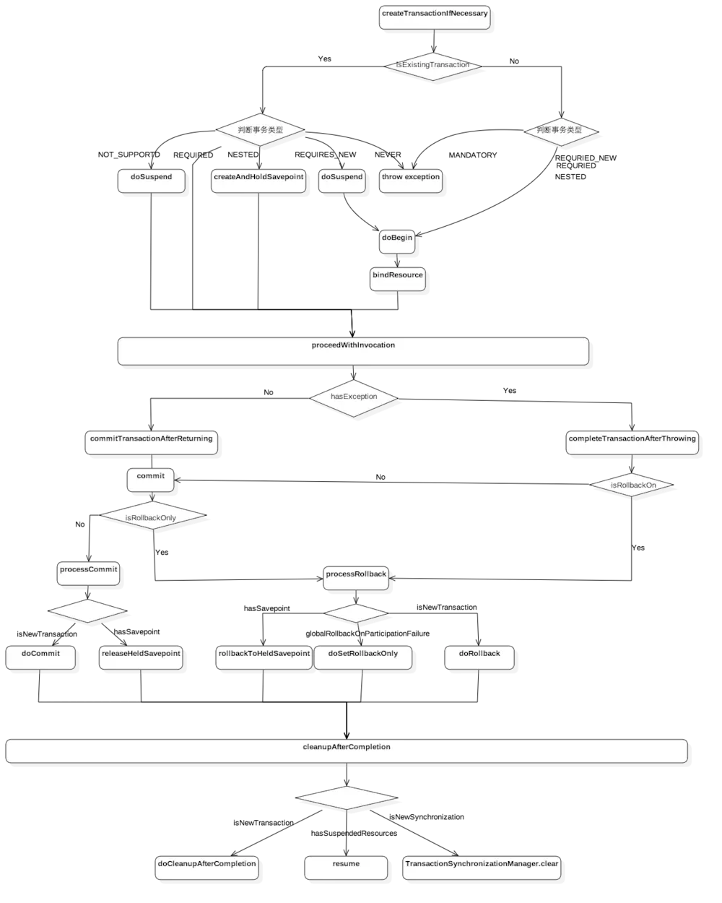

# spring-jdbc&tx
红字为主要执行路径，蓝字为暂不分析的代码
 本篇主要讲解 transaction，虽然标题带有 jdbc 字样，但不会对 JdbcTemplate 作讲解，因为其主要就是一个模板方法模式，没有什么难点。

## 架构
spring-tx 由以下五大核心构成

- TransactionAspectSupport 事务切面，其主要工作是控制打开、提交、回滚事务的流程。
- DataSourceTransactionManager 事务管理器，是打开、提交、回滚事务的具体执行者。
- DefaultTransactionStatus 事务状态，由事务管理器打开事务时产生，其管理着当前事务的状态、事务资源以及可能被挂起的事务资源。
- RuleBasedTransactionAttribute 事务属性，这个类跟我们编程时使用 @Transactional 息息相关，此类保存着要应用的事务传播行为、隔离级别、超时时间、是否只读以及回滚策略。
- TransactionSynchronizationManager 事务同步管理器，其绑定者当前事务的资源以及事务属性

下面来看事务处理的流程

## 如何构建事务切面
参见 ProxyTransactionManagementConfiguration

    // 创建事务切面
    @Bean(name = TransactionManagementConfigUtils.TRANSACTION_ADVISOR_BEAN_NAME)
    @Role(BeanDefinition.ROLE_INFRASTRUCTURE)
    public BeanFactoryTransactionAttributeSourceAdvisor transactionAdvisor() {
        BeanFactoryTransactionAttributeSourceAdvisor advisor = new BeanFactoryTransactionAttributeSourceAdvisor();
        advisor.setTransactionAttributeSource(transactionAttributeSource());
        advisor.setAdvice(transactionInterceptor());
        if (this.enableTx != null) {
            advisor.setOrder(this.enableTx.<Integer>getNumber("order"));
        }
        return advisor;
    }

    // 创建 TransactionAttribute 生成器
    // 用于切点匹配和事务处理
    @Bean
    @Role(BeanDefinition.ROLE_INFRASTRUCTURE)
    public TransactionAttributeSource transactionAttributeSource() {
        return new AnnotationTransactionAttributeSource();
    }

    // 创建事务 advice
    @Bean
    @Role(BeanDefinition.ROLE_INFRASTRUCTURE)
    public TransactionInterceptor transactionInterceptor() {
        TransactionInterceptor interceptor = new TransactionInterceptor();
        interceptor.setTransactionAttributeSource(transactionAttributeSource());
        if (this.txManager != null) {
            interceptor.setTransactionManager(this.txManager);
        }
        return interceptor;
    }

## 如何完成事务流程
参见 TransactionAspectSupport.invokeWithinTransaction

    /**
     * 使用环绕性 advice 执行事务
     */
    @Nullable
    protected Object invokeWithinTransaction(Method method, @Nullable Class<?> targetClass,
            final InvocationCallback invocation) throws Throwable {
        // 获取 TransactionAttribute
        TransactionAttributeSource tas = getTransactionAttributeSource();
        final TransactionAttribute txAttr = (tas != null ? tas.getTransactionAttribute(method, targetClass) : null);
        // 获取 PlatformTransactionManager
        final PlatformTransactionManager tm = determineTransactionManager(txAttr);
        // 获取 joinpointId
        final String joinpointIdentification = methodIdentification(method, targetClass, txAttr);
        // 执行事务
        if (txAttr == null || !(tm instanceof CallbackPreferringPlatformTransactionManager)) {
            // 创建 txInfo
            TransactionInfo txInfo = createTransactionIfNecessary(tm, txAttr, joinpointIdentification);
            // 执行事务操作
            Object retVal;
            try {
                retVal = invocation.proceedWithInvocation();
            }
            catch (Throwable ex) {
                // 回滚事务
                completeTransactionAfterThrowing(txInfo, ex);
                throw ex;
            }
            finally {
                // 还原之前的事务信息
                cleanupTransactionInfo(txInfo);
            }
            // 提交事务
            commitTransactionAfterReturning(txInfo);
            return retVal;
        }
        else {
            //...
        }
    }

## JdbcTemplate 如何获取事务资源
参见 TransactionSynchronizationManager.getResource

    private static final ThreadLocal<Map<Object, Object>> resources = new NamedThreadLocal<>("Transactional resources");
    
    /**
     * 获取资源
     */
    @Nullable
    public static Object getResource(Object key) {
        // unwrapResource
        Object actualKey = TransactionSynchronizationUtils.unwrapResourceIfNecessary(key);
        // 从 TL 获取资源
        Object value = doGetResource(actualKey);
        if (value != null && logger.isTraceEnabled()) {
            logger.trace("Retrieved value [" + value + "] for key [" + actualKey + "] bound to thread [" +
                    Thread.currentThread().getName() + "]");
        }
        // 返回
        return value;
    }

    /**
     * 真•获取资源
     */
    @Nullable
    private static Object doGetResource(Object actualKey) {
        // 如果资源集合为空, 则返回空
        Map<Object, Object> map = resources.get();
        if (map == null) {
            return null;
        }
        // 获取资源
        Object value = map.get(actualKey);
        // 如果资源为空, 则移除资源
        if (value instanceof ResourceHolder && ((ResourceHolder) value).isVoid()) {
            map.remove(actualKey);
            // 如果资源集合为空, 则移除资源集合
            if (map.isEmpty()) {
                resources.remove();
            }
            value = null;
        }
        // 返回
        return value;
    }

## 如何处理嵌套事务
    /**
     * 处理嵌套事务
     */
    private TransactionStatus handleExistingTransaction(
            TransactionDefinition definition, Object transaction, boolean debugEnabled)
            throws TransactionException {
        // PROPAGATION_NEVER, 抛出异常
        if (definition.getPropagationBehavior() == TransactionDefinition.PROPAGATION_NEVER) {
            throw new IllegalTransactionStateException(
                    "Existing transaction found for transaction marked with propagation 'never'");
        }
        // PROPAGATION_NOT_SUPPORTED
        // 挂起之前的事务, 并以非事务方式执行
        if (definition.getPropagationBehavior() == TransactionDefinition.PROPAGATION_NOT_SUPPORTED) {
            if (debugEnabled) {
                logger.debug("Suspending current transaction");
            }
            // 挂起事务资源
            Object suspendedResources = suspend(transaction);
            boolean newSynchronization = (getTransactionSynchronization() == SYNCHRONIZATION_ALWAYS);
            // 以非事务方式准备新的 TransactionStatus
            // 注意第二个参数为null, 第三个参数为 false, 即没有事务资源
            // 但还是会将 TransactionStatus 绑定到 TL
            return prepareTransactionStatus(definition, null, false, newSynchronization, debugEnabled, suspendedResources);
        }
        // PROPAGATION_REQUIRES_NEW
        // 挂起之前的事务, 并以全新的事务执行
        if (definition.getPropagationBehavior() == TransactionDefinition.PROPAGATION_REQUIRES_NEW) {
            if (debugEnabled) {
                logger.debug("Suspending current transaction, creating new transaction with name [" +
                        definition.getName() + "]");
            }
            // 挂起事务资源
            SuspendedResourcesHolder suspendedResources = suspend(transaction);
            try {
                // 准备新的 TransactionStatus
                boolean newSynchronization = (getTransactionSynchronization() != SYNCHRONIZATION_NEVER);
                DefaultTransactionStatus status = newTransactionStatus(definition, transaction, true, newSynchronization, debugEnabled, suspendedResources);
                // 绑定新的事务资源
                doBegin(transaction, definition);
                // 将 TransactionStatus 绑定到 TL
                prepareSynchronization(status, definition);
                return status;
            }
            catch (RuntimeException | Error beginEx) {
                resumeAfterBeginException(transaction, suspendedResources, beginEx);
                throw beginEx;
            }
        }
        // PROPAGATION_NESTED
        // 保存之前的事务操作, 并加入之前的事务
        if (definition.getPropagationBehavior() == TransactionDefinition.PROPAGATION_NESTED) {
            if (!isNestedTransactionAllowed()) {
                throw new NestedTransactionNotSupportedException(
                        "Transaction manager does not allow nested transactions by default - " +
                        "specify 'nestedTransactionAllowed' property with value 'true'");
            }
            if (debugEnabled) {
                logger.debug("Creating nested transaction with name [" + definition.getName() + "]");
            }
            // 支持 savepoint
            if (useSavepointForNestedTransaction()) {
                // 加入当前正在执行的事务
                // 注意第二个参数为传递进来的 transaction, 第三、四个参数为 false,
                DefaultTransactionStatus status = prepareTransactionStatus(definition, transaction, false, false, debugEnabled, null);
                // 保存当前已执行的事务
                status.createAndHoldSavepoint();
                return status;
            }
            else {
                // Nested transaction through nested begin and commit/rollback calls.
                // Usually only for JTA: Spring synchronization might get activated here
                // in case of a pre-existing JTA transaction.
                boolean newSynchronization = (getTransactionSynchronization() != SYNCHRONIZATION_NEVER);
                DefaultTransactionStatus status = newTransactionStatus(definition, transaction, true, newSynchronization, debugEnabled, null);
                doBegin(transaction, definition);
                prepareSynchronization(status, definition);
                return status;
            }
        }
        // PROPAGATION_SUPPORTS、PROPAGATION_REQUIRES
        // 不对之前的事务做操作, 直接加入之前的事务
        if (debugEnabled) {
            logger.debug("Participating in existing transaction");
        }
        // 是否验证当前事务
        // 如果隔离级别不一致或事务只读, 则抛出异常
        if (isValidateExistingTransaction()) {
            if (definition.getIsolationLevel() != ISOLATION_DEFAULT) {
                Integer currentIsolationLevel = TransactionSynchronizationManager.getCurrentTransactionIsolationLevel();
                if (currentIsolationLevel == null || currentIsolationLevel != definition.getIsolationLevel()) {
                    Constants isoConstants = DefaultTransactionDefinition.constants;
                    throw new IllegalTransactionStateException("Participating transaction with definition [" +
                            definition + "] specifies isolation level which is incompatible with existing transaction: " +
                            (currentIsolationLevel != null ?
                                    isoConstants.toCode(currentIsolationLevel, DefaultTransactionDefinition.PREFIX_ISOLATION) :
                                    "(unknown)"));
                }
            }
            if (!definition.isReadOnly()) {
                if (TransactionSynchronizationManager.isCurrentTransactionReadOnly()) {
                    throw new IllegalTransactionStateException("Participating transaction with definition [" +
                            definition + "] is not marked as read-only but existing transaction is");
                }
            }
        }
        // 加入当前事务
        boolean newSynchronization = (getTransactionSynchronization() != SYNCHRONIZATION_NEVER);
        return prepareTransactionStatus(definition, transaction, false, newSynchronization, debugEnabled, null);
    }

## 关于事务的传播行为&隔离级别
这两个已经被说烂了的东西，这里不再叙述，可以参考引用文章。

## 参考引用
1. [实战Spring事务传播性与隔离性 - 简书](https://www.jianshu.com/p/249f2cd42692)
