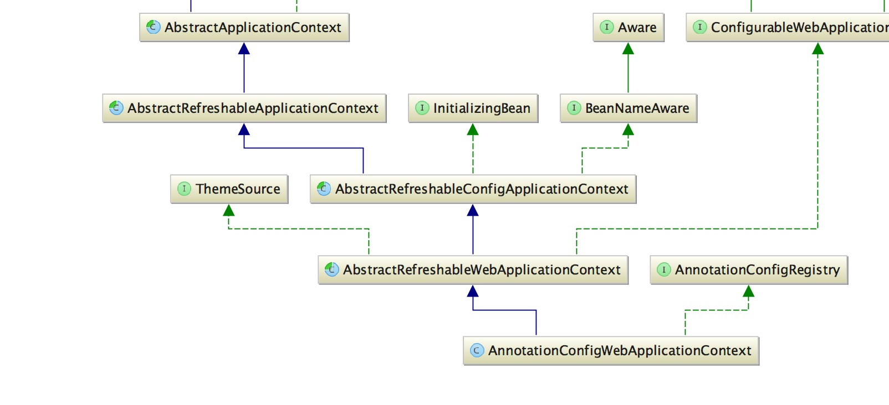
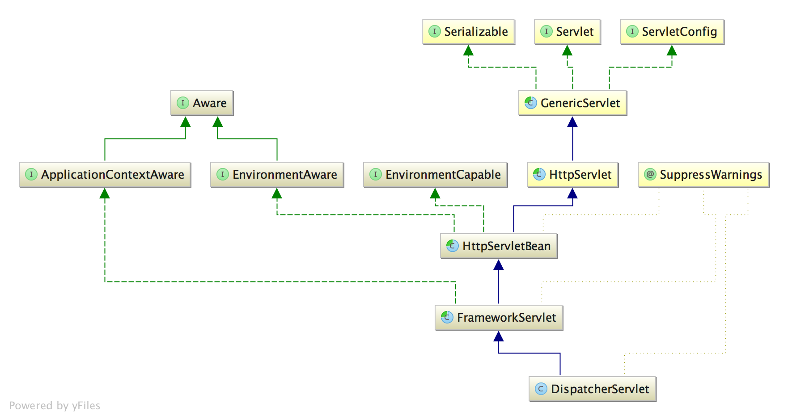
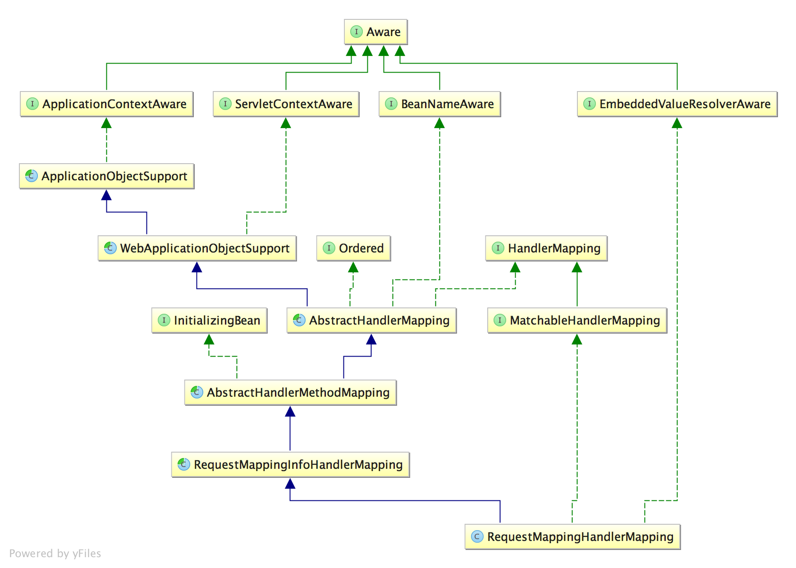
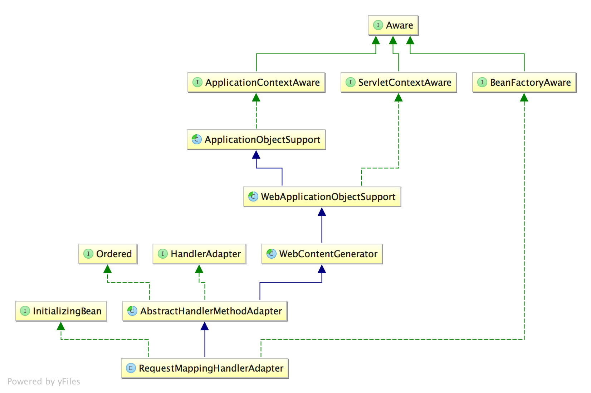
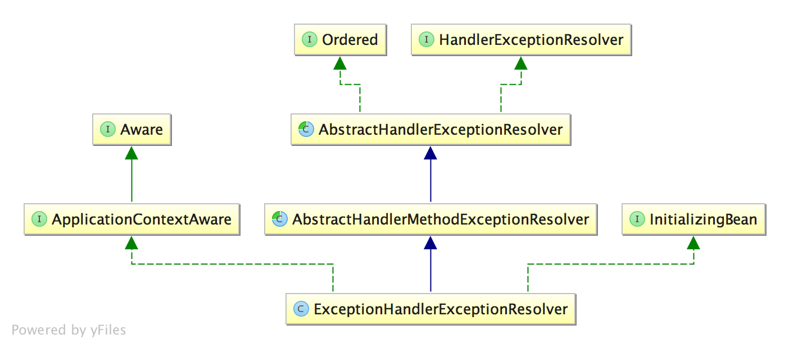

# spring-mvc
红字为主要执行路径，蓝字为暂不分析的代码
 本篇主要基于 RestController 构建，对于异步和视图并没有深入。

## 架构
spring-mvc 主要由 AnnotationConfigWebApplicationContext、DispatcherServlet、RequestMappingHandlerMapping、RequestMappingHandlerAdapter、ExceptionHandlerExceptionResolver 五大核心构成，下面来看看他的类图和介绍。

### AnnotationConfigWebApplicationContext

  
AnnotationConfigWebApplicationContext 继承自 AbstractApplicationContext，而 AbstractApplicationContext 是 ApplicationContext 的核心实现，此处不再赘述。

- AbstractRefreshableApplicationContext 主要完成 BeanFactory 的实例化
- AbstractRefreshableConfigApplicationContext 主要完成配置 bean 的读取
- AbstractRefreshableWebApplicationContext 核心，主要完成 servletContext、servletConfig 的注入，注册 RequestScope、SessionScope、ServletContextScope
- AnnotationConfigWebApplicationContext 主要完成对注解 bean 的扫描

### DispatcherServlet

  

- HttpServletBean 构建一个 ServletBean 类型的超类，并提供初始化的功能且由子类覆盖
- FrameworkServlet 
    - 接驳 rootApplicationContext 与 webApplicationContext，并刷新 webApplicationContext 来完成初始化
    - 作为请求处理的入口，完成对 http-method 的分发，controller 级别的分发则交给 DispatcherServlet 来做
- DispatcherServlet 完成 controller 级别请求的分发

### RequestMappingHandlerMapping

  

- ApplicationObjectSupport 完成 ApplicationContext 的注入并提供初始化方法以便子类覆盖
- WebApplicationObjectSupport 完成 ServletContext 的注入并提供初始化方法以便子类覆盖
- RequestMappingHandlerMapping 存储 url 与 requestMapping 之间的映射，并完成 controller 级别请求的寻址

### RequestMappingHandlerAdapter

  

- ApplicationObjectSupport 同上
- WebApplicationObjectSupport 同上
- RequestMappingHandlerMapping 完成 controller 级别请求的处理

### ExceptionHandlerExceptionResolver

  

- ExceptionHandlerExceptionResolver 寻找能够处理异常的方法并调用它来完成异常处理

## 配置

    @Retention(RetentionPolicy.RUNTIME)
    @Target(ElementType.TYPE)
    @Documented
    @Import(DelegatingWebMvcConfiguration.class)
    public @interface EnableWebMvc {
    }

DelegatingWebMvcConfiguration 开启了如下17个 mvc 所需配置，RestController 场景下最核心的三个配置是 requestMappingHandlerMapping、requestMappingHandlerAdapter、handlerExceptionResolver

    requestMappingHandlerMapping
    requestMappingHandlerAdapter
    handlerExceptionResolver

    mvcPathMatcher
    mvcUrlPathHelper
    mvcContentNegotiationManager
    viewControllerHandlerMapping
    resourceHandlerMapping
    mvcResourceUrlProvider
    defaultServletHandlerMapping
    mvcConversionService
    mvcValidator
    mvcUriComponentsContributor
    httpRequestHandlerAdapter
    simpleControllerHandlerAdapter
    mvcViewResolver
    mvcHandlerMappingIntrospector

## 启动
- FrameworkServlet.initWebApplicationContext
 主要工作是接驳 rootApplicationContext 与 webApplicationContext，并刷新 webApplicationContext 来完成初始化

        /**
         * 初始化 WebApplicationContext
         */
        protected WebApplicationContext initWebApplicationContext() {
            // 获取 root ctx
            WebApplicationContext rootContext = WebApplicationContextUtils.getWebApplicationContext(getServletContext());
            WebApplicationContext wac = null;
            // 如果已存在 wac
            if (this.webApplicationContext != null) {
                wac = this.webApplicationContext;
                if (wac instanceof ConfigurableWebApplicationContext) {
                    ConfigurableWebApplicationContext cwac = (ConfigurableWebApplicationContext) wac;
                    if (!cwac.isActive()) {
                        // 设置 parent
                        if (cwac.getParent() == null) {
                            cwac.setParent(rootContext);
                        }
                        // 刷新 wac
                        configureAndRefreshWebApplicationContext(cwac);
                    }
                }
            }
            // 如果不存在 wac, 则从 servletContext 上查找
            if (wac == null) {
                wac = findWebApplicationContext();
            }
            // 如果依然不存在 wac, 则创建 wac
            if (wac == null) {
                wac = createWebApplicationContext(rootContext);
            }
            /**
             * 如果还没有发布 contextRefresh 事件
             * 则调用 onRefresh 完成最后的初始化
             * @see DispatcherServlet#onRefresh
             */
            if (!this.refreshEventReceived) {
                synchronized (this.onRefreshMonitor) {
                    onRefresh(wac);
                }
            }
            // 将 wac 注入进 servletContext
            if (this.publishContext) {
                String attrName = getServletContextAttributeName();
                getServletContext().setAttribute(attrName, wac);
            }
            return wac;
        }
- AbstractHandlerMethodMapping.afterPropertiesSet
 主要工作是检测所有带 @Controller @RequestMapping 的类和方法, 并将其注册成 HandlerMethod

        /**
         * 检测所有带 @Controller @RequestMapping 的类和方法, 并将其注册成 HandlerMethod
         */
        @Override
        public void afterPropertiesSet() {
            initHandlerMethods();
        }

        /**
         * 注册所有的 HandlerMethod
         */
        protected void initHandlerMethods() {
            // 迭代所有的 bean 并注册 HandlerMethod
            for (String beanName : getCandidateBeanNames()) {
                if (!beanName.startsWith(SCOPED_TARGET_NAME_PREFIX)) {
                    processCandidateBean(beanName);
                }
            }
            // 打印日志
            handlerMethodsInitialized(getHandlerMethods());
        }

        /**
         * 注册 HandlerMethod
         */
        protected void processCandidateBean(String beanName) {
            // 获取 beanType
            Class<?> beanType = null;
            try {
                beanType = obtainApplicationContext().getType(beanName);
            }
            catch (Throwable ex) {
                // An unresolvable bean type, probably from a lazy bean - let's ignore it.
                if (logger.isTraceEnabled()) {
                    logger.trace("Could not resolve type for bean '" + beanName + "'", ex);
                }
            }
            // 如果 bean 带有 @Controller @RequestMapping, 则将其注册
            if (beanType != null && isHandler(beanType)) {
                detectHandlerMethods(beanName);
            }
        }

        /**
         * 注册 HandlerMethod
         */
        protected void detectHandlerMethods(Object handler) {
            Class<?> handlerType = (handler instanceof String ? obtainApplicationContext().getType((String) handler) : handler.getClass());
            if (handlerType != null) {
                Class<?> userType = ClassUtils.getUserClass(handlerType);
                // 遍历 method 并生成 method 与 RequestMappingInfo 的映射
                Map<Method, T> methods = MethodIntrospector.selectMethods(userType,
                        (MethodIntrospector.MetadataLookup<T>) method -> {
                            try {
                                return getMappingForMethod(method, userType);
                            }
                            catch (Throwable ex) {
                                throw new IllegalStateException("Invalid mapping on handler class [" +
                                        userType.getName() + "]: " + method, ex);
                            }
                        });
                if (logger.isTraceEnabled()) {
                    logger.trace(formatMappings(userType, methods));
                }
                // 遍历映射并将注册成 HandlerMethod
                methods.forEach((method, mapping) -> {
                    Method invocableMethod = AopUtils.selectInvocableMethod(method, userType);
                    registerHandlerMethod(handler, invocableMethod, mapping);
                });
            }
        }

        /**
         * 注册 HandlerMethod
         */
        protected void registerHandlerMethod(Object handler, Method method, T mapping) {
            this.mappingRegistry.register(mapping, handler, method);
        }

        // 真•注册 HandlerMethod
        public void register(T mapping, Object handler, Method method) {
            this.readWriteLock.writeLock().lock();
            try {
                // 创建 HandlerMethod
                HandlerMethod handlerMethod = createHandlerMethod(handler, method);
                assertUniqueMethodMapping(handlerMethod, mapping);
                // 加入 mappingLookup
                this.mappingLookup.put(mapping, handlerMethod);
                // 加入 urlLookup
                List<String> directUrls = getDirectUrls(mapping);
                for (String url : directUrls) {
                    this.urlLookup.add(url, mapping);
                }
                // 加入 nameLookup
                String name = null;
                if (getNamingStrategy() != null) {
                    name = getNamingStrategy().getName(handlerMethod, mapping);
                    addMappingName(name, handlerMethod);
                }
                // 加入 corsLookup
                CorsConfiguration corsConfig = initCorsConfiguration(handler, method, mapping);
                if (corsConfig != null) {
                    this.corsLookup.put(handlerMethod, corsConfig);
                }
                // 加入 registry
                this.registry.put(mapping, new MappingRegistration<>(mapping, handlerMethod, directUrls, name));
            }
            finally {
                this.readWriteLock.writeLock().unlock();
            }
        }
- RequestMappingHandlerAdapter.afterPropertiesSet
 主要工作初始化 ControllerAdvice、argumentResolvers、returnValueHandlers

        @Override
        public void afterPropertiesSet() {
            // 初始化 controller advice
            initControllerAdviceCache();
            // 初始化 argumentResolvers、initBinderArgumentResolvers、returnValueHandlers
            if (this.argumentResolvers == null) {
                List<HandlerMethodArgumentResolver> resolvers = getDefaultArgumentResolvers();
                this.argumentResolvers = new HandlerMethodArgumentResolverComposite().addResolvers(resolvers);
            }
            if (this.initBinderArgumentResolvers == null) {
                List<HandlerMethodArgumentResolver> resolvers = getDefaultInitBinderArgumentResolvers();
                this.initBinderArgumentResolvers = new HandlerMethodArgumentResolverComposite().addResolvers(resolvers);
            }
            if (this.returnValueHandlers == null) {
                List<HandlerMethodReturnValueHandler> handlers = getDefaultReturnValueHandlers();
                this.returnValueHandlers = new HandlerMethodReturnValueHandlerComposite().addHandlers(handlers);
            }
        }

        private void initControllerAdviceCache() {
            if (getApplicationContext() == null) {
                return;
            }
            // 查找并排序 ControllerAdvice
            List<ControllerAdviceBean> adviceBeans = ControllerAdviceBean.findAnnotatedBeans(getApplicationContext());
            AnnotationAwareOrderComparator.sort(adviceBeans);
            List<Object> requestResponseBodyAdviceBeans = new ArrayList<>();
            // 迭代 adviceBeans
            for (ControllerAdviceBean adviceBean : adviceBeans) {
                Class<?> beanType = adviceBean.getBeanType();
                if (beanType == null) {
                    throw new IllegalStateException("Unresolvable type for ControllerAdviceBean: " + adviceBean);
                }
                // 将带 @RequestMapping、@ModelAttribute 的 method 加入 modelAttributeAdviceCache
                Set<Method> attrMethods = MethodIntrospector.selectMethods(beanType, MODEL_ATTRIBUTE_METHODS);
                if (!attrMethods.isEmpty()) {
                    this.modelAttributeAdviceCache.put(adviceBean, attrMethods);
                }
                // 将带 @InitBinder 的 method 加入 initBinderAdviceCache
                Set<Method> binderMethods = MethodIntrospector.selectMethods(beanType, INIT_BINDER_METHODS);
                if (!binderMethods.isEmpty()) {
                    this.initBinderAdviceCache.put(adviceBean, binderMethods);
                }
                // 将 RequestBodyAdvice、ResponseBodyAdvice 加入结果集
                if (RequestBodyAdvice.class.isAssignableFrom(beanType) || ResponseBodyAdvice.class.isAssignableFrom(beanType)) {
                    requestResponseBodyAdviceBeans.add(adviceBean);
                }
            }
            // 赋值 requestResponseBodyAdvice
            if (!requestResponseBodyAdviceBeans.isEmpty()) {
                this.requestResponseBodyAdvice.addAll(0, requestResponseBodyAdviceBeans);
            }
            // 打印日志
            if (logger.isDebugEnabled()) {
                int modelSize = this.modelAttributeAdviceCache.size();
                int binderSize = this.initBinderAdviceCache.size();
                int reqCount = getBodyAdviceCount(RequestBodyAdvice.class);
                int resCount = getBodyAdviceCount(ResponseBodyAdvice.class);
                if (modelSize == 0 && binderSize == 0 && reqCount == 0 && resCount == 0) {
                    logger.debug("ControllerAdvice beans: none");
                }
                else {
                    logger.debug("ControllerAdvice beans: " + modelSize + " @ModelAttribute, " + binderSize +
                            " @InitBinder, " + reqCount + " RequestBodyAdvice, " + resCount + " ResponseBodyAdvice");
                }
            }
        }
- ExceptionHandlerExceptionResolver.afterPropertiesSet
 主要工作是初始化 ControllerAdvice、argumentResolvers、returnValueHandlers

        @Override
        public void afterPropertiesSet() {
            // 初始化 advice
            initExceptionHandlerAdviceCache();
            // 添加默认的入参处理器
            if (this.argumentResolvers == null) {
                List<HandlerMethodArgumentResolver> resolvers = getDefaultArgumentResolvers();
                this.argumentResolvers = new HandlerMethodArgumentResolverComposite().addResolvers(resolvers);
            }
            // 添加默认的出参处理器
            if (this.returnValueHandlers == null) {
                List<HandlerMethodReturnValueHandler> handlers = getDefaultReturnValueHandlers();
                this.returnValueHandlers = new HandlerMethodReturnValueHandlerComposite().addHandlers(handlers);
            }
        }

        private void initExceptionHandlerAdviceCache() {
            if (getApplicationContext() == null) {
                return;
            }
            // 查找并排序所有的 adviceBean
            List<ControllerAdviceBean> adviceBeans = ControllerAdviceBean.findAnnotatedBeans(getApplicationContext());
            AnnotationAwareOrderComparator.sort(adviceBeans);
            // 迭代 adviceBeans
            for (ControllerAdviceBean adviceBean : adviceBeans) {
                Class<?> beanType = adviceBean.getBeanType();
                if (beanType == null) {
                    throw new IllegalStateException("Unresolvable type for ControllerAdviceBean: " + adviceBean);
                }
                // 如果有异常 advice, 则加入 exceptionHandlerAdviceCache
                ExceptionHandlerMethodResolver resolver = new ExceptionHandlerMethodResolver(beanType);
                if (resolver.hasExceptionMappings()) {
                    this.exceptionHandlerAdviceCache.put(adviceBean, resolver);
                }
                // 如果是 ResponseBodyAdvice, 则加入 responseBodyAdvice
                if (ResponseBodyAdvice.class.isAssignableFrom(beanType)) {
                    this.responseBodyAdvice.add(adviceBean);
                }
            }
            // 打印日志
            if (logger.isDebugEnabled()) {
                int handlerSize = this.exceptionHandlerAdviceCache.size();
                int adviceSize = this.responseBodyAdvice.size();
                if (handlerSize == 0 && adviceSize == 0) {
                    logger.debug("ControllerAdvice beans: none");
                }
                else {
                    logger.debug("ControllerAdvice beans: " +
                            handlerSize + " @ExceptionHandler, " + adviceSize + " ResponseBodyAdvice");
                }
            }
        }
- DispatcherServlet.onRefresh
 主要工作是对 DispatcherServlet 所需的 bean 进行赋值

        @Override
        protected void onRefresh(ApplicationContext context) {
            initStrategies(context);
        }

        /**
         * 初始化必要的处理器
         */
        protected void initStrategies(ApplicationContext context) {
            // 以下方法都大同小异，只列出一个作参考
            initMultipartResolver(context);
            initLocaleResolver(context);
            initThemeResolver(context);
            initHandlerMappings(context);
            initHandlerAdapters(context);
            initHandlerExceptionResolvers(context);
            initRequestToViewNameTranslator(context);
            initViewResolvers(context);
            initFlashMapManager(context);
        }

        private void initThemeResolver(ApplicationContext context) {
            try {
                this.themeResolver = context.getBean(THEME_RESOLVER_BEAN_NAME, ThemeResolver.class);
                if (logger.isTraceEnabled()) {
                    logger.trace("Detected " + this.themeResolver);
                }
                else if (logger.isDebugEnabled()) {
                    logger.debug("Detected " + this.themeResolver.getClass().getSimpleName());
                }
            }
            catch (NoSuchBeanDefinitionException ex) {
                // We need to use the default.
                this.themeResolver = getDefaultStrategy(context, ThemeResolver.class);
                if (logger.isTraceEnabled()) {
                    logger.trace("No ThemeResolver '" + THEME_RESOLVER_BEAN_NAME +
                            "': using default [" + this.themeResolver.getClass().getSimpleName() + "]");
                }
            }
        }

## 执行
- DispatcherServlet.doDispatch
 主要工作是分发请求

        /**
         * 分发请求
         */
        protected void doDispatch(HttpServletRequest request, HttpServletResponse response) throws Exception {
            HttpServletRequest processedRequest = request;
            HandlerExecutionChain mappedHandler = null;
            boolean multipartRequestParsed = false;
            WebAsyncManager asyncManager = WebAsyncUtils.getAsyncManager(request);
            try {
                ModelAndView mv = null;
                Exception dispatchException = null;
                try {
                    // 如果需要, 将 request 转换成 MultipartHttpServletRequest
                    processedRequest = checkMultipart(request);
                    multipartRequestParsed = (processedRequest != request);
                    // 查找能够处理此请求的 mappedHandler
                    mappedHandler = getHandler(processedRequest);
                    // 如果找不到 mappedHandler, 则返回 404
                    if (mappedHandler == null) {
                        noHandlerFound(processedRequest, response);
                        return;
                    }
                    HandlerAdapter ha = getHandlerAdapter(mappedHandler.getHandler());
                    // 如果是 GET 或 HEAD 请求且支持缓存, 则直接返回
                    String method = request.getMethod();
                    boolean isGet = "GET".equals(method);
                    if (isGet || "HEAD".equals(method)) {
                        long lastModified = ha.getLastModified(request, mappedHandler.getHandler());
                        if (new ServletWebRequest(request, response).checkNotModified(lastModified) && isGet) {
                            return;
                        }
                    }
                    // 应用前置拦截器
                    if (!mappedHandler.applyPreHandle(processedRequest, response)) {
                        return;
                    }
                    /**
                     * 处理请求
                     * @see AbstractHandlerMethodAdapter#handle
                     * @see RequestMappingHandlerAdapter#handleInternal
                     */
                    mv = ha.handle(processedRequest, response, mappedHandler.getHandler());
                    // 异步处理???
                    if (asyncManager.isConcurrentHandlingStarted()) {
                        return;
                    }
                    // 应用默认 view
                    applyDefaultViewName(processedRequest, mv);
                    // 应用后者拦截器
                    mappedHandler.applyPostHandle(processedRequest, response, mv);
                }
                catch (Exception ex) {
                    dispatchException = ex;
                }
                catch (Throwable err) {
                    dispatchException = new NestedServletException("Handler dispatch failed", err);
                }
                // 处理返回结果
                processDispatchResult(processedRequest, response, mappedHandler, mv, dispatchException);
            }
            catch (Exception ex) {
                triggerAfterCompletion(processedRequest, response, mappedHandler, ex);
            }
            catch (Throwable err) {
                triggerAfterCompletion(processedRequest, response, mappedHandler, new NestedServletException("Handler processing failed", err));
            }
            finally {
                // 异步处理???
                if (asyncManager.isConcurrentHandlingStarted()) {
                    if (mappedHandler != null) {
                        mappedHandler.applyAfterConcurrentHandlingStarted(processedRequest, response);
                    }
                }
                else {
                    // 清理 multipartRequest
                    if (multipartRequestParsed) {
                        cleanupMultipart(processedRequest);
                    }
                }
            }
        }