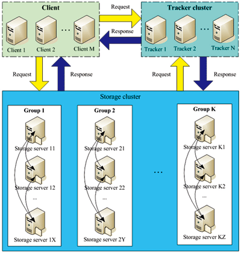
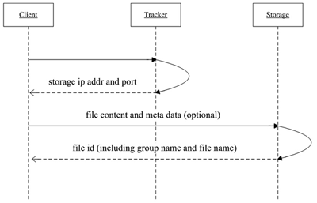
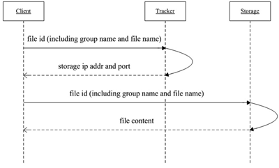

# 本篇说明
本篇为FastDFS介绍及安装、使用说明 
红字为重要说明，橙字为不确定说明，绿字待定。

# FastDFS
## 定义
FastDFS是C语言实现的、开源的、轻量级的应用级分布式文件系统，开发者为淘宝开发平台部资深架构师余庆。它提供了负载均衡、冗余备份机制，是一个可扩展、高可用、高性能的分布式文件系统。

## 架构
FastDFS一共由三部分组成：由下图所示：

TrackerServer：负责负载均衡和调度，它是整个FastDFS的中心，它将StorageServer的分组信息以及状态信息保存在内存中。

StorageServer：存储文件和文件meta信息，它直接使用操作系统的文件系统管理DFS上的文件。

Client：请求发起方，使用客户端接口与TrackerServer或StorageServer进行数据交互。

## 流程
上传流程：

下载流程：

## 特性
- 分组：FastDFS采用了分组存储方式。集群由一个或多个组构成，集群容量为所有组的存储容量之和。一个组由一台或多台StoragServer组成，同组内的StorageServer之间是互备关系。
- 对等：FastDFS集群中的TrackerServer之间是对等关系，同组内的StoragServer之间也是对等关系。

## 安装
[参考github-wiki](https://github.com/happyfish100/fastdfs/wiki)

## 配置详解
[参考作者说明](http://bbs.chinaunix.net/thread-1941456-1-1.html)

## 客户端
### 引入依赖

	<dependency>
		<groupId>org.csource</groupId>
		<artifactId>fastdfs-client-java</artifactId>
		<version>1.27-SNAPSHOT</version>
	</dependency>

### 配置

	fastdfs.connect_timeout_in_seconds = 5        # 连接超时时间
	fastdfs.network_timeout_in_seconds = 30       # 读超时时间
	fastdfs.charset = UTF-8                       # 字符集
	fastdfs.http_anti_steal_token = false         # 
	fastdfs.http_secret_key = FastDFS1234567890   #
	fastdfs.http_tracker_http_port = 80           # 通过http直接访问文件的端口
	fastdfs.tracker_servers = 10.0.11.201:22122   # tracker_server地址，多个用逗号分割

### 使用

	public class FdfsTest {

		private static final Logger LOGGER = LoggerFactory.getLogger(FdfsTest.class);

		private static final String CONF_NAME = "fdfs_client.conf";

		private StorageClient storageClient;
		private TrackerServer trackerServer;

		// 初始化
		@Before
		public void initStorageClient() throws Exception {
			ClientGlobal.init(CONF_NAME);
			TrackerClient tracker = new TrackerClient();
			trackerServer = tracker.getConnection();
			storageClient = new StorageClient(trackerServer, null);
		}

		// 关闭
		@After
		public void closeClient() {
			if (storageClient != null) {
				try {
					storageClient.close();
				} catch (IOException e) {
					LOGGER.error(e.getMessage(), e);
				}
			}
			if (trackerServer != null) {
				try {
					trackerServer.close();
				} catch (IOException e) {
					LOGGER.error(e.getMessage(), e);
				}
			}
		}

		@Test
		public void upload_download() throws Exception {
			String fileName = "fastdfs-client.properties";
			// 文件属性不是必填参数
			NameValuePair[] metaList = new NameValuePair[1];
			metaList[0] = new NameValuePair("fileName", fileName);
			// 上传
			String[] uploadResult = storageClient.upload_file(fileName, null, metaList);
			LOGGER.info("result {}", Arrays.asList(uploadResult));
			// 下载
			int result = storageClient.download_file(uploadResult[0], uploadResult[1], "build.properties");
			LOGGER.info("result {}", result);
		}
	}

# 参考引用
0. [blogs/FastDFS概览.md at master · leotse90/blogs](https://github.com/leotse90/blogs/blob/master/FastDFS%E6%A6%82%E8%A7%88.md)
0. [happyfish100/fastdfs-client-java: FastDFS java client SDK](https://github.com/happyfish100/fastdfs-client-java)
