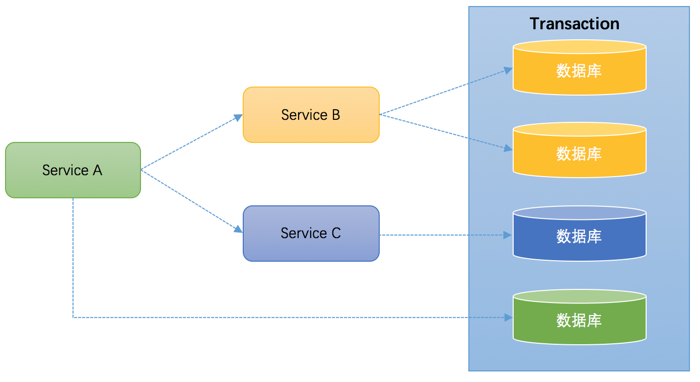

# 本篇说明
本篇为分布式系统总结，红字为重要说明，绿字高亮，橙字为不确定说明。

# 入门
## 定义
- 狭义的分布式系统是指由网络连接的计算机系统，每个节点独立地承担计算或存储任务，节点间通过网络协同工作。

## 特点
- 分布性
- 对等性
- 并发性
- 缺乏全局时钟
- 故障随时发生
- ？？？三态(成功/失败/超时)

## 问题
- 消息传递异步无序
- 网络分区
- 节点故障
    - fail-stop(宕机不可恢复)
    - fail-recover(宕机可恢复)
- 拜占庭将军问题

# 理论
## flp
- 在异步通信场景，即使只有一个进程失败了，没有任何算法能保证非失败进程能够达到一致性
- flp定理告诉我们：
    - 一致性算法的可靠性是无法保证的，同时满足 safety 和 liveness 的一致性协议是不存在的
    - 不存在一个能在异步网络上能够容忍各种故障并保持一致的分布式系统

## cap
- Consistency 指更新操作成功并返回客户端完成后，所有节点在同一时间的数据完全一致
- Availability 指服务必须一直处于可用状态，每次请求都能获取到非错的响应
- Partition Tolerance 指分布式系统在遇到任何网络分区故障的时候，仍然能够对外提供满足一致性或(和？？？)可用性的服务
- 选择AP就无法保证C，发生P时，一旦有更新操作就会导致不一致的状态
- 选择CP就无法保证A，发生P时，一旦有更新操作就会导致节点阻塞不可用
- 选择CA就无法保证P，除非不发生P则可以同时保证CA，一旦发生P就无法同时保证CA

## base
- 如果不能做到强一致，则可根据业务特性牺牲C，保证AP，以求达到最终一致性
- 基本可用
    - 分布式系统出现故障时，允许损失部分可用性，保证核心可用
    - 例：流量过大时，引导用户到降级页面
- 软状态
    - 允许系统中的数据存在中间状态，并认为该状态不影响系统的整体可用性。
    - 例：分布式存储中一般一份数据至少会有三个副本，允许不同节点间副本同步的延时就是软状态的体现
- 最终一致性
    - 所有数据副本经过一定时间后，最终能够达到一致的状态
    - 实际工程实践中，最终一致性分为5种，需要结合使用
        - 因果一致性
            - 如果节点A在更新完某个数据后通知了节点B，那么节点B之后对该数据的访问和修改都是基于A更新后的值。于此同时，和节点A无因果关系的节点C的数据访问则没有这样的限制。
        - 读己之所写
            - 节点A更新一个数据后，它自身总是能访问到自身更新过的最新值，而不会看到旧值。
        - 会话一致性
            - 系统保证在同一个有效的会话中实现“读己之所写”的一致性
        - 单调读一致性
            - 如果一个节点从系统读取了某个数据后，那么系统针对该节点对此数据的后续访问都不应该返回更旧的值
        - 单调写一致性
            - 一个系统要保证来自同一个节点的写操作被顺序的执行

# 分布式一致性

# 分布式共识
## paxos

## raft

## gossip

# 分布式事务
## 定义
分布式事务是指事务的参与者、协调者、资源管理器、事务管理器分别位于分布式系统的不同节点之上。

## 场景
### 本地事务
大多数场景下，应用都只需要操作单一的库，这种情况下我们称之为本地事务，本地事务的ACID特性由数据库直接提供保障。

- 一个典型的场景如下图所示：
  

        Connection conn = ... //获取数据库连接
        conn.setAutoCommit(false); //开启事务
        try{
            //...执行增删改查sql
            conn.commit(); //提交事务
        } catch (Exception e) {
            conn.rollback();//事务回滚
        } finally{
            conn.close();//关闭链接
        }

### 跨库事务
跨库事务是指一个应用需要操作多个库，不同的库存储不同的业务数据。那么什么场景下会跨库？根据业务的不同，我们一般会对数据库进行垂直切分。
- 垂直切分是指将原来存储在同一数据库中的不同业务数据分离后，存储在不同的数据库中。如下图所示：
  

### 跨应用事务
- 将业务垂直切分后，如果还是由一个应用操作不同的数据库，这显然是不合适的，拆库的同时应拆分应用，不同的业务数据由不同的应用维护。
- 如果某个功能需要操作多个库，那么这个功能应调用多个应用完成，而不是直接操作多个库，这是最典型的分布式事务场景。如下图所示：
  

## x/open
看过本地事务、跨库事务、跨应用事务之后，我们猜想是否有一个组织或者公司对以上场景提出过规范或者解决方案，答案是有的。
x/open，即现在的[open group](http://www.opengroup.org/)，是一个独立的组织，主要负责制定各种行业技术标准。
x/open组织主要由各大知名公司或者厂商进行支持，这些组织制定并遵循行业技术标准，其主要成员如下图所示：

x/open对分布式事务处理即DTP(Distributed Transaction Processing)提出了以下规范：
- [DTP 参考模型](http://pubs.opengroup.org/onlinepubs/9294999599/toc.pdf)
- [DTP XA 规范](http://pubs.opengroup.org/onlinepubs/009680699/toc.pdf)

## DTP模型
### 模型元素
在《DTP参考模型》第3版中，规定了构成DTP模型的5个基本元素：

- AP(Application Program，应用程序)
    - 用于定义事务边界(即定义事务的开始和结束)，并在事务边界内对资源进行操作。
- RM(Resource Manager，资源管理器)
    - 如数据库、文件系统等，并提供对资源的访问。
- TM(Transaction Manager，事务管理器)
    - 负责分配事务的唯一标识，监控事务的进度，提交、回滚事务等。
- CRM(Communication Resource Manager，通信资源管理器)
    - 控制一个TM域内或者跨TM域的分布式应用之间的通信。
- CP(Communication Protocol，通信协议)
    - 提供CRM提供的分布式应用节点之间的通信服务。

### 模型实例
一个DTP模型实例至少由AP、RMs、TM三个部分组成，如下图所示：

- 上图类似于前面提到的跨库事务，即单个应用需要操作多个库。
    - 在图里就是一个AP需要操作多个RM，AP通过TM来声明一个全局事务，然后操作不同的RM，最后通知TM来提交或回滚全局事务。
    - 如果图中的RM缩减成一个，则类似于本地事务，即单个应用操作单个库

如果分布式事务需要跨多个应用，那么每个模型实例中，还需要额外的加入一个CRM。如下图所示：
    
CRM作为多个模型之间的通信桥梁，其主要作用是通信和传播事务，与传统的RPC框架不同，CRM采用OSI TP(Open Systems Interconnection — Distributed Transaction Processing)进行通信。

### 事务管理器作用域(TM Domain)
一个TM Domain由一个或多个模型实例组成，这些模型实例使用同一个TM，但是操作不同的RMs，由TM来统一协调这些模型实例共同参与形成的全局事务。如下图所示：
    
TM domain只是列出了一个全局事务中的模型实例，但并不关心这些模型实例之间的关系，然而，这些模型实例之间是存在一定的层级依赖关系，这就是下面要说的全局事务树形结构。

### 全局事务树形结构(Global Transaction Tree Structure)
当一个TM domain存在多个模型实例时，会形成一种树形调用关系，如下图所示：
    

- 发起分布式事务的模型实例称之为root节点，其他的模型实例统称为事务参与者。事务发起者负责开启全局事务，事务参与者负责自己的事务分支。
- 从模型实例之间的调用关系来说，调用方称之为上游节点(Superior Node)，被调用方称之为下游节点(Subordinate Node)。

## DTP XA 规范
在最基础的DTP模型实例中，只有AP、RMs、TM三个部分，三个部分彼此间都需要交互，如下图所示：
    
关于这张图，XA规范有以下描述：

> The subject of this X/Open specification is interface (3) in the diagram above, the XA interface by which TMs and RMs interact.

> For more details on this model and diagram, including detailed definitions of each component, see the referenced DTP guide.

也就是说XA规范最主要的作用是定义了RM与TM的交互接口，下图更加清晰地演示了XA规范在DTP模型中的位置
    
XA规范除了定义RM与TM的交互接口之外，还对两阶段提交协议进行了优化。

- DTP模型指定了全局事务的提交要使用2pc
- 2pc不是由XA提出，而是由OSI TP提出
- XA只是定义了2pc中需要使用的接口，即RM与TM的交换接口

## 2pc
2pc即两阶段提交协议，由协调者、参与者配合实现分布式一致性，其角色和作用如下：

角色 | XA 概念 | 作用 
----|---------|-----
协调者 | 事务管理器 | 协调各个参与者，对分布式事务进行提交或回滚
参与者 | 资源管理器 | 分布式集群中的节点

二阶段提交分为准备和提交两个阶段，其算法思路为：每个参与者将操作结果通知协调者，再由协调者根据所有参与者的反馈情况，决定各参与者是提交操作还是中止操作。

### 准备阶段
- 事务询问
    - 协调者向所有参与者询问，是否准备好执行事务并等待各参与者的响应。
- 事务执行
    - 各参与者执行事务
        - 如果本地事务成功，写事务日志，但不提交
        - 如果本地事务失败，直接返回失败，退出执行
- 事务响应
    - 回复协调者yes(可以提交) or no(不可以提交)

### 提交阶段
协调者会根据准备阶段的结果执行2种操作：提交事务 or 中断事务。

- 提交事务
    - 发送提交请求
        - 协调者向所有参与者发出提交请求。
    - 事务提交
        - 参与者收到提交请求后提交事务并释放占用的资源。
    - 反馈事务提交结果
        - 参与者向协调者反馈结果。
    - 事务提交确认
        - 协调者收到所有参与者的反馈后，完成事务。
- 中断事务
    - 发送回滚请求
        - 协调者向所有参与者发出回滚请求。
    - 事务回滚
        - 参与者收到回滚请求后回滚事务并释放占用的资源。
    - 反馈事务回滚结果
        - 参与者向协调者反馈结果。
    - 事务中断确认
        - 协调者收到所有参与者的反馈后，中断事务。

### 优缺点
- 优点
    - 原理简单，容易实现
- 缺点
    - 同步阻塞
        - 所有参与者都在等协调者的第二阶段命令
             参与者是否可以响应其他请求？不一定，这得看应用使用什么数据库
             以mysql为例，第一阶段执行事务操作时的隔离级别是“串行读”，意味着锁定粒度非常高(锁表)，但并不意味着mysql不能接受其他请求

### 无法解决的故障
- fail-stop
    - 协调者在发出提交命令后宕机，收到命令的参与者也宕机，剩下的参与者则无法将流程走下去，即便选出新的协调者也不能决定是提交还是回滚
- 网络分区
    - 假设在协调者发出提交命令后出现网络分区，一部分参与者收到了命令并执行然后释放资源，一部分参与者没有收到命令并阻塞下去，那么在网络恢复之前，会导致数据不一致

## 3pc
3pc即三阶段提交协议，其致力于解决二阶段提交中的单点故障问题，因此引入了参与者超时机制和额外的一个询问阶段。

三阶段提交分为 CanCommit、PreCommit、DoCommit 三个阶段。

### CanCommit
- 事务询问
    - 协调者向所有参与者询问，是否准备好执行事务并等待各参与者的响应。
- 事务响应
    - 回复协调者yes(准备好了) or no(没有准备好) 

### PreCommit
协调者根据 CanCommit 的结果执行2种操作：执行事务预提交 or 或者中断事务。

- 执行事务预提交
    - 协调者向所有参与者发出预提交请求，并进入 prepared 状态
    - 参与者收到预提交请求后，执行事务并不提交，返回ACK
- 中断事务
    - 协调者向所有参与者中断请求
    - 参与者收到请求并执行中断，返回ACK
- 参与者未收到协调者消息
    - 因为有参与者对协调者timeout机制，所以认为协调者timeout，执行中断

### DoCommit
协调者根据 PreCommit 的结果执行2种操作：提交事务 or 或者中断事务。

- 提交事务
    - 协调者向所有参与者发出提交请求
    - 参与者提交事务并释放资源，返回ACK
    - 协调者完成事务
- 中断事务
    - 协调者向所有参与者发出中断请求
    - 参与者回滚事务，返回ACK
    - 协调者完成中断
- 参与者未收到协调者消息
    - 协调者timeout，如果上阶段执行的是预提交，则认为其他参与者也是执行的预提交，所以此阶段提交事务成功的概率性非常大，执行提交事务

### 无法解决的故障
3pc解决了2pc的fail-stop故障，但引入了fail-recover故障且仍然无法解决网络分区故障

- fail-recover/网络分区
    - 在协调者发出预提交后出现fail-recover或网络分区故障，部分参与者收到了消息并执行了预提交，部分参与者没有收到消息执行了中断，那么在故障恢复之前，因为超时，执行了预提交的参与者会提交事务，此时，不一致就发生了

## jta

## 刚性事务
刚性事务遵循ACID原则，提供的是强一致性，其典型代表为数据库事务、2PC、3PC。

## 柔性事务
柔性事务遵循BASE原则，提供的是最终一致性，其典型代表为最大努力通知、可靠消息最终一致性、补偿型

### 最大努力通知
最大努力通知适用于一些最终一致性时间敏感度低的业务，且被动方处理结果不影响主动方的处理结果。
典型的使用场景有：银行通知、商户通知等，其一般特点如下：

- 不可靠消息：业务活动主动方，在完成业务处理之后，向业务活动的被动方发送消息，直到通知N次后不再通知，允许消息丢失(不可靠消息)。
- 定期校对：业务活动的被动方，根据定时策略，向业务活动主动方查询(主动方提供查询接口)，恢复丢失的业务消息。

### 可靠消息最终一致性
可靠消息最终一致性是指业务方完成本地业务逻辑后通过可靠消息来通知其他业务方完成后续的业务逻辑以实现最终一致性。此方式有两个注意点：

- 发送消息的业务方必须传递可靠消息，也就是说，如果业务操作成功，那么由这个业务操作所产生的消息一定要成功投递出去，否则就丢消息。
- 接收消息的业务方必须保证幂等操作

那么如何生产可靠消息？

- 使用同时都支持XA的RM，例：mysql、jms
- 使用事务消息，例：rabbitmq

来看一看，错误的发送示例

    @Transactional
    public void test1(){
        //1 数据库操作
        //2 发送MQ消息
    }
看似没问题，当消息发送失败，数据库操作回滚，一且都很完美。然而，如果发送消息只是响应超时，消息实际上已投递成功，这时数据库操作回滚，不一致的数据就产生了。

### TCC(补偿型)
tcc是try-confirm-cancel的简称，其事务提交分为两个阶段，try阶段、confirm/cancel阶段，说明如下：

- try阶段：完成所有业务检查(一致性)，预留业务资源(准隔离性)
- confirm阶段：如果try阶段全部成功，则使用try阶段预留的业务资源执行业务操作，不做任何业务检查。
- cancel阶段：如果try阶段有失败，则取消try阶段预留的业务资源。

tcc看起来和2pc是如此的相似，来看一看他们的对比：
    

再来看一看他们的区别：

- 2pc是资源层面的强一致性事务，在两阶段提交的过程中，会一直持有资源锁。
- tcc是业务层面的最终一致性事务，不会一直持有资源锁。
- 2pc由RM直接提供，tcc则需要工程师自己实现，tcc对工程师的要求也更高。

# 参考引用
0. [分布式系统理论概述 - 程序猿院长的个人空间 - OSCHINA](https://my.oschina.net/u/4051865/blog/3036100)
0. [分布式系统理论 - 知乎](https://zhuanlan.zhihu.com/distributed)
0. [分布式系统理论基础 - 一致性、2PC和3PC - 知乎](https://zhuanlan.zhihu.com/p/21994882)
0. [分布式理论梳理——FLP定理 - 野马草原 - OSCHINA](https://my.oschina.net/duofuge/blog/1512344)
0. [分布式理论(一) - CAP定理 - 掘金](https://juejin.im/post/5b26634b6fb9a00e765e75d1)
0. [分布式之【CAP理论、BASE理论 、FLP不可能定理】](https://nicky-chen.github.io/2018/04/25/cap-base-flp/)
0. [CAP理论中的P到底是个什么意思？ - 知乎](https://www.zhihu.com/question/54105974)
0. [分布式理论(二) - BASE理论 - 掘金](https://juejin.im/post/5b2663fcf265da59a401e6f8)
0. [分布式理论(三) - 2PC协议 - 掘金](https://juejin.im/post/5b2664446fb9a00e4a53136e)
0. [分布式理论(四) - 3PC协议 - 掘金](https://juejin.im/post/5b26648e5188257494641b9f)
0. [2PC和3PC | Calvin's Marbles](http://www.calvinneo.com/2019/03/12/2pc-3pc/)
0. [漫话分布式系统共识协议: 2PC/3PC篇 - 知乎](https://zhuanlan.zhihu.com/p/35298019)
0. [分布式事务概述](http://www.tianshouzhi.com/api/tutorials/distributed_transaction/383)
0. [百特开源](https://www.bytesoft.org/)
0. [Paxos算法 - 维基百科，自由的百科全书](https://zh.wikipedia.org/wiki/Paxos%E7%AE%97%E6%B3%95)
0. [分布式理论(五) - 一致性算法Paxos - 掘金](https://juejin.im/post/5b2664bd51882574874d8a76)
0. [Paxos算法详解 - 知乎](https://zhuanlan.zhihu.com/p/31780743)
0. [Paxos 总结 | ggaaooppeenngg](https://ggaaooppeenngg.github.io/zh-CN/2018/05/20/paxos-%E6%80%BB%E7%BB%93/)
0. [如何浅显易懂地解说 Paxos 的算法？ - 知乎](https://www.zhihu.com/question/19787937)
0. [请问分布式事务一致性与raft或paxos协议解决的一致性问题是同一回事吗？ - 知乎](https://www.zhihu.com/question/275845393)
0. [分布式一致性和分布式共识协议 | Calvin's Marbles](http://www.calvinneo.com/2017/09/20/distributed-system-consistency-and-consensus/)
