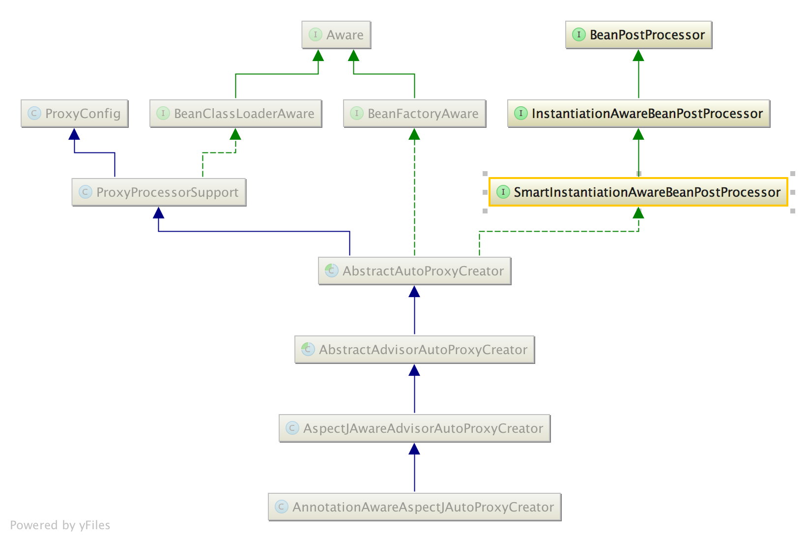
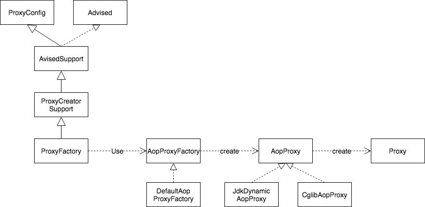
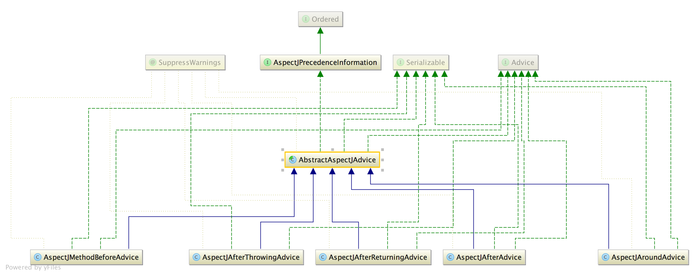

# spring-aop
红字为主要执行路径，蓝字为暂不分析的代码

## 架构
spring-aop 由 AnnotationAwareAspectJAutoProxyCreator、 ProxyFactory、 AspectJAdvice 三大核心构成，下面来看看他们的类图和介绍。

### AnnotationAwareAspectJAutoProxyCreator
  

- AbstractAutoProxyCreator 主要功能是对初始化后的 bean 进行代理
- AbstractAdvisorAutoProxyCreator 完成代理的过程中需要构建所有的切面，beanFactory 里的切面由此类构建
- AspectJAwareAdvisorAutoProxyCreator 排序所有的切面
- AnnotationAwareAspectJAutoProxyCreator 完成代理的这个过程中需要构建所有的切面，带 @Aspect 的切面由此类构建

### ProxyFactory
  
ProxyFactory 的主要工作是使用 AopProxyFactory 来创建 AopProxy，再通过 AopProxy 来创建最终的代理

### AspectJAdvice
  
springAOP定义了5种不同的 advice，其结构如上图所示

## 如何构建切面
### 构建切面
参见 AnnotationAwareAspectJAutoProxyCreator.findCandidateAdvisors

    /**
     * 获取所有切面
     */
    @Override
    protected List<Advisor> findCandidateAdvisors() {
        // 从 beanFactory 获取 advisor
        List<Advisor> advisors = super.findCandidateAdvisors();
        // 根据 @Aspect 构建切面
        if (this.aspectJAdvisorsBuilder != null) {
            advisors.addAll(this.aspectJAdvisorsBuilder.buildAspectJAdvisors());
        }
        return advisors;
    }
### 构建切面1 来自 beanFactory
参见 BeanFactoryAdvisorRetrievalHelper.findAdvisorBeans

    /**
     * 从 beanFactory 查找所有的 Advisor
     */
    public List<Advisor> findAdvisorBeans() {
        // 从 beanFactory 查找所有的 Advisor
        String[] advisorNames = this.cachedAdvisorBeanNames;
        if (advisorNames == null) {
            advisorNames = BeanFactoryUtils.beanNamesForTypeIncludingAncestors(beanFactory, Advisor.class, true, false);
            this.cachedAdvisorBeanNames = advisorNames;
        }
        if (advisorNames.length == 0) {
            return new ArrayList<>();
        }
        // 迭代 advisorNames, 并将其加入结果集
        List<Advisor> advisors = new ArrayList<>();
        for (String name : advisorNames) {
            if (isEligibleBean(name)) {
                // 如果 bean 正在创建, 则跳过
                if (this.beanFactory.isCurrentlyInCreation(name)) {
                    if (logger.isTraceEnabled()) {
                        logger.trace("Skipping currently created advisor '" + name + "'");
                    }
                }
                // 将 bean 加入结果集
                else {
                    try {
                        advisors.add(this.beanFactory.getBean(name, Advisor.class));
                    }
                    catch (BeanCreationException ex) {
                        Throwable rootCause = ex.getMostSpecificCause();
                        if (rootCause instanceof BeanCurrentlyInCreationException) {
                            BeanCreationException bce = (BeanCreationException) rootCause;
                            String bceBeanName = bce.getBeanName();
                            if (bceBeanName != null && this.beanFactory.isCurrentlyInCreation(bceBeanName)) {
                                if (logger.isTraceEnabled()) {
                                    logger.trace("Skipping advisor '" + name +
                                            "' with dependency on currently created bean: " + ex.getMessage());
                                }
                                // Ignore: indicates a reference back to the bean we're trying to advise.
                                // We want to find advisors other than the currently created bean itself.
                                continue;
                            }
                        }
                        throw ex;
                    }
                }
            }
        }
        return advisors;
    }
### 构建切面2 来自 @Aspect
参见 BeanFactoryAspectJAdvisorsBuilder.buildAspectJAdvisors

    /**
     * 查找带 @Aspect 的 bean, 并构建 springAOP Advisors
     */
    public List<Advisor> buildAspectJAdvisors() {
        // DCL for aspectBeanNames
        // 如果 aspectBeanNames 为 null
        List<String> aspectNames = this.aspectBeanNames;
        if (aspectNames == null) {
            synchronized (this) {
                aspectNames = this.aspectBeanNames;
                if (aspectNames == null) {
                    List<Advisor> advisors = new ArrayList<>();
                    aspectNames = new ArrayList<>();
                    // 读取所有 beanNames
                    String[] beanNames = BeanFactoryUtils.beanNamesForTypeIncludingAncestors(this.beanFactory, Object.class, true, false);
                    // 迭代 beanNames
                    for (String beanName : beanNames) {
                        // 是否合格的 aspect
                        if (!isEligibleBean(beanName)) {
                            continue;
                        }
                        // 获取 beanType
                        Class<?> beanType = this.beanFactory.getType(beanName);
                        if (beanType == null) {
                            continue;
                        }
                        // 如果 bean 是一个 aspect
                        if (this.advisorFactory.isAspect(beanType)) {
                            // 构建 AspectMetadata
                            aspectNames.add(beanName);
                            AspectMetadata amd = new AspectMetadata(beanType, beanName);
                            // 如果是 PerClauseKind.SINGLETON, 则构建 advisor 并将其加入 advisorsCache
                            if (amd.getAjType().getPerClause().getKind() == PerClauseKind.SINGLETON) {
                                // 构建 AspectInstanceFactory 并获取 advisors
                                MetadataAwareAspectInstanceFactory factory = new BeanFactoryAspectInstanceFactory(this.beanFactory, beanName);
                                List<Advisor> classAdvisors = this.advisorFactory.getAdvisors(factory);
                                // 加入 advisorsCache or aspectFactoryCache
                                if (this.beanFactory.isSingleton(beanName)) {
                                    this.advisorsCache.put(beanName, classAdvisors);
                                }
                                else {
                                    this.aspectFactoryCache.put(beanName, factory);
                                }
                                advisors.addAll(classAdvisors);
                            }
                            // 反之, 则将 AspectInstanceFactory 加入 aspectFactoryCache
                            else {
                                if (this.beanFactory.isSingleton(beanName)) {
                                    throw new IllegalArgumentException("Bean with name '" + beanName +
                                            "' is a singleton, but aspect instantiation model is not singleton");
                                }
                                // 构建 AspectInstanceFactory 并获取 advisors
                                MetadataAwareAspectInstanceFactory factory = new PrototypeAspectInstanceFactory(this.beanFactory, beanName);
                                advisors.addAll(this.advisorFactory.getAdvisors(factory));
                                this.aspectFactoryCache.put(beanName, factory);
                            }
                        }
                    }
                    this.aspectBeanNames = aspectNames;
                    return advisors;
                }
            }
        }
        // 如果没有 aspect, 则返回空列表
        if (aspectNames.isEmpty()) {
            return Collections.emptyList();
        }
        // 迭代 aspectNames
        List<Advisor> advisors = new ArrayList<>();
        for (String aspectName : aspectNames) {
            // 从 advisorsCache 取 advisors 并加入结果集
            List<Advisor> cachedAdvisors = this.advisorsCache.get(aspectName);
            if (cachedAdvisors != null) {
                advisors.addAll(cachedAdvisors);
            }
            // 使用 AspectInstanceFactory 构建 advisors, 并加入结果集
            else {
                MetadataAwareAspectInstanceFactory factory = this.aspectFactoryCache.get(aspectName);
                advisors.addAll(this.advisorFactory.getAdvisors(factory));
            }
        }
        return advisors;
    }

## 如何选择切面
参见 AbstractAdvisorAutoProxyCreator.findEligibleAdvisors

    /**
     * 为 bean 选择切面
     * @see #findCandidateAdvisors
     * @see #sortAdvisors
     * @see #extendAdvisors
     */
    protected List<Advisor> findEligibleAdvisors(Class<?> beanClass, String beanName) {
        // 获取所有切面
        List<Advisor> candidateAdvisors = findCandidateAdvisors();
        // 为 bean 选择切面
        List<Advisor> eligibleAdvisors = findAdvisorsThatCanApply(candidateAdvisors, beanClass, beanName);
        // 提供给子类处理切面的机会
        extendAdvisors(eligibleAdvisors);
        // 排序切面
        if (!eligibleAdvisors.isEmpty()) {
            eligibleAdvisors = sortAdvisors(eligibleAdvisors);
        }
        return eligibleAdvisors;
    }

    /**
     * 为 bean 选择切面
     */
    public static List<Advisor> findAdvisorsThatCanApply(List<Advisor> candidateAdvisors, Class<?> clazz) {
        if (candidateAdvisors.isEmpty()) {
            return candidateAdvisors;
        }
        // 选择 introduction 类型的 advisor
        List<Advisor> eligibleAdvisors = new ArrayList<>();
        for (Advisor candidate : candidateAdvisors) {
            if (candidate instanceof IntroductionAdvisor && canApply(candidate, clazz)) {
                eligibleAdvisors.add(candidate);
            }
        }
        // 选择非 introduction 类型的 advisor
        boolean hasIntroductions = !eligibleAdvisors.isEmpty();
        for (Advisor candidate : candidateAdvisors) {
            if (candidate instanceof IntroductionAdvisor) {
                continue;
            }
            if (canApply(candidate, clazz, hasIntroductions)) {
                eligibleAdvisors.add(candidate);
            }
        }
        // 返回
        return eligibleAdvisors;
    }

    /**
     * 选择 advisor
     */
    public static boolean canApply(Advisor advisor, Class<?> targetClass, boolean hasIntroductions) {
        if (advisor instanceof IntroductionAdvisor) {
            return ((IntroductionAdvisor) advisor).getClassFilter().matches(targetClass);
        }
        else if (advisor instanceof PointcutAdvisor) {
            PointcutAdvisor pca = (PointcutAdvisor) advisor;
            // TODO 暂不深究这个匹配过程
            return canApply(pca.getPointcut(), targetClass, hasIntroductions);
        }
        else {
            return true;
        }
    }

## 如何代理
参见 AbstractAutoProxyCreator.createProxy

    /**
     * 为 bean 创建代理
     */
    protected Object createProxy(Class<?> beanClass, @Nullable String beanName,
            @Nullable Object[] specificInterceptors, TargetSource targetSource) {
        // 设置 beanDef.attribute originalTargetClass
        if (this.beanFactory instanceof ConfigurableListableBeanFactory) {
            AutoProxyUtils.exposeTargetClass((ConfigurableListableBeanFactory) this.beanFactory, beanName, beanClass);
        }
        // 创建 ProxyFactory
        ProxyFactory proxyFactory = new ProxyFactory();
        proxyFactory.copyFrom(this);
        // 决定是否使用 cglib 代理
        if (!proxyFactory.isProxyTargetClass()) {
            if (shouldProxyTargetClass(beanClass, beanName)) {
                proxyFactory.setProxyTargetClass(true);
            }
            else {
                evaluateProxyInterfaces(beanClass, proxyFactory);
            }
        }
        // 合并 commonInterceptors 与 specificInterceptors
        Advisor[] advisors = buildAdvisors(beanName, specificInterceptors);
        // 设置 advisor
        proxyFactory.addAdvisors(advisors);
        // 设置目标 bean
        proxyFactory.setTargetSource(targetSource);
        // 提供子类处理 proxyFactory 的机会
        customizeProxyFactory(proxyFactory);
        // ???
        proxyFactory.setFrozen(this.freezeProxy);
        // ???
        if (advisorsPreFiltered()) {
            proxyFactory.setPreFiltered(true);
        }
        // 创建代理
        return proxyFactory.getProxy(getProxyClassLoader());
    }

    /**
     * 创建代理
     */
    public Object getProxy(@Nullable ClassLoader classLoader) {
        // 获取 aopProxy 并创建 proxy
        AopProxy aopProxy = createAopProxy();
        return aopProxy.getProxy(classLoader);
    }

    // 真•创建代理
    @Override
    public Object getProxy(@Nullable ClassLoader classLoader) {
        if (logger.isTraceEnabled()) {
            logger.trace("Creating CGLIB proxy: " + this.advised.getTargetSource());
        }
        try {
            // 目标 class
            Class<?> rootClass = this.advised.getTargetClass();
            Assert.state(rootClass != null, "Target class must be available for creating a CGLIB proxy");
            // 确认 proxySuperClass
            Class<?> proxySuperClass = rootClass;
            if (ClassUtils.isCglibProxyClass(rootClass)) {
                proxySuperClass = rootClass.getSuperclass();
                Class<?>[] additionalInterfaces = rootClass.getInterfaces();
                for (Class<?> additionalInterface : additionalInterfaces) {
                    this.advised.addInterface(additionalInterface);
                }
            }
            // 校验 class 并打印日志
            validateClassIfNecessary(proxySuperClass, classLoader);
            // 创建并配置 enhancer
            Enhancer enhancer = createEnhancer();
            if (classLoader != null) {
                enhancer.setClassLoader(classLoader);
                if (classLoader instanceof SmartClassLoader && ((SmartClassLoader) classLoader).isClassReloadable(proxySuperClass)) {
                    enhancer.setUseCache(false);
                }
            }
            enhancer.setSuperclass(proxySuperClass);
            enhancer.setInterfaces(AopProxyUtils.completeProxiedInterfaces(this.advised));
            enhancer.setNamingPolicy(SpringNamingPolicy.INSTANCE);
            enhancer.setStrategy(new ClassLoaderAwareUndeclaredThrowableStrategy(classLoader));
            // TODO 暂不深入下面这段创建代理的过程
            Callback[] callbacks = getCallbacks(rootClass);
            Class<?>[] types = Arrays.stream(callbacks).map(Callback::getClass).toArray(Class<?>[]::new);
            // fixedInterceptorMap only populated at this point, after getCallbacks call above
            enhancer.setCallbackFilter(new ProxyCallbackFilter(this.advised.getConfigurationOnlyCopy(), this.fixedInterceptorMap, this.fixedInterceptorOffset));
            enhancer.setCallbackTypes(types);
            // Generate the proxy class and create a proxy instance.
            return createProxyClassAndInstance(enhancer, callbacks);
        }
        catch (CodeGenerationException | IllegalArgumentException ex) {
            throw new AopConfigException("Could not generate CGLIB subclass of " + this.advised.getTargetClass() +
                    ": Common causes of this problem include using a final class or a non-visible class",
                    ex);
        }
        catch (Throwable ex) {
            // TargetSource.getTarget() failed
            throw new AopConfigException("Unexpected AOP exception", ex);
        }
    }

## 如何应用切面
参见 CglibAopProxy.DynamicAdvisedInterceptor.intercept

    public Object intercept(Object proxy, Method method, Object[] args, MethodProxy methodProxy) throws Throwable {
        Object oldProxy = null;
        boolean setProxyContext = false;
        Object target = null;
        TargetSource targetSource = this.advised.getTargetSource();
        try {
            // 设置当前代理到 TL
            if (this.advised.exposeProxy) {
                // Make invocation available if necessary.
                oldProxy = AopContext.setCurrentProxy(proxy);
                setProxyContext = true;
            }
            // 获取目标类
            target = targetSource.getTarget();
            Class<?> targetClass = (target != null ? target.getClass() : null);
            // 为当前方法选择切面
            List<Object> chain = this.advised.getInterceptorsAndDynamicInterceptionAdvice(method, targetClass);
            Object retVal;
            // 如果没有切面可选, 则直接调用当前方法
            if (chain.isEmpty() && Modifier.isPublic(method.getModifiers())) {
                Object[] argsToUse = AopProxyUtils.adaptArgumentsIfNecessary(method, args);
                retVal = methodProxy.invoke(target, argsToUse);
            }
            // 反之, 则构建 MethodInvocation 并调用 proceed 来应用切面
            else {
                CglibMethodInvocation methodInvocation = new CglibMethodInvocation(proxy, target, method, args, targetClass, chain, methodProxy);
                retVal = methodInvocation.proceed();
            }
            // 处理返回值
            retVal = processReturnType(proxy, target, method, retVal);
            return retVal;
        }
        finally {
            // 如果需要则释放目标类
            if (target != null && !targetSource.isStatic()) {
                targetSource.releaseTarget(target);
            }
            // 还原代理点
            if (setProxyContext) {
                AopContext.setCurrentProxy(oldProxy);
            }
        }
    }

### MethodInvocation
MethodInvocation 是应用切面的核心，应用过程如下图所示：
  

