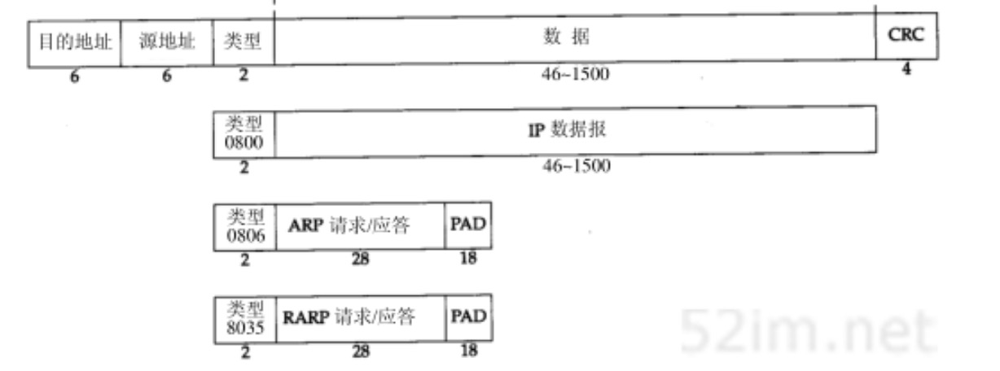
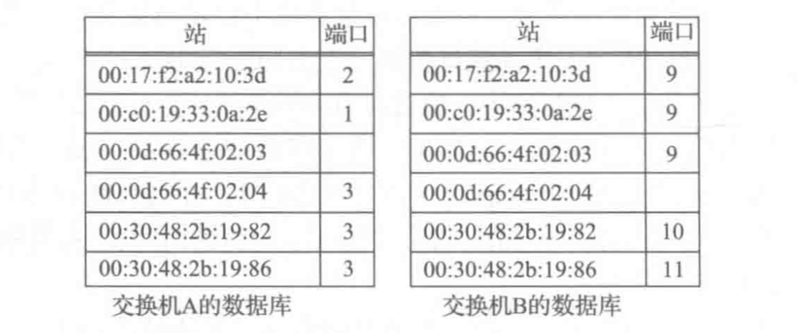

# 本篇说明
本系列为《tcp/ip 详解-卷1》浓缩，本篇为链路层浓缩。 
红字为重要说明，橙字为不确定说明，绿字待定。

# 链路层
从概述可以知道，在TCP/IP协议族中，链路层主要有三个目的：

- 为IP模块发送和接收数据报
- 为ARP模块发送请求和接收应答
- 为RARP模块发送请求和接收应答。

TCP/IP支持多种不同的链路层协议，这取决于网络所使用的硬件，如以太网、令牌环网、FDDI（光纤分布式数据接口）及RS-232串行线路等。

## 以太网 & IEEE 802
以太网一般是指Digital Equipment Corp.、Intel Corp.、Xerox Corp.在1982年联合公布的一个标准。它是当今TCP/IP采用的主要局域网技术。它采用一种称作CSMA/CD的媒体接入方法，其意思是带冲突检测的载波侦听多路接入（Carrier Sense, Multiple Access with Collision Detection）。它的速率为10 Mb/s，地址为48 bit。

几年后，IEEE 802委员会公布了一个稍微不同的标准集，其中802.3针对CSMA/CD网络，802.4针对令牌总线网络，802.5针对令牌环网络。这三者的共同特性(逻辑链路控制[LLC])由802.2标准定义。不幸的是，802.2和802.3定义了一个与以太网不同的帧格式。

以太网IP数据报的封装由RFC 894定义，IEEE 802网络IP数据报的封装由RFC 1042定义。RFC要求每台Internet主机都与一个10 Mb/s的以太网电缆相连接：

- 必须能发送和接收RFC 894封装格式的分组
- 应该能发送和接收RFC 894混合RFC 1042封装格式的分组
- 也许能发送和接收RFC 1042封装格式的分组。
- 如果主机能同时发送和接收两种类型的分组数据，那么类型必须是可设置的，而且默认必须是RFC 894。

两种帧格式都采用48 bit的目的地址和源地址。它就是我们常称的硬件地址，ARP和RARP协议对32 bit的IP地址和48 bit的硬件地址进行转换。

以太网格式：

802.3以太网格式：

由上两幅图可见，以太网格式和802.3以太网最小字节格式是基本相同的，尾部CRC(也称作FCS)代表对桢内数据的循环冗余校验。以太网格式的桢的最小长度为6+6+2+46+4=64字节。

## WIFI
参见 tcp/ip详解-卷1 第二版，此处紧作一个引用，不作展开。

## SLIP
SLIP的全称是Serial Line IP，它是一种在串行线路上对IP数据报进行封装的简单形式，因SLIP现今也不使用了，所以略过它。

## PPP & PPPoE
这里仅对两种点对点协议作一个简介，具体的报文格式以及交互流程请参考引用。

- PPP（Point-to-Point Protocol）工作在数据链路层，它通常用在两点之间创建直接的连接，并提供连接认证、传输加密以及压缩。PPP被用在多种类型的物理网络中，包括串口线、电话线、中继链接、移动电话、特殊无线电链路以及光纤链路。
- PPPoE（Point-to-Point Protocol over Ethernet）以太网上的点对点协议，是将PPP封装在以太网框架中的一种网络隧道协议。由于协议集成PPP协议，所以实现出传统以太网不能提供的身份验证、加密及压缩等功能，也可用于缆线调制解调器（cable modem）和数字用户线路（DSL）等以以太网协议向用户提供接入服务的协议体系。 本质上，它是一个允许在以太网广播域中的两个以太网接口间创建点对点的隧道协议。

## 网桥 & 交换机
IEEE 802.1d标准规定了网桥的操作，交换机本质上是高性能网桥。网桥或交互机用于连接多个物理的链路层网络。最基本的设置涉及连接两个交换机来形成一个局域网，如下图所示：

图中的交换机A和B互联形成一个局域网，在这个例子中，客户端都连接到A，服务端都连接到B，端口号仅供参考。注意，每个网络单元都有自己的MAC地址，每个网桥经过一段时间对域外MAC地址的学习后，最终交换机会知道每个网络单元可由哪个端口到达。每个交换机基于每个端口的列表被存储在一张表中，如下图所示：

当第一次打开交换机时，它的数据库是空的，因此它不知道除自己外的任务网络单元的位置。下面来看一看它的学习过程：

### MAC地址学习过程

每当交换机在一个端口收到一个以太帧，都要先学习帧头的源MAC，如果该MAC地址在地址表中不存在，则记录到地址表，并启动一个300秒的定时器(如果300秒内没有流量通过，则该表项将会被删除)。如果该MAC地址在地址表中存在，则将其超时时间刷新为300秒。地址表如下面所示：

|MAC|端口号|超时时间|
|---|---|---|
|72:00:05:17:f8:01|0|300|

### 以太桢转发过程
根据以太帧的目的MAC地址，来匹配MAC地址表，会有以下几种情况：

- 匹配到特殊MAC地址，比如生成树地址“01:80:C2:00:00:00”，将以太帧直接给STP模块处理
- 匹配到一个表项，发送给对应的端口
- 没有匹配的表项，发送给除接收到此帧的端口外的所有端口，这种情况通常称为泛洪

以上步骤，都假设没有配置VLAN，如果配置了VLAN，学习过程、转发过程都需要检查帧头802.1Q的VLAN ID字段，泛洪也只在属于该VLAN ID的端口上泛洪，此操作避免了以太桢发送给所有的主机。

## 环回接口
大多数的产品都支持环回接口（Loopback Interface，一个虚拟网络接口），以允许运行在同一主机上的客户端和服务端通过TCP/IP进行通信。A类网络号127就是为环回接口预留的。根据惯例，大多数系统把127.0.0.1分配给这个接口，并命名为localhost。一个传给环回接口的IP数据报不能出现在任何网络上。

下图是环回接口处理IP数据报的简单过程。

- 传给环回地址（一般是127.0.0.1）的任何数据均作为IP输入。
- 传给广播地址或多播地址的数据报复制一份传给环回接口，然后送到以太网上。这是因为广播传送和多播传送的定义包含主机本身。
- 任何传给该主机IP地址的数据均送到环回接口。

## 最大MTU
以太网桢中的数据长度有一个限制，其最大值是1500字节，链路层的这个特性称作MTU（最大传输单元），不同类型的网络有不同的上限。

如果IP层有一个数据报要传，且数据的长度比链路层的MTU要大，那么IP层就需要进行分片（fragmentation），把数据报分成若干片，这样每一片都小于MTU，我们将在UDP一篇中IP分片的过程。

## 路径MTU
如果两台主机之间的通信需要通过多个网络，那么每个网络的链路层就可能有不同的MTU，重要的不是两台主机所在的网络的MTU的值，而是两台主机通信路径中最小的MTU，它被称作路径MTU。

两台主机之间的路径MTU不一定是个常数，它取决于当时所选择的路由，而选路不一定是对称的（从A到B的路由可能与从B到A的路由不同），因此路径MTU在两个方向上不一定是一致的。

## 隧道基础
在某些情况下，两台计算机通过Internet或其他网络建立一条虚拟链路是有用的。虚拟专用网络（VPN）提供这种服务，实现这类服务的最常用方法就是隧道。一般来说，隧道是在高层(或同等层)分组中携带低层数据。例如：在一个IP分组中携带IP数据，在一个UDP、IP中携带以太网数据。隧道转变了在头部中严格分层的思想，并允许形成覆盖网络，即这些链路是实现其他协议的虚拟链路，而不是物理链路。

# 参考引用
0. [tcp/ip详解-卷1](https://book.douban.com/subject/1088054/)
0. [tcp/ip详解-卷1 第二版](https://book.douban.com/subject/26825411/)
0. [以太网](https://zh.wikipedia.org/wiki/%E4%BB%A5%E5%A4%AA%E7%BD%91)
0. [PPP](https://zh.wikipedia.org/wiki/%E7%82%B9%E5%AF%B9%E7%82%B9%E5%8D%8F%E8%AE%AE)
0. [PPPoE](https://zh.wikipedia.org/wiki/PPPoE)
0. [交换机mac表的获取？ - 知乎](https://www.zhihu.com/question/58187639)
