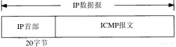
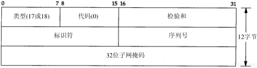
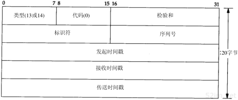
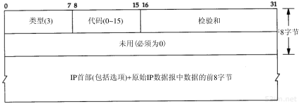
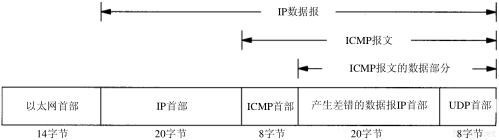
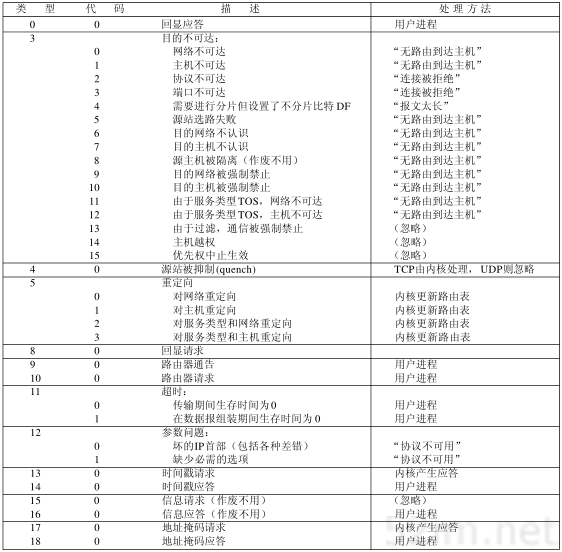

# 本篇说明
本系列为《tcp/ip 详解-卷1》浓缩，本篇为ICMP浓缩。 
红字为重要说明，橙字为不确定说明，绿字待定。

# ICMP
ICMP(Internet控制报文协议)经常被认为是IP层的一个组成部分，它传递差错报文以及其他需要注意的信息。ICMP报文通常被IP层或更高层协议（TCP或UDP）使用，一些ICMP报文会被返回给用户进程。

## ICMP 报文
ICMP报文是在IP数据报内部被传输的，如下图示：

ICMP报文的格式如下图所示：

所有报文的前4个字节都是一样的，但是剩下的其他字节则互不相同，下面将介绍不同的报文格式。

类型：有15个不同的值，以描述特定类型的ICMP报文

代码：用来进一步代描述同一类型下不同条件的ICMP报文

校验和：覆盖整个ICMP报文

## ICMP 报文的类型
各种类型的ICMP报文如下图所示：

上图中的最后两列表明ICMP报文是一份查询报文还是一份差错报文。当发送一份ICMP差错报文时，报文始终包含产生ICMP差错报文的IP数据报的IP首部和其数据部分的前8个字节。这样，接收ICMP差错报文的模块就会把它与某个特定的协议(根据IP首部中的协议字段)和用户进程(根据IP数据部分的前8字节中的端口号)联系起来。

以下几种情况都不会导致ICMP差错报文的产生：

- ICMP差错报文（但是，ICMP查询报文可能会产生ICMP差错报文）
- 目的地址是广播地址或多播地址的IP数据报
- 作为链路层广播的数据报
- 不是IP分片的第一片
- 源地址不是单个主机的数据报(说明源地址不是零地址/环回地址/广播地址/多播地址)

这些规则是为了防止ICMP差错报文对广播分组响应所带来的广播风暴。例如，如果不限制对ICMP差错报文进行响应，那么差错可能会遇到另一个差错，而差错再产生差错，这样会无休止地循环下去。

## ICMP地址掩码请求与应答

ICMP报文中的标识符和序列号字段由发送端任意选择设定，这些值在应答中将被返回，这样，发送端就可以把应答与请求进行匹配。

## ICMP时间戳请求与应答

请求端填写发起时间戳，然后发送报文。应答系统收到请求报文时填写接收时间戳，在发送应答时填写发送时间戳。

## ICMP端口不可达差错
下图为icmp不可达差错报文的格式：

下图为udp端口不可达的差错报文：

ICMP的一个规则是，ICMP差错报文必须包括生成该差错报文的IP数据报首部以及IP首部后面的前8个字节。

导致差错的IP数据报首部要被送回的原因是因为IP首部中包含了协议字段，它使得ICMP可以知道如何解释后面的8个字节。

一个重要的事实是不管是TCP首部还是UDP首部，源端口和目的端口都被包含在首部的前8个字节中。就是由于目的端口号才导致产生了ICMP端口不可达的差错报文，接收ICMP的系统可以根据源端口号来把差错报文与某个特定的用户进程相关联。

## ICMP报文的4.4BSD处理
由于ICMP覆盖的范围很广，从致命差错到信息差错，因此不同的系统对ICMP报文的处理是不同的，下图为4.4BSD系统的处理方法

如果最后一列指明是“内核”，那么ICMP就由内核来处理；如果最后一列指明是“用户进程”，那么报文就被传送到用户进程，如果不存在任何这样的用户进程，那么报文就悄悄地被丢弃；如果最后一列指明的是引号内的一串字符，那么它就是对应的Unix差错；有一些报文被完全忽略。

# 参考引用
0. [tcp/ip详解-卷1](https://book.douban.com/subject/1088054/)
