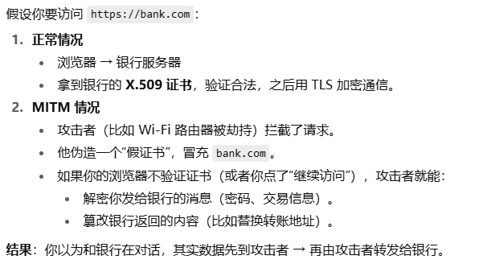
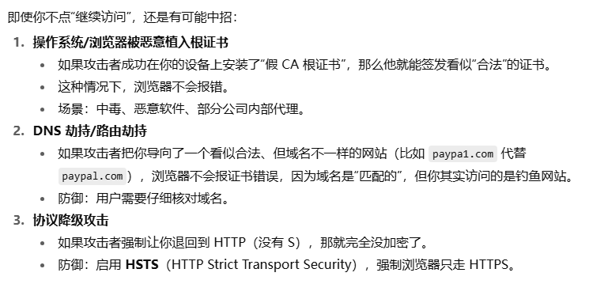

### 中间人攻击

- 定义
  - 攻击者在 **客户端和服务器之间** 悄悄“插一脚”，拦截、篡改或伪造通信内容，而双方还以为自己在安全地直接通信
- 攻击流程
  
- 如何防止MITM攻击

  - 理论上，只有不忽略浏览器的警告，就可以防止MITM攻击
  - 但是，总有些例外
  
  - **注1：**如果你的计算机中了病毒或木马，很难避免被植入根证书
  - **注2：**针对被劫持/植入的情况，访问涉及资产/资金交易的网站时
    - 一是：检查是否有自己不认识的的根证书
    - 二是：要注意访问的协议是不是HTTPS
    - 三是：要点开地址栏左边的按钮查看证书
