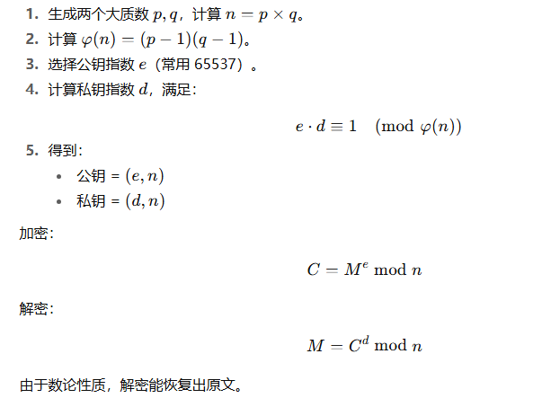
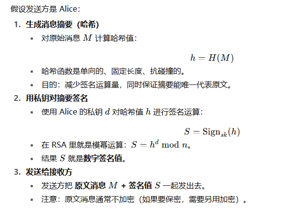
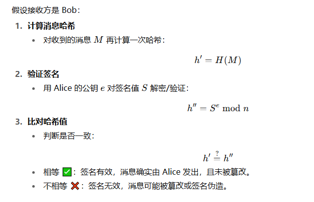

# 密码学概念

### 核心目标

- 保密性
  - 信息只有被授权的人才能看到
  - **实现方式：**加密算法（对称加密、非对称加密）
- 完整性
  - 信息在传输或存储过程中没有被篡改
  - **实现方式：**哈希函数、消息认证码(MAC)
- 身份认证
  - 确认信息发送者是谁，防止冒充
  - **实现方式：**数字签名、证书、公钥基础设施(PKI)
- 不可否认性
  - 信息发送者不能否认自己发送过的信息
  - **实现方式：**数字签名
- 抗抵赖性/防篡改
  - 结合完整性和不可否认性，保证信息不可篡改且发送者承担责任

### 主要算法类别

- 对称加密

- 非对称加密
  - 非对称加密，也叫**公钥密码学**，由**公钥**和**私钥**组成
  - 用途
    - 公钥加密，私钥解密
    - 私钥签名，公钥验证
    - **注：**以上两种用途均可以进行反向操作，但是没有意义
      - 如果用私钥加密明文，公钥持有者均可以解密，那这个明文并没有达到保密的效果
      - 如果用公钥签名，那凡是公钥持有者均可以对消息签名，结果是并没有达到数字签名的目的之一，无法证明消息确实是由某个发送者发出的
  - 工作机制
    
    - 注：不必纠结以上公钥e、私钥d、模n的生成过程，只需知道加解密的过程就是模幂运算即可
      - 加密：计算明文M的e次方，然后对n求模，得到密文C
      - 解密：计算密文C的d次方，然后对n求模，得到明文M
  
- 哈希函数

- 数字签名

  - **目的**

    - **身份认证**：证明消息确实是由某个发送者发出的
    - **完整性保护**：确保消息在传输过程中没有被篡改

  - 签名过程
  

  - 验签过程
  

  - **注：**签名的过程其实就是用私钥对消息的hash进行模幂运算得到密文，用公钥验证就是用公钥对密文进行模幂运算得到消息的hash1，同时对消息计算hash得到hash2，比对 hash1 == hash2，如果hash值相同，则认为消息是由私钥持有者发出且没有被篡改

- MAC函数

- 密钥交换协议
  - **特点：**在不安全的通道上安全地交换对称密钥

  - **典型协议**：基于椭圆曲线的 Diffie–Hellman (ECDHE)
    - 客户端和服务器各自生成临时的椭圆曲线密钥对(公钥+私钥)
    - 互相交换公钥
    - 双方用对方的公钥 + 自己的私钥，算出相同的共享密钥(对称会话密钥)

### 应用场景

- 安全通信：SSL/TLS
  - 非对称加密用于交换对称密钥(TLS1.3已废弃此方式，使用ECDHE)
  - 对称加密用于数据传输
  - 哈希保证数据完整性
- 数字签名与认证：电子合同、区块链交易
  - 私钥签名 → 公钥验证，确保发送者身份与数据完整
- 密码存储：用户密码
  - 哈希 + 盐存储，防止泄露后被破解

### 学习路径(日后再说)

- 图解密码学|熊亮
- 密码学与网络安全|第7版
- 现代密码学原理与应用|潘爱民