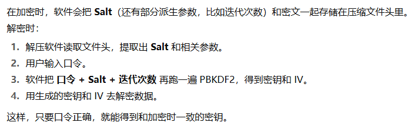
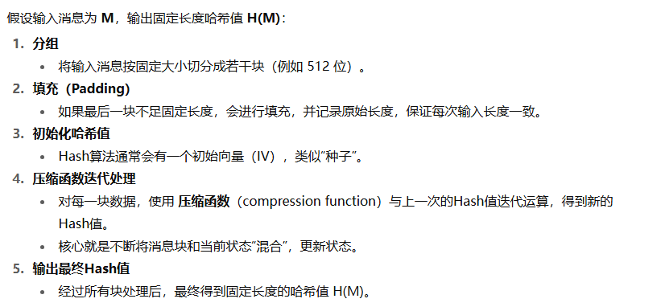

# 密码学概念

### 核心目标

- 保密性
  - 信息只有被授权的人才能看到
  - **实现方式：**加密算法（对称加密、非对称加密）
- 完整性
  - 信息在传输或存储过程中没有被篡改
  - **实现方式：**哈希函数、消息认证码(MAC)
- 身份认证
  - 确认信息发送者是谁，防止冒充
  - **实现方式：**数字签名、证书、公钥基础设施(PKI)
- 不可否认性
  - 信息发送者不能否认自己发送过的信息
  - **实现方式：**数字签名
- 抗抵赖性/防篡改
  - 结合完整性和不可否认性，保证信息不可篡改且发送者承担责任

### 主要算法类别

- 对称加密

  - 其核心特征是**加密和解密使用同一个密钥**
  - **常见算法：**AES、DES、3DES、ChaCha20
  - 工作机制

    - 分组加密（如AES）
    
    - 流加密（如 RC4、ChaCha20）
      
  
  - 提问
  
    - 常用压缩软件，如WinRAR，也是使用的对称加密算法，然而设置的口令是一个不定长度的字符串，那么它是如何将这个口令映射成固定字节的密钥的？
  
      - 加密
      
  
      - 解密
      
- 非对称加密
  - 非对称加密，也叫**公钥密码学**，由**公钥**和**私钥**组成
  - **常见算法：**
    - 基于大整数分解难题(代表：RSA)
    - 基于离散对数难题(代表：DSA)
    - 基于椭圆曲线离散对数难题(代表：ECC)
    - 基于格理论(代表：NTRU、Kyber、Dilithium)
  - 用途
    - 公钥加密，私钥解密
    - 私钥签名，公钥验证
    - **注：**以上两种用途均可以进行反向操作，但是没有意义
      - 如果用私钥加密明文，公钥持有者均可以解密，那这个明文并没有达到保密的效果
      - 如果用公钥签名，那凡是公钥持有者均可以对消息签名，结果是并没有达到数字签名的目的之一，无法证明消息确实是由某个发送者发出的
  - RSA工作机制
    
    - 注1：不必纠结以上公钥e、私钥d、模n的生成过程，只需知道加解密的过程就是模幂运算即可
      - 加密：计算明文M的e次方，然后对n求模，得到密文C
      - 解密：计算密文C的d次方，然后对n求模，得到明文M
    - 注2：大质素p、q与私钥一样是保密的，一旦泄露就可以推导出私钥
    - 注3：跟BTC使用的ECC不同，ECC是先确定私钥，然后推到出公钥，但不可反向推导
  - **总结：**非对称加密体系中
    - **加解密** 和 **签名/验证** 本质上都是 **公钥与私钥之间的数学映射运算**
    - 这个运算是**可逆的，但必须用对应的另一把密钥**
- HASH

  - hash是一种 **将任意长度的输入数据，映射为固定长度输出（哈希值、摘要）的算法**

  - **常见算法：**MD5、SHA-1、SHA-256

  - 用途：数据完整性校验、数字签名、密码存储、区块链等

  - 工作机制（概念理解）
  
- MAC

  - MAC是一种 **对消息完整性和身份验证** 的保护手段，它解决了两个问题
    - **消息完整性**：保证消息在传输过程中没有被篡改
    - **消息认证**：确认消息是由拥有共享密钥的合法发送方发出的
    - **注1：**MAC **不是加密**，它本质上是一个摘要（短码），依赖 **密钥**
    - **注2：**MAC 的设计初衷是：在 **对称密钥环境下** 提供消息完整性和认证，算是对对称加密算法的一种补足
      - AES-CTR 等模式可以被攻击者修改密文而不破坏解密，这就需要MAC算法来验证消息的完整性
    - **注3：**在TLS1.3中，已使用**AEAD**类算法(此类算法自带MAC算法的功能)，如AES-GCM、AES-CCM、ChaCha20-Poly1305等算法进行加密通信，不再依赖于MAC算法
  - **常见算法：**
    - 基于对称加密的 MAC
      - 如 **CBC-MAC**：用块加密算法（AES、DES）生成 MAC
    - 基于哈希函数的 MAC
      - HMAC
  - HMAC工作机制
    - HMAC 通过 **对消息和密钥进行两次哈希**，让结果既依赖消息内容，也依赖密钥，从而生成固定长度的 MAC 值
    
    - 把密钥和内填充异或后连接消息，对其结果进行第一次hash
    - 把密钥和外填充异或后连接第一次hash，对其结果进行第二次hash
  - **推荐实践**
    - **Encrypt-then-MAC**：先对明文加密，再对密文生成 MAC
      - 防止密文篡改导致解密错误
      - 接收方可以先验证完整性，确认消息未被篡改，再进行解密
    - 为什么不能用 **MAC-then-Encrypt**
      - Padding Oracle 攻击原理
        - 攻击者不知道密钥，但可以篡改密文发送给接收方
        - 接收方解密后，会检查填充是否正确
        - 接收方对填充错误和填充正确的情况做出不同响应（比如返回不同错误信息、延迟等）
        - 攻击者通过分析响应，逐步推测明文内容
- 数字签名

  - **目的**
    - **身份认证**：证明消息确实是由某个发送者发出的
    - **完整性保护**：确保消息在传输过程中没有被篡改
    
  - RSA签名过程
  

  - RSA验签过程
  

  - **注：**签名的过程其实就是用私钥对消息的hash进行模幂运算得到密文，用公钥验证就是用公钥对密文进行模幂运算得到消息的hash1，同时对消息计算hash得到hash2，比对 hash1 == hash2，如果hash值相同，则认为消息是由私钥持有者发出且没有被篡改
- 密钥交换协议
  - **特点：**在不安全的通道上安全地交换对称密钥
  - **典型协议**：基于椭圆曲线的 Diffie–Hellman (ECDHE)，**典型使用场景：TLS1.3**
    - 客户端和服务器各自生成临时的椭圆曲线密钥对(公钥+私钥)
    - 互相交换公钥
    - 双方用对方的公钥 + 自己的私钥，算出相同的共享密钥(对称会话密钥)
      - 注：不必纠结这一步在不知道对方私钥的情况下，如何推导出共享密钥的(因为完全看不懂推导公式)

### 应用场景

- 安全通信：SSL/TLS
  - **SSL（Secure Sockets Layer）**最早由 Netscape 提出的安全通信协议，但它已经停用（最后一个版本 SSL 3.0 在 2015 年就被 IETF 标准废弃）
  - **TLS（Transport Layer Security）**是 SSL 的后继版本，从 TLS 1.0 开始，一直发展到现在常用的 **TLS 1.2 / TLS 1.3**
  - **现在所有 HTTPS 实际上用的都是 TLS**，而不是 SSL
  - TLS1.2 握手过程（简化版）
    
  - 在 HTTPS 下，TLS 负责保护整个 **应用层数据（Application Data）**，它不仅仅是 HTTP 报文体（body），还包括 HTTP 报文头（header）和一些控制信息，但**不包括 IP 层和 TCP 层的报文头**
  
    - | 部分                                                   | 加密情况          |
      | ------------------------------------------------------ | ----------------- |
      | HTTP **请求行**（GET /index.html HTTP/1.1）            | 加密              |
      | HTTP **头部**（Host, Cookie, User-Agent 等）           | 加密              |
      | HTTP **消息体**（body，比如表单数据、JSON、HTML 文件） | 加密              |
      | TCP/IP **头部**（源端口、目标端口、IP 地址等）         | 不加密            |
      | TLS **控制信息**（握手、MAC）                          | 加密 / 完整性保护 |
  
- 数字证书

  - 数字证书是由权威的第三方机构（CA, Certificate Authority）签发的电子凭证，主要用于证明某个**公钥**确实属于某个实体（个人、组织、网站）

    - 常见的标准是 **X.509 证书**，典型内容如下
      - 主体信息 (Subject)：证书属于谁（比如域名 `www.example.com`，或某个组织）
      - 颁发者信息 (Issuer)：哪个 CA（证书颁发机构）签发的
      - 公钥 (Public Key)：该主体的公钥（浏览器后续会用来验证握手）
      - 有效期 (Validity)：证书的生效时间和到期时间
      - 序列号 (Serial Number)：证书的唯一标识
      - 签名算法 (Signature Algorithm)：CA 用什么算法签发（比如 SHA256 with RSA）
      - CA 的数字签名 (Digital Signature)：CA 用它自己的私钥对上述信息做签名，保证证书不可篡改

  - 工作机制
  

- 数字签名与认证：电子合同、区块链交易

  - 私钥签名 → 公钥验证，确保发送者身份与数据完整

- 密码存储：用户密码
  - 哈希 + 盐存储，防止泄露后被破解

### 学习路径(日后再说)

- 图解密码学|熊亮
- 密码学与网络安全|第7版
- 现代密码学原理与应用|潘爱民